# UMG-Slate-Compendium

#### Document version
*0.0.2*

<a name="table-of-contents"></a>
## Table of Contents

> 1. [Introduction](#introduction) 
> 2. [Performance & Design Considerations](#performance--design-considerations) \
>    2.1 [CPU Considerations](#cpu-considerations) \
>    2.1 [GPU Considerations](#gpu-considerations)
> 3. [Slate & UMG in Unreal](#slate--umg-in-unreal)
> 4. [Slate](#slate) \
>    4.1 [Slate Units & DPI Scaling](#slate-units--dpi-scaling) \
>    4.2 [Slate Users](#slate-users) \
>    4.3 [Widget Layout](#widget-layout) \
>    4.4 [On Paint](#on-paint) \
>    4.5 [Widget Hierarchy](#widget-hierarchy) \
>    4.6 [Invalidation](#invalidation) \
>    4.7 [Slate Widget Examples(Slate Test Suite/Starship)](#slate-widget-examplesslate-test-suitestarship-suite) \
>    4.8 [Helpful Console Commands for Slate](#helpful-console-commands-for-slate)
> 5. [UMG (Unreal Motion Graphics)](#umg-unreal-motion-graphics) \
>    5.1 [User Widget Hierarchy](#user-widget-hierarchy) \
>    5.2 [User Widget Animation](#user-widget-animation) \
>    5.3 [User Widget Events](#user-widget-events)
> 6. [Common Widgets](#common-widgets)
> 7. [Common Widget Functionality](#common-widget-functionality)
> 8. [Input Framework(in relation to UMG/Slate)](#input-frameworkin-relation-to-umgslate) \
>    8.1 [Input Flow of Unreal Engine](#input-flow-of-unreal-engine) \
>    8.2 [Input Event Types](#input-event-types) \
>    8.3 [Input Modes](#input-modes)
> 9. [Unreal's Focusing System](#unreals-focusing-system) \
>    9.1 [Navigation Grid Explanation](#navigation-grid-explanation) \
>    9.2 [Navigation Genesis](#navigation-genesis)
> 10. [Split Screen](#split-screen) \
>     10.1 [Game Layer Manager](#game-layer-manager) \
>     10.1 [Viewport Layout](#viewport-layout)
> 11. [Important Links](#important-links)
> 12. [Important File Names](#important-file-names)

<a name="introduction"></a>
## Introduction

This compendium is intended to teach the basics of UMG & Slate and to
provide a base understanding of how to work with Unreal Engine’s UI
framework. PLEASE let me know if there is anything about this document
that can be improved upon because this is meant to help everybody!

An important note about skill level in programming and how its used in this
document: usually when somebody refers to a concept as *“high level”* they
mean its very complicated and requires a high skill level or a lot of
experience, **BUT** in programming its flipped; where a *“high level”* concept is
actually extremely easy to use and is a simple concept with little to no
experience and the more *“low level”* it gets, the more complicated the
concept becomes and requires a larger amount of experience.
For example; **Blueprint** is a *“high level”* coding language, **C++** is a *“low level”*
coding language.

GeeksForGeeks has a great and simple article explaining the difference: \
*<u>https://www.geeksforgeeks.org/difference-between-high-level-and-low-level-languages/ </u>*

An important note about the two types of Unreal Engine:
- **Launcher Version**: The version of the engine that you would download
  from the Epic Games Launcher that exposes the engine to view but is
  not intended to be modifiable and not being able to submit code
  changes to Epic to integrate into Unreal Engine.
- **Source Code Version**: The version of the engine that you would
  download from GitHub which gives full modifiable access to the Unreal
  Engine as well as being able to submit code changes to Epic for them
  to integrate into Unreal Engine’s future releases.

*All pictures of the editor in this document are from the launcher version of the engine.*

What this compendium covers:
- **Performance & Design considerations**
- **Slate Framework**
- **UMG Framework**
- **The input framework in relation to UMG/Slate**
- **How the built in focusing system works**
- **How splitscreen generally works**

It is **NOT** intended to teach beginners how to use Unreal Engine in general,
just this specific aspect of the engine which encompasses a lot of the
engine.

This compendium requires you to have a basic understanding of these areas
of Unreal Engine:
- **How to use Blueprint and Unreal’s C++**
- **Unreal Engine’s garbage collection framework**
- **Unreal Engine’s gameplay framework**

This compendium will contain information that is taken from official
documentation but is intended to shed light on what some of the official
documentation means BUT it is not a redefinition of something that is
already explained.

At the bottom of the document is a list of helpful links and files for you to refer back to \
(you can reach them easily using the [Table of Contents](#table-of-contents) at the top of the file).

**[⬆ Back to Top](#table-of-contents)**
<a name="performance-design-considerations"></a>
## Performance & Design Considerations

**UMG** & **Slate** are extremely performant frameworks for both the rendering (GPU) and computation (CPU) aspects,
<a name="cpu-considerations"></a>
#### CPU Considerations
Slate/UMG use the concept of **Invalidation** and caching rather than constantly polling the data. \
The reason for this is because sometimes polling is either not performant or functionally incorrect(for example when using multithreaded code). \
Typically performant UI in Unreal is intended to be **event based**. \
UMG has **Property Binds** but they should not be used because they will be updated every frame 
which is significantly more taxing on the CPU than using an event based framework. \
UI Complexity is usually in relation to the number of active and visible widgets 
(so offscreen widgets don’t tick and should not run functionality if not on screen). \
The general technical design with UI is to be reactive to game code but not
to drive the game code to keep it performant and reusable, only to start
executing the game code and to listen if that game code succeeded or
failed.

|                                                                                             **CPU Technial Design Scenario**                                                                                              |
|:-------------------------------------------------------------------------------------------------------------------------------------------------------------------------------------------------------------------------:|
| In an RTS you need to have a UI marker for seeing where to place a squad of soldiers in the world,<br/>the player selects a valid spot in the world for where to place the UI marker and then the troops will move to it. |

| **Good Example**                                                                                                                                                                                                                                                                    |                                                                                                                                                       **Bad Example** |
|:------------------------------------------------------------------------------------------------------------------------------------------------------------------------------------------------------------------------------------------------------------------------------------|----------------------------------------------------------------------------------------------------------------------------------------------------------------------:|
| A player manager object creates the UI marker widget and manages where to move the troops.<br/>The world position that is chosen by the player is fed into the UI marker’s widget(from the player manager object) and the widget itself handles positioning itself in screen space. | The player picks a world position and feeds that directly to the UI marker, the UI marker then directly tells the troops where to move to and handles their movement. |

<a name="gpu-considerations"></a>
#### GPU Considerations
Most of the general GPU considerations you would have to worry about are
the same when working in 3D space, such as:
- **Texture memory sizes**
- **Computational complexity of material shader**
- **Draw calls**

If your framework is built out properly, GPU optimization wouldn’t be an issue when it comes to Slate/UMG due to it using some of Unreal’s 3D
rendering features to offload some of the work. \
An important gotcha with Unreal Engine is that it does not have a robust method of swapping between different textures depending on platform type. \
For example; switching from Mobile to PC, you will have to build those systems out yourself so that unused textures are not cooked, loaded, \
referenced, or even stored on the hard disk on the platform that you do not want them to be on.

**[⬆ Back to Top](#table-of-contents)**
<a name="slate-umg-in-unreal"></a>
## Slate & UMG in Unreal
Unreal Engine uses **Slate**; its custom **UI Programming Framework**. It is used \
for both game and non-game applications (the unreal editor and the Epic Games Launcher were built using Slate) using Widgets. \
**Slate** is entirely used within C++ using declarative syntax and is **<u>NOT</u>** derived from the `UObject` hierarchy. \
Because it is not derived from `UObject`, that means you can’t use Unreal’s object casting system to get specific Slate \
types, the way you should cast for them is using `static_cast<>` or `const_cast<>` below is an example using `static_cast<>`.

```c++
// This is the recommended way of saving a pointer to a widget(to use SharedPtr/WeakPtr/SharedRef's)
// Sometimes it's fine to use a raw pointer(depends on what you're doing)
TSharedPtr<SWidget> genericWidget;
if(genericWidget->GetType() == "SMyCoolWidget)
{
    SMyCoolWidget* coolWidgetPtr = static_cast<SMyCoolWidget*>(genericWidget.Get());
}
```

Pros of Slate:
- **Performance gains from entirely being in C++**
- **Usable for generic application usage** (an example of this is that the Epic Game’s Launcher and the Unreal Editor itself is entirely built with Slate)
- **Used to extend the editor** (this is due to the Unreal Editor being built from Slate in the first place)
- **Not used with Unreal’s Garbage Collection System**

Cons of Slate:
- **Entirely within C++** (there’s no visual designer)
- **Not able to have sequencer animations** (everything is hard coded)
- **Requires thorough knowledge to be able to use it for full production**
- **Not usable with Blueprints**
- **Not used with Unreal’s Garbage Collection System**

 \
*Slate Test Suite (In UE5 its called Starship Gallery)*

**UMG** (**Unreal Motion Graphics**) is derived from the `UObject` hierarchy but aren't `Actor`’s and \
is used to create & display Slate Widgets (basically a Unreal Engine friendly wrapper for Slate to work with Blueprint).

Pros of UMG:
- **Can be used with Blueprints and C++**
- **Allows for artist driven animation’s**
- **Has a visual designer**
- **Used with Unreal’s Garbage Collection System and Reflection System**
- **Able to extend the editor** (Unreal Engine 4.23+ using Editor Utility Widgets)

Cons of UMG:
- **Restricted to Unreal Engine** (not usable outside the engine for regular OS applications)
- **Ease of use also can cause developers to cause technical debt and for the UI to get messy**

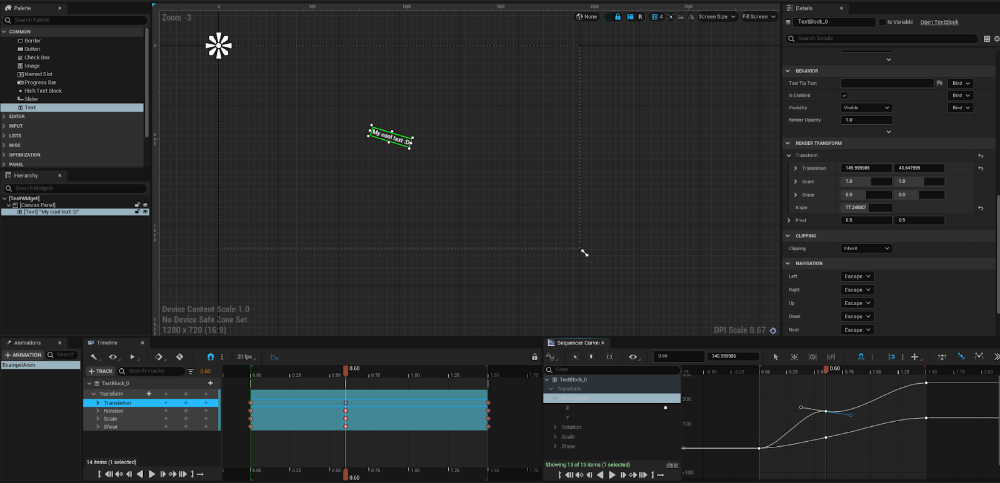

**[⬆ Back to Top](#table-of-contents)**
<a name="slate"></a>
## Slate

The Slate Framework has two main parts:
- **Slate Renderer**
  - Slate Widgets are displayed using its own renderer called the Slate Renderer, \
  it handles rendering UI elements in front of the game’s viewport as well as combining with Unreal’s world rendering pipeline to display UI elements.
- **Slate Application** 
  - The Slate Application is an object that manages all the CPU related tasks of Slate Widgets such as their viewport positions, \
  user focus navigation, widget hierarchy placement and tracking, receiving input and routing that input to either Slate Widgets \
  or to the rest of the game engine (yes this is where the raw inputs are received before UI element’s get them) and registering \
  (creating)/tracking the Slate Users.

<a name="slate-units-dpi-scaling"></a>
#### Slate Units & DPI Scaling
- **Slate Units**: Unreal’s way of making a UI that is independent of pixel density so your application can support multiple platforms easily. \
This allows for it to be more precise and independent of the pixel density of the user’s monitor. \
A single slate unit can vary in physical size but by default it is conveniently set to 1 pixel for each slate unit. \
To set the default value; it is recommended to adjust the base DPI Scaling instead.
- **DPI Scaling**: How Unreal modifies the slate units conversion at runtime by scaling each slate unit by this value, \
so for example if you’re slate units are set to 1 unit = 1 pixel, and the dpi scaling is set to a value of 2.5 then each \
slate unit would be 1 unit = 2.5 pixels. You can change the DPI scaling depending on the resolution via a curve table in \
the project settings under the “Engine-User Interface” category.

Epic themselves admits it’s not perfect but it works well for most-all use cases. \
[Epic's AnswerHub explaining Slate Units](https://answers.unrealengine.com/questions/190770/what-are-slate-units.html)

<a name="slate-users"></a>
#### Slate Users
**Slate Users** are classes that represent that a local individual input-providing user \
(for example; in split screen co-op with 3 players then there are 3 Slate Users, but in an online game with 32 players and no split screen then the only local player is the only Slate User on this device). \
Each **Platform’s SDK** will tell the **Slate Application** to register (create) a new Slate User when a new connection is added (for example when a new controller is plugged in). \
When a new connection is added, a new Slate User is created but not when a connection is removed to account for a controller disconnecting accidentally (to keep the settings for that controller just in case they reconnect). \
When a connection is removed, that Slate User is just not updated. The Slate User instance keeps track of the widget that the user is currently focusing on, \
and controls the cursor/has pointer information to account for gestures (this is only for the first Slate User because you can’t plug in multiple mouses and if you are… why?).

You can access the Slate User via 2 primary ways:
- From the Slate Application using an integer index for that local Slate User.
- From a `ULocalPlayer` object which you can get from any Player Controller. \
> An important thing to note is that Local Player’s can exist before the Player Controller is spawned \
> (there’s functions in Player Controllers for when their Local Player is set that you can override), \
> and Local Player’s exist between levels instead of per level like Player Controllers since they are UObjects and not Actors.

```c++
// The way you get the local player is dependent on your own needs
// This is meant to be an example,
// NOT INTENDED FOR FINAL/RELEASE CODE
ULocalPlayer* localPlayer = nullptr;
if(UWorld* const world = GetWorld())
{
    if(APlayerController* const pc = world->GetFirstPlayerController())
    {
        localPlayer = pc->GetLocalPlayer();
    }
}
// Valid check the local player pointer
if(!IsValid(localPlayer))
{
    // If its not valid then exit the function
    return;
}
// Make sure Slate is initialized and working properly 
if(FSlateApplication::IsInitialized())
{
    // This function will return the Slate User that this local player is tied to
    FSlateApplication::Get().GetUser(localPlayer->GetControllerId());
}
```
*Code example for how to get the Slate User using the player controller's local player object*

<a name="widget-layout"></a>
#### Widget Layout

The way a Slate Widgets layout is calculated is done in two passes (listed in order of execution):
1. **Cache Desired Size**: Calculate how much space each widget wants to occupy, \
this occurs through a *Bottom-Up* approach where it guarantees when this pass happens for a widget, \
its children have already computed and cached their desired size.

 \
*Example of Desired Size for a Horizontal Box with Textblock and Image widget's*

For the desired size example we have a horizontal box holding a text block and an image widget. \
In this case we compute the desired size for the text block (which is measured by the string that is displaying) and the image widget (which is measured based on the image data that is shown). \
Then the horizontal box is computed by combining the text block and image widget’s(we are assuming that the text block is 14 slate units and the image widget is 8 slate units) desired sizes, \
so for this example 14 slate units + 8 slate units = 22 Slate Units.

2. **Arrange Children**: This occurs in a *Top-Down* approach where the widget is asked to arrange its children based on \
their desired sizes and the desired size of this widget (which all occurred in the first pass).

 \
*Example of Arranged Children using Allotted Size for a Horizontal Box with Textblock and Image widget’s*

For the arranged children example the horizontal box was allotted 25 slate units by its parent widget (not shown to keep things simple). \
The first horizontal box slot indicates that it wants the desired size of the child which is 14 slate units from the text block, \
while the second slot wants to fill the available width which is 11 slate units remaining for the image widget.

<a name="on-paint"></a>
#### On Paint

**Drawing Slate** is the process where Slate will iterate over all visible widgets and create a list of **Draw Elements** to send to the rendering system, this list is created every frame.

This occurs in an On Paint function where it will do two things:
- Arrange all the children based on their **Geometry** (desired size).
- Paint the actual visuals related to this widget.

<a name="widget-hierarchy"></a>
#### Widget Hierarchy

The concept of the **Widget Hierarchy** is done using child slots, which are optional objects that can be tied to a Slate Widget\
(because some Widgets are not designed to have children such as the Image widget(**Leaf Widget**)) \
but requires the slot to be custom build for tracking each widgets child such as how the Button widget(**Compound Widget**) \
only accepts 1 child widget meanwhile an Overlay widget can have multiple child widgets.

Widgets usually come in 3 main types:
- **Leaf Widgets**: Widgets with no child slots. \
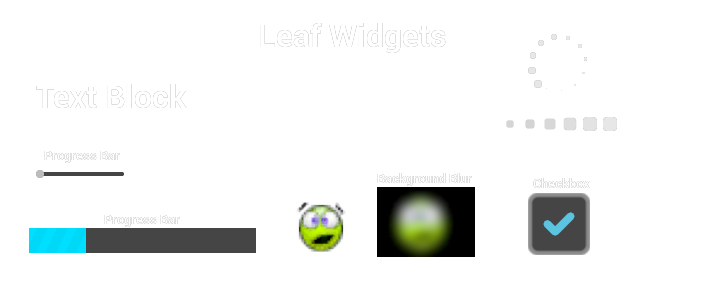
- **Panels Widgets**: with a dynamic number of child slots. \
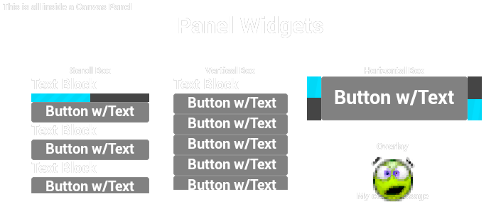
- **Compound Widgets**: Widgets with a fixed number of explicitly named child slots. \
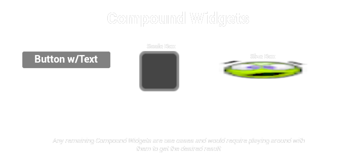

The key elements of any Slate Widget (also known as an SWidget, where every Slate Widget is prefixed with a capital ‘S’ in C++) \
are a mix of functions and values:
- **Compute Desired Size** (Function): Responsible for calculating the desired size as the first pass for layouting.
  - **Slate Rect** (Value): A rectangle with its origin at the top left corner, defined by upper-left and lower-right corners. \
  The origin is in the top-left with the Y-axis going downwards and X-axis going to the right. This is used with calculations for desired size and for the bounds.
- **Arrange Children** (Function): Responsible for arranging child widgets as the second pass for layout's.
- **On Paint** (Function): Responsible for the actual rendered appearance of the widget.
- **Event Handlers** (Delegate values and/or Functions): These are the event based hooks for the UI elements to change at runtime usually in the form of “OnSomething”.

<a name="invalidation"></a>
#### Invalidation

To avoid having to calculate the desired size of the widget every frame (which can tax the CPU if it’s happening to a lot of Widgets at once), \
Widgets have the concept of caching their desired size, but at runtime if the size of the widget changes (either through an animation or through game code) \
then it will **Invalidate** the widget to tell Slate that this widget needs to recalculate its **Desired Size** and then **Rearrange the Layout** that widget is in (or has). \
This is an optimization to avoid polling for each widget's desired size every frame when it doesn’t need to recalculate it.

<a name="slate-widget-examples"></a>
#### Slate Widget Examples(Slate Test Suite/Starship Suite)

The **Slate Widget Examples** (also known as **Slate Test Suite** if using UE4/ **Starship Suite** if using UE5) \
is a collection of Slate built examples such as radio buttons, responsive grid, color wheel, etc.

You can access the test suite within the Unreal Editor by going to:
1. This is different depending on whether you’re using UE4/UE5 
   - UE4: `Window>Developer Tools>Debug Tools` 
   - UE5: `Tools/Debug/Debug Tools` \
   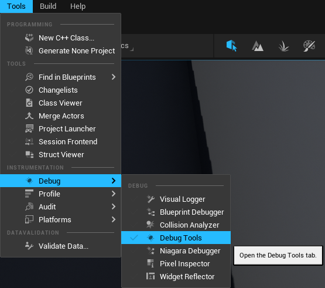
2. Select `Test Suite` \
   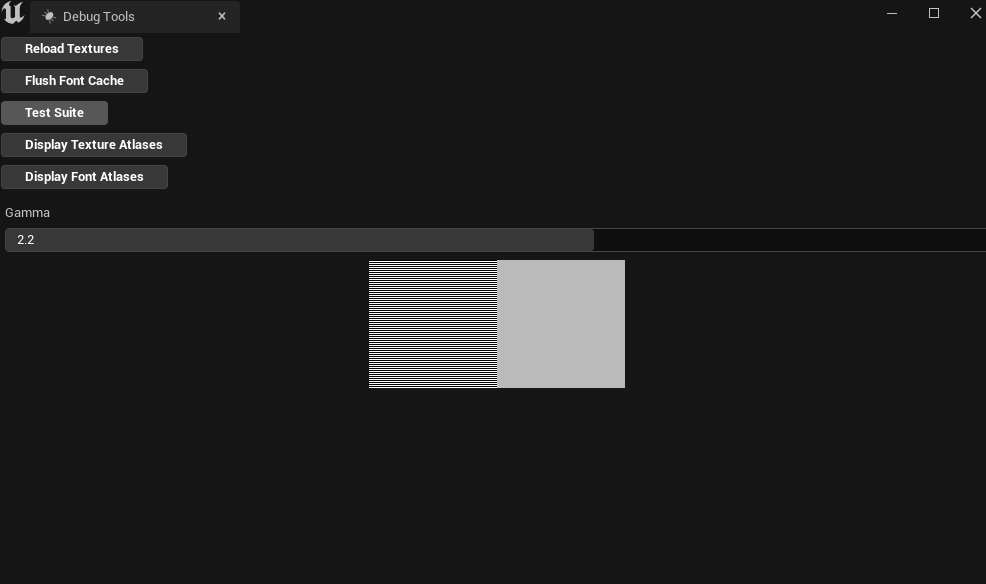

You can also run the Test Suite as its own application without the Unreal Editor open if you have the source code version of the engine \
and build the Test Suite program(which will create the executable in `[EnginePath]/Engine/Binaries/Win64/`).
- UE4
  - `[EnginePath]/Engine/Source/Runtime/AppFramework/Public/Widgets/Testing/STestSuite.h`
  - `[EnginePath]/Engine/Source/Runtime/AppFramework/Private/Widgets/Testing/STestSuite.cpp`
- UE5
  - `[EnginePath]/Engine/Source/Runtime/AppFramework/Public/Widgets/Testing/SStarshipSuite.h`
  - `[EnginePath]/Engine/Source/Runtime/AppFramework/Private/Widgets/Testing/SStarshipSuite.cpp`

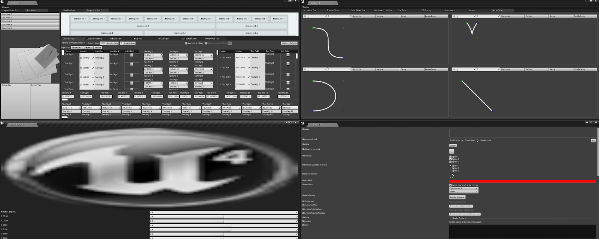 \
*Test Suite from UE4, currently the UE4 version of the test suite is more feature rich than Starship Suite in UE5.*

<a name="helpful-console-commands-for-slate"></a>
#### Helpful Console Commands for Slate
- `Slate.HitTestGridDebugging [0/1]`: Flag for showing UMG/Slate focusing hit test grid.
- `SlateDebugger.Invalidate.[Disable/Enable]`: Enables or disables the invalidation debugger visualizer.
- `Slate.GlobalScrollAmount [float value]` (default = 32.0): The amount used for scrolling for each click of the mouse wheel(in Slate Units).

**[⬆ Back to Top](#table-of-contents)**
<a name="umg"></a>
## UMG (Unreal Motion Graphics)

The UMG framework are UObject’s that have to be tied to a specific **Player Controller** known as the **Owning Player**(to account for split screen), \
if nothing is inputted for the owning player then it will automatically be connected to the first local player in the level.

The hierarchy of UMG’s object types is laid out below:
- **UVisual**: The base class for elements in UMG Slots and Widgets.
  - **UWidget**: The base class for all Widgets, they create Slate Widgets and handle routing functionality from Blueprint/UObject based classes to Slate. \
  These are widgets like TextBlock, ScrollBox, Button, etc.
    - **UUserWidget**: The base class for designing UI, animating UI, and connecting that functionality to game code.

User Widgets are built out of Widgets except how a User Widget does not require a root widget, \
basically like how Actors are built out of multiple Actor Components and require a root Actor Component(known as Root Component).

User Widgets cannot inherit their **Widget Hierarchy** like how Actors do with Components but they can inherit class functionality \
(so making a User Widget abstract will allow for other classes to inherit from it or creating the class in C++ will allow for inheritance).

<a name="user-widget-hierarchy"></a>
#### User Widget Hierarchy

Each **User Widget** is the root `UWidget` by design, so a User Widget can have no widgets inside it and is by default a **Compound Widget** that can only have 1 child, \
but that child can have other children under it and causes the cascading effect of child widgets within each User Widget's **Tree Hierarchy**. \
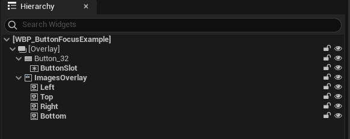 \
*Example of Hierarchy panel in the UMG Designer window*

<a name="user-widget-animation"></a>
#### User Widget Animation

Every User Widget is able to create custom animations using the widgets within that User Widget via **Sequencer**. \
You can create these animations inside the Widget Designer and you’re able to modify things relating to that widget specifically such as render transform, widget visibility, etc. \
You can also modify properties of widgets such as material parameters, runtime values within the widget, etc.

@TODO
*[Insert picture of UMG designer with animation's being modified/played]*

If a User Widgets **Tick Frequency** is set to **Never** instead of **Auto** in the class defaults then it will never run animation’s \
because for an animation to play at all, the user widget needs to be able to tick that animation and \
if the user widgets ability to tick is turned off(by setting its tick frequency to never) then it will not tick the animation object.

<a name="user-widget-events"></a>
#### User Widget Events

Every user widget has built in events that you can implement and add your own functionality from;

@TODO
*[Insert picture for each event, include code snippet and BP node]*

- **Pre Construct**: This occurs both in editor in the designer and before the widget is actually created, similar to the Construction Script found on Actors.
- **On Initialized**: This occurs only once at runtime when the non template instance is created(when you spawn a user widget).
- **Construct**: This can occur multiple times on a single user widget because it is based on when it is Constructed to the screen (Add to Viewport or Add to Player Screen). \
So if you're removing the widget from parent and re-adding it later then it's recommended not to put first time initialization code in this but instead put that in “On Initialized”.
- **Destruct**: Occurs when this widget is no longer on screen, can be called multiple times as its the inverse of Construct where it occurs when this widget is removed from parent.
- **On Paint**: Occurs when this widget is painted every frame, different from Tick as it is meant to handle Paint Context information.
- **Tick**: This will occur every frame that this widget is on screen, it will not tick if the widget is not being shown(even if it still exists, the only thing that matters is that it is being shown then its ticking).
- **On Animation Started**: Occurs when an widget animation starts playing, it will give you that widget that started playing in case you need to check against it or use it later. \
(For Blueprint users; recent versions of Unreal require animation finished events to be in the event graph while prior ones allow for them to show up as overridable functions)
- **On Animation Finished**: Occurs when an widget animation finishes playing, it will give you that widget finished playing in case you need to check against it or use it later. \
(For Blueprint users; recent versions of Unreal require animation finished events to be in the event graph while prior ones allow for them to show up as overridable functions)
- **On Focus Received**: (If you're having trouble finding it in Blueprint, it has to return an Event Reply struct so you have to override it in the functions list and not in the event graph) \
Occurs when focus is given to this User Widget(only this widget). It requires that you return an Event Reply struct which you can choose to either return Handled or Unhandled.
- **On Added to** Focus Path: Occurs when this widget or a child widget within this User Widget is added to the focus path(or focused) and wasn’t previously part of it.
- **On Focus Lost**: Occurs when this User Widget(only this widget) loses focus.
- **On Removed from Focus Path**: Similar to On Focus Lost except it can occur when a child widget within this User Widget or this widget itself is no longer part of the focus path.

**[⬆ Back to Top](#table-of-contents)**
<a name="common-widgets"></a>
## Common Widgets

There is a large amount of commonly used widgets in Unreal Engine, at its basic core elements. \
Most/All of your UI that used UMG/Slate will probably be built from a combination of these widgets:

@TODO
*[Insert picture for each widget as an simple example of it]*

- **Text Block** *[Leaf Widget]*: Handles displaying static text that can be changed at runtime by setting it to another text value. \
TextBlock widgets allow for a custom font to be used(including its typeface if the font has any others), customizing its text size, letter spacing(also known as kerning), its outline settings(this will offset the rendered text), \
apply materials to the letters themselves, add a shadow offset(this will offset the rendered text), set its justification(how the text is aligned), etc.
- **Rich Text Block** *[Leaf Widget]*: Works similarly to TextBlock widgets but allows for the use of custom images, glyphs, multiple fonts, etc to be used within the same text value at once.
- **Image** *[Leaf Widget]*: Handles displaying either a texture or a material that uses the UI domain to display it.
- **Border** *[Compound Widget]*: Can only have 1 child widget. Displays child widget in front of this widget, basically an Image widget that can have a child.
- **Button** *[Compound Widget]*: Can only have 1 child widget. Displays that child in front of this widget, can be interacted with and focused. Returns when it is clicked/pressed/released/hovered/unhovered. You can also set its click(mouse button) method, touch(touch screen’s) method, and press(keyboard & gamepad) method.
- **Check Box** *[Leaf Widget]*: Handles displaying a specific image/material depending on what state the check box is in, it can be clicked(or set to a specific state) and meant to show if something is on/off.
- **Progress Bar** *[Leaf Widget]*: Handles displaying an image/material in front of this widget via a scaled 0-1 percentage value via its Bar Fill Type.
  - **Left to Right**: Fills the progress bar from left to right.
  - **Right to Left**: Fills the progress bar from right to left.
  - **Fill from Center**: Linearly fills the progress bar on both X and Y from the center towards the edges.
  - **Top to Bottom**: Fills the progress bar from top to bottom.
  - **Bottom to Top**: Fills the progress bar from bottom to top.
- **Slider** *[Leaf Widget]*: Similar to the progress bar except it is interactable and you can change the orientation of it from horizontal to vertical and set its step size(for keyboard/gamepad presses).
- **Editable Text** *[Leaf Widget]*: A field for the user to be able to type in one line of text, allows for hint text and can be set to read only, is password(so it only shows a dot instead of the actual text), as well as being able to adjust settings on it like a normal text block widget.
- **Editable Text(Multi-Line)** *[Leaf Widget]*: Same as Editable Text widget except the user can type in multiple lines of text instead of one.
- **Text Box** *[Leaf Widget]*: Same as Editable Text except it is wrapped with an image/material behind the text.
- **Text Box(Multi-Line)** *[Leaf Widget]*: Same as Editable Text(Multi-Line) except it is wrapped with an image/material behind the text.
- **Spin Box** *[Leaf Widget]*: Displays a number(can be set to allow decimals or not) that the user can input or use the mouse and interact with it to slide and increase/decrease the number.
- **Combo Box(String)** *[Leaf Widget]*: A drop down box widget that displays a string(NOT TEXT, so its not localizable) value when selected and displays its options as well.
- **Invalidation Box** *[Compound Widget]*: Can only have 1 child widget. This will control when that child widget is invalided for its layout/geometry passes, very useful for performance optimization.
- **Retainer Box** *[Compound Widget]*: Can only have 1 child widget. This will render a material over its child widget and only its child widget so it will not render that material over background space that the child widget does not occupy with its render. \
For example if you wrap a Text Block with a Retainer Box, the material will only apply over the text and not the space between each letter.
- **Throbber** *[Leaf Widget]*: Displays an image/material in a specific animated pattern. Useful for showing something is loading.
- **Circular Throbber** *[Leaf Widget]*: A version of the throbber that moves the images/materials in a circle. \
*A note from the author, “Please change the throbber’s image with something other than the default image in your final products if possible, thank you.”*
- **Spacer** *[Leaf Widget]*: This widget does not have a visual representation and it just provides padding and space between other widgets, recommended to use this rather than padding within slots if your UI design is changing constantly to make rapid iteration easier.
- **Background Blur** *[Compound Widget]*: Can only have 1 child widget. Basically an image widget with its child rendered behind it, and blurs the rendered result of that child widget using Gaussian Blur. \
Recommended to use this with proper clipping area’s setup otherwise use a custom material to make it easier for artists to modify.
- **Input Key Selector** *[Leaf Widget]*: Allows for the user to press an input while focusing this widget and it will display what input that is.
- **Canvas Panel** *[Panel Widget]*: This is the default widget found in newly created User Widgets, allows for the designer to place child widgets at arbitrary locations, anchored and z-ordered with other children of this canvas. \
It uses absolute layout for its placement so it's good for on screen indicators that follow a specific in-world object or something that can move around the entire screen.
- **Horizontal Box** *[Panel Widget]*: Allows for its child widgets to be laid out in a horizontal flow moving from left to right with 0 index as the farthest left and its last widget being farthest right.
- **Vertical Box** *[Panel Widget]*: Works the same as horizontal boxes except it lays out its children in a vertical flow moving from top to bottom, with 0 index as the farthest top widget and its last widget being the farthest bottom widget. \
*Vertical Box and Horizontal Box do not scroll, to allow for that you would have to use a scroll box widget or something similar.*
- **Scroll Box** *[Panel Widget]*: Works the same way as the vertical box AND the horizontal box(has to be set to either vertical or horizontal) but allows them to be scrollable. Does not support virtualization.
- **Size Box** *[Compound Widget]*: Can only have 1 child widget. Allows for this widget to specify the desired size of its child widget(since not all widgets will report a desired size because they are dependent on their own child widgets).
- **Scale Box** *[Compound Widget]*: Can only have 1 child widget. Allows for this widget to have its child scaled to fit a constrained size on this box's allotted area.
- **Overlay** *[Panel Widget]*: Displays widgets stacked on top of each other based on their index within the child widgets. This widget is extremely useful to quickly overlay a widget over another widget quickly.
- **Grid Panel** *[Panel Widget]*: Allows child widgets to automatically be placed in a grid like pattern resembling a table that retains the width of every column.
- **Uniform Grid Panel** *[Panel Widget]*: Basically the grid panel but it will evenly divide up available space between all of its children.
- **Widget Switcher** *[Panel Widget]*: This will only display one of its child widgets at a time via its child index but it will load all of them(not good for main pages, just smaller stuff) and initialize, construct all of them when the widget switcher is loaded, initialized, constructed.
- **Safe Zone** *[Compound Widget]*: Can only have 1 child widget. This widget is special where it will apply padding to the top/bottom/left/right sides of its child widget inwards to account for what device this widget is being shown on, \
so for example on some mobile devices with a notch on one side, the safe zone will account for that and add padding to its child widget so it does not get cut off by the notch, as well as accounting for tv’s with extra pixels under the bezel, \
projectors having extra columns of pixels hidden behind the black border, etc. A good example is for certain phones that have a notch(you know which ones I’m talking about), the safe zone will pad out that side of the screen for you so your widgets are not being covered by the notch. \
You can also use some helpful debug console commands for simulating the safe zone on PC in the editor:
  - `r.DebugSafeZone.TitleRatio 0.96`
  - `r.DebugActionZone.ActionRatio 0.96`
  - `r.DebugSafeZone.Mode [integer between 0 and 2]`
    - 0: Do not display the safe zone overlay
    - 1: Display the overlay for the title safe zone
    - 2: Display the overlay for the action safe zone

**[⬆ Back to Top](#table-of-contents)**
<a name="common-widget-functionality"></a>
## Common Widget Functionality

Each widget has its own functionality and use while still containing a common functionality across all the widgets such as:

@TODO
*[Insert picture for each value of this setting in the editor]*

- **Accessibility**: Each widget will listen to the project’s default settings for accessibility, these settings can be overridden for each widget and can affect its own children, \
going over accessibility is out of scope for this document but here is an official Epic approved course going over it \
https://www.unrealengine.com/en-US/onlinelearning-courses/introduction-to-accessible-design-with-unreal-engine (also in the list of important links at the top of the document).
- **Tool Tip Text**: A tool tip text widget that is either using the default widget or your own custom one, to show when the user hovers over the widget with the mouse.
- **Is Enabled**: Flag to know if this widget is enabled/disabled and if it can be modified interactively by the user.
- **Visibility**: The render visibility and interactivity visibility of the widget. \
@TODO
*[Insert picture for each value of this setting in the editor]*
  - **Visible**: Renders the widget and allows it to be intractable with the cursor.
  - **Collapsed**: Does not render, not interactable, and takes up no space in the layout.
  - **Hidden**: Does not render and is not interactable but occupies layout space.
  - **Not Hit-Testable/Hit Test Invisible(Self & All Children)**: Does render the widget but cannot be interacted with and does not allow its children to be interactable.
  - **Not Hit-Testable/Hit Test Invisible(Self Only)**: Does render the widget but only this widget cannot be interacted with.
- **Render Opacity**: The render opacity of this widget and does affect its children’s opacity as well. 0 = Invisible, 1 = Fully Visible.
- **Render Transform**: Each widget has a render transform, which can affect the collision shape of the widget, but not override the original layout and paint information. \
Think of it like it’s a modifier to the original transform information but it does not change its layout.
  - **Translation**: The X and Y location offset.
  - **Scale**: The X and Y scale of the widget.
  - **Shear**: The X and Y shear of the widget, also known as skew.
  - **Angle**: The rotational of the widget. You only need 1 axis to rotate on but it can go between -180 and 180 degrees.
  - **Pivot**: The pivot offset of the widget that controls the location for where transforms are applied from. \
  The actual value is a normalized amount starting at 0.5 on X/Y to be the center of the widget, 0.0 = Left/Top and 1.0 = Right/Bottom directions.
- **Is Volatile**: This flag when set to true will mark this widget as non-cacheable so it always has to update its layout and geometry collision, it is defaulted to false because it is not commonly used but it is exposed in case you need it.
- **Clipping**: This is in regards to layout and geometry information where you can specify how the widget is clipped, \
this does not batch together clipping spaces so this can have a performance cost depending on how many overlapping and clipping widgets you have on screen. \
@TODO
*[Insert picture for each value of this setting in the editor]*
  - **Inherit**: This clipping space does not allow the widget to clip its children, but this widget and all its children inherit the clipping area of the last widget that was clipped above it.
  - **Clip to Bounds**: This clipping space clips to the bounds of this widget, it intersects those bounds with any previous clipping area from above it.
  - **Clip to Bounds - Without Intersecting(Advanced)**: This clipping area clips to its bounds as well but it does **<u>NOT</u>** intersect with any existing clipping geometry, it will always push its own new clipping state. \
  Allowing this widget to render outside the bounds of the hierarchy that does clip it. This will **<u>NOT</u>** allow you to ignore the clipping zone that is set to *"Always"* though.
  - **Clip to Bounds - Always(Advanced)**: This clipping area clips to bounds as well and it always intersects those bounds with any previous clipping area. \
  This clipping area **<U>CANNOT</U>** be ignored, it will always clip its children. Useful for hard barriers in the UI where you never want animations or other effects to break into/out of that region.
  - **On Demand(Advanced)**: This clipping area clips to its bound when its Desired Size is larger than the allocated geometry in the layout. \
  If it does occur where it needs to be clipped, then it will be treated like *“Always”*. According to the source code, this mode was primarily added for Text for when it is placed inside a container that eventually is resized to not be able to support the length of the text.
- **Navigation**: This is where you would add your navigation hooks for what widget to navigate to when using Unreal’s focusing framework. You can set these at runtime in Blueprint and in C++. \
Please refer to the [Navigation Section](#unreals-focusing-system) for a more detailed explanation of the navigation flow.
  - **Escape**: This navigation type will navigate to either another widget or try to reach any other widget and escape out of the bounds of this widget when navigated out in that direction.
  - **Stop**: Navigation stops when trying to navigate out of this widget in that direction.
  - **Wrap**: Navigation will attempt to wrap to the opposite bounds of this widget(for example in a vertical box, navigating to the bottom widget and having a wrap setting for down on the last widget will send navigation to the top widget of the vertical box).
  - **Explicit**: Navigates to a specifically chosen widget when navigating out of this widget in that direction.
  - **Custom**: Allows you to override what widget to navigate to using a function that can either return a widget or no widget(simulating the *“Stop”* navigation type). Intended for when navigating **FROM** or out of this widget to another widget in that specific direction.
  - **Custom Boundary**: Allows you to override what widget to navigate to using a function that can either return a widget or no widget(simulating the *“Stop”* navigation type). Intended for when navigating **TO** this widget from another widget in that specific direction, \
  so if the direction is Left and you have it set to Custom Boundary then when you navigate from another widget to this one and it was a Left direction then it will run this function that it's bound to.
- **Flow Direction**: For localization, allows you to set the flow direction of this widget regarding whether it is from left to right, or right to left. \
Only certain widgets actually use it but it is in all widgets in case you want to add your own functionality based on flow direction. For example text widgets can flip from left to right/right to left depending on its flow direction and the language that specifies its flow direction to that.

**[⬆ Back to Top](#table-of-contents)**
<a name="input-framework"></a>
## Input Framework(in relation to UMG/Slate)

<a name="input-flow-of-unreal-engine"></a>
#### Input Flow of Unreal Engine

The general flow of input from the lowest level to the highest level is listed in order below in the order that an input is routed for each user \
(each stage calls to the next stage of the input flow):
1. **Engine Heartbeat Tick**: Unreal Engine’s heartbeat tick that notifies the platform SDKs to tick/update every frame.
2. **Platform’s API**: SDK for Windows/Mac/Xbox/Playstation/etc which creates the Slate Application on initialization and sends inputs to it every frame per user.
3. **Slate Application**: Handles routing that input between Input Processors, Slate UI and the game engine for game code to receive that input.
4. **Input Processors** *optional*: These are C++ objects that can be dynamically added/removed from a list of Input Pre Processors within the Slate Application and receive input before anything else does and controls whether input is consumed or continues to be routed down. \
It’s recommended you make one for your project because it gives you full control of your inputs before anything else in the engine gets them, there’s even an Epic made example in the engine called **AnalogCursor**! \
This will also get input even if you're using Input Mode UI Only and receive inputs in the editor!
5. **Slate UI Elements**: Any focused UI elements on screen that should be receiving input and can consume that input.
   - This is also where **UMG Widgets** will receive input since UMG Widgets are just UObject based wrappers for Slate Widgets.
6. **Game Viewport Client**: When looking through the code it may seem a little confusing for figuring out where the input is routed to the Game Viewport Client but basically at its core level, \
if the Slate Application sent it to the Slate elements and it did not get consumed then it gets routed down through to the viewport widget which is a Slate widget(which is also the visual representation of the game’s final rendered image) that is then routed to the Game Viewport Client, \
which handles propagating that input to the rest of the game engine and connecting with the game code. This is the point where depending on which input mode you’re using, Input Mode Game/Input Mode Game and UI will allow pawn’s to receive input.
7. **Player Controller**: Once the Game Viewport receives an input, it has to go through some checks to make sure it's usable for game code and then tells the player controller to add it to its **Input Stack** inside `ProcessPlayerInput` which is called on from the player controller’s `Tick`.
8. **Player Input**: A player input object that Player Controllers have for routing input to pawns and other objects that are on its Input Stack.
9. **Input Component**: This is the commonly used method to receive input for game code that is also found in Epic's official documentation, it is an object that is on every actor that connects with the Player Controller’s Input Stack to receive input that is routed through the engine for the game code to listen to and receive inputs.

 \
*Input Flow Diagram*

<a name="input-event-types"></a>
#### Input Event Types

Each time an input occurs a struct is used for each type of input that all inherit from **FInputEvent**:

- **FInputEvent**: Base class for all mouse, key events, Touch/Motion events.
  - **Modifier Keys** `FModiferKeysState`: State of modifier keys when this event happened during this frame.
  - **Is Repeat** `bool`: Flag to know if this input event was auto-repeated(held and then repeatedly fired).
  - **User Index** `uint32`: The integer index of the **Slate User** that caused this event.
  - **Event Path** `const FWidgetPath*`: The path of events that are sent along with this event.

Every other event type comes from `FInputEvent`:
- **FKeyEvent** `FInputEvent`: A key action for Keyboard/Gamepad being Pressed/Released. It is passed to event handlers dealing with this key input.
  - **Key** `FKey`: The name of the key that was pressed.
  - **CharacterCode** `uint32`: The character code that's the Unreal friendly version of the key that was pressed. If it’s not accounted for then the character key returns zero.
  - **KeyCode** `uint32`: The original character code received from hardware/SDK.
- **FAnalogInputEvent** `FKeyEvent`: Describes an analog key value to account for thumbsticks.
  - **AnalogValue** `float`: 0-1 value to represent the thumbstick axis, 0 = not being pressed & 1 being fully pressed.
- **FCharacterEvent** `FInputEvent`: A keyboard action where a UTF-16 code(Unicode 16 bit encoding) is inputted, used for OnKeyChar functionality.
  - **Character** `TCHAR`: The character that was pressed.
- **FPointerEvent** `FInputEvent`: A Mouse/Touch input(since Touch is considered as Mouse inputs as well where they only use the Left Mouse Button as the Touch input) used for Press/Release/Move/etc. Some of these values you may not even need to use, but it provides a lot of helpful information.
  - **ScreenSpacePosition** `FVector2D`: The current screen space position of this pointer event.
  - **LastScreenSpacePosition** `FVector2D`: The last frame’s screen space position of this pointer event.
  - **CursorDelta** `FVector2D`: The distance between current and last screen space positions.
  - **PressedButtons** `const TSet<FKey>*`: The currently pressed mouse buttons that this pointer event is using.
  - **EffectingButton** `FKey`: The mouse button that this pointer event is representing(touch events will always use Left Mouse Button).
  - **PointerIndex** `uint32`: Which pointer(finger) index is for this Slate User.
  - **TouchpadIndex** `uint32`: Which pointer(finger) index is for this Slate User when on laptops with touchpad mouse’.
  - **Force** `float`: How much force is being applied on this touchpad/pointer input.
  - **IsTouchEvent** `bool`: Is this a touch(including trackpad) based pointer event or mouse based.
  - **GestureType** `EGestureType`: Which type of gesture this pointer event is using such as a swipe, scroll, magnify, rotate, long press, etc.
  - **WheelOrGestureDelta** `FVector2D`: The change in gesture value since the last gesture event of the same type.
  - **IsDirectionInvertedFromDevice** `bool`: Is the gesture delta inverted.
  - **IsTouchForceChanged** `bool`: Is this event a special force-change touch event.
  - **IsTouchFirstMove** `bool`: Is this event a special first-move touch event.
- **FMotionEvent** `FInputEvent`: Describes a touch pad event using the internal gyroscope such as it being Pressed/Moved/Lifted/Rotated/etc.
  - **Tilt** `FVector`: The current tilt of the device/controller.
  - **RotationRate** `FVector`: The rotation speed of the device/controller.
  - **Gravity** `FVector`: The direction of gravity in the real world(pointing down towards the ground) that was reported by the device/controller.
  - **Acceleration** `FVector`: The 3D acceleration of the device/controller.
- **FNavigationEvent** `FInputEvent`: The focus navigation event for Left/Right/Up/Down which is passed around for **User Focus**.
  - **NavigationType** `EUINavigation`: The navigation direction of this event, if it was Up/Down/Left/Right/etc.
  - **NavigationGenesis** `ENavigationGenesis`: Enum for knowing where this navigation event came from(was caused by) such as Keyboard/Controller/User.

<a name="input-modes"></a>
#### Input Modes

**WidgetBlueprintLibrary** has 3 functions for setting something called **Input Mode** on Player Controllers, \
the three states explain what’s actually happening in the input flow in relation to step 6; Game Viewport Client. \
It is important to understand that there is no dedicated Input Mode, but these are shortcuts for changing values on the Game Viewport Client via the Player Controller.
- **Input Mode UI Only**: Basically tells the Game Viewport Client to ignore input so any inputs that the Game Viewport Client receives are discarded \
so the input is not routed down to later steps in the input flow AND releases the mouse so you can click around in the viewport(or outside of the Viewport if the **Mouse Lock Mode** says so).
- **Input Mode Game Only**: Tells the Game Viewport Client that it can receive inputs so when the Game Viewport Client receives those inputs \
they are properly routed down to later steps in the input flow AND locks the mouse so it cannot click around in the viewport.
- **Input Mode Game & UI**: Tells the Game Viewport Client that it can receive inputs AND releases the mouse so you can click around in the viewport \
(or outside of the Viewport if the **Mouse Lock Mode** says so).

Mouse Lock Mode`EMouseLockMode` is how the mouse cursor is locked(meaning the cursor cannot move out of the bounds) to the viewport depending on the mode it is in:
- **Do Not Lock**: Do not lock the mouse cursor to the viewport.
- **Lock On Capture**: Only lock the mouse cursor to the viewport when the mouse is captured(clicking or interacting with the viewport).
- **Lock Always**: Always lock the mouse cursor to the viewport, not allowing it to leave the viewport.
- **Lock in Fullscreen**: Always lock the cursor if we're in fullscreen.

> I want to specify that Mouse Lock Mode is on a per viewport basis which accounts for splitscreen for each player's viewport while window would account for the entire window all of the viewports.

@TODO
*[Insert picture visually explaining what values are changed in the game viewport client]*

**[⬆ Back to Top](#table-of-contents)**
<a name="unreals-focusing-system"></a>
## Unreal's Focusing System

Unreal Engine’s focusing system in regards to Slate/UMG is the concept of **User Focus** where only one **Slate Widget** can be focused at a time by a specific user known as a **Slate User**. \
Multiple Slate Users can focus on the same widget but a user cannot focus on two widgets at once \
(to do so would require you to have to build that functionality out on your own but at that point you’re probably fighting with it rather than working with it and saving time having to manage both the game you’re building and your custom focusing system).

User Focus is tracked by the **Slate Application** using an integer index for each **Slate User** and also tracks which **Slate Widget** that user is currently focusing on, these are the local users on this application to account for split screen players.

Unreal Engine’s focusing system is built from 4 key elements:
- **Slate Application**: This handles tracking which widget is currently in focus(including notifying when focus is changed) and for telling the focusing system that an input was pressed.
- **HittestGrid**(yes that is how the class is named, I consider it a typo of HitTestGrid): Handles finding the next focusable widget by using the function FindNextFocusableWidget and returns it to the Slate Application.
- **SWidget**: This is a base functionality in all widgets that is meant to be overridden:
  - `OnKeyDown`: When a key is pressed and focus is on this widget, this is what this widget should do.
  - `OnNavigation`: When the widget is focused/loses focus, etc.
- **Navigation Config**: Handles figuring out which navigation direction to use based on an input.

<a name="navigation-grid-explanation"></a>
#### Navigation Grid Explanation

> To visualize the hit test grid, the console command is `Slate.HitTestGridDebugging [0/1]` also located in the [Helpful Console Commands Section](#helpful-console-commands-for-slate) of the [Slate Overview Section](#slate)

The hit test grid is basically how it handles navigation, and it will facilitate which widget to navigate to per use(so each user has their own Hittest Grid), \
navigation is calculated only along the direction specified along a grid(at a resolution of 128, \
there is no reason to change it since it checks if the widget is within that evenly spaced grid in a straight line) \
made up of the collidable bound boxes of each opted in widget (thus desired size and geometry come into play here) and this grid is populated based on specific widgets that have opted into this hit test grid.

| 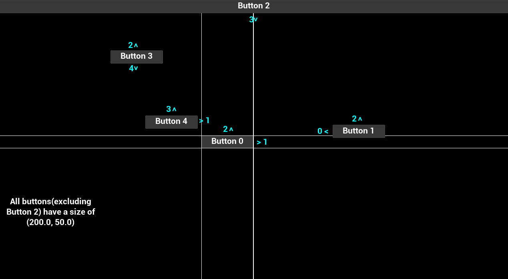 | 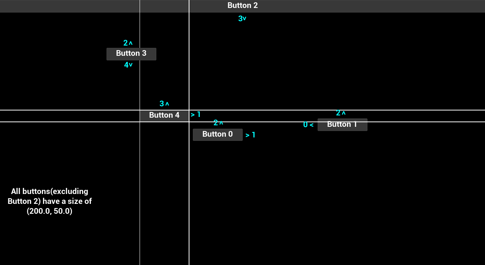 |
|:---------------------------------------------------------:|:---------------------------------------------------------:|

*In this example we show what buttons we can navigate to on navigation direction press. \
Button 2 in this case will always navigate to the closest widget because it can navigate to any widget below it.*

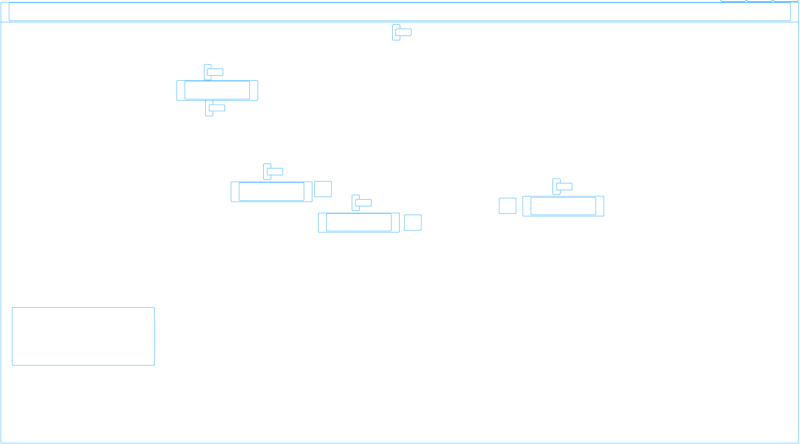 \
*This is what the navigation grid actually looks like in the example when using the “Slate.HitTestGridDebugging 1” console command.*

When an **Navigation Genesis** occurs it basically gets the cells that the currently focused widget is at and then based off the navigation direction the hit test grid check in a straight line \
to find the focusable widget by sweeping in each cell to see if there is a widgets bounding box within it and running through a series of checks in the specified order, if they fail these checks then we return a debug result for it and skip it:
1. **Does Not Intersect**: If the bounding rectangle of the widget is not intersecting with the sweep.
2. **Previous Widget Is Better**: If the widget isn’t closer than the previously checked widget then we failed because the previous widget was closer, the closest widget is always favored.
3. **Not A Descendent**: If the widget's boundary navigation rule isn’t Escape and the widget isn’t a descendent of our boundary condition widget(so we’re not supposed to navigate to this widget in the first place).
4. **Disabled**: If that widget is not enabled.
5. **Does Not Support Keyboard Focus**: This widget does not support keyboard focus.

After the widget has passed these tests it is saved as the Best Widget and saves its **Slate Rect**(to be used for navigation later) and then it checks what that widgets boundary navigation rule is \
(Explicit, Custom, CustomBoundary, Stop, Wrap) and handles for each one that isn’t Escape. Once the sweep reaches the window edge of the screen, it will send focus to the best widget.

You can also know when focus changes for any user(be sure to filter for specific users!) by getting the Slate Application and getting its `FocusChangingDelegate` and listening for focus changes. \
You can filter which user changed focus via the `FFocusEvent` that the delegate outputs that has the user index that changed focus(it also has the cause for the focus change in case you need to know that for a specific use case).

@TODO
*[Insert code snippet of the delegate and binding to an example function inside a player controller as well as how to filter in that function]*

<a name="navigation-genesis"></a>
#### Navigation Genesis

Navigation can be caused by 3 types, known as **Navigation Genesis**:
- **Keyboard**: The navigation event was caused by the keyboard input.
- **Controller**: The navigation event was caused by the gamepad input.
- **User**: The navigation event is a user generated event that was caused by game code, widgets, etc.

**[⬆ Back to Top](#table-of-contents)**
<a name="split-screen"></a>
## Split Screen

Split Screen works where it has a **Game Layer Manager** that manages the viewport slate widget, which player that’s using that slate widget and how to shape that slate widget. \
The game layer manager is instanced by the game engine on initialization inside `GameEngine.cpp`(`UGameEngine`) and in `PlayLevel.cpp`(`UEditorEngine`) using a hard coded class so to build your own it would require modifying the engine’s source code \
(Epic if you see this, please change this to be a configurable class that can be specified in the project settings, you have it setup for the Game Viewport Client so it's halfway there!).

When displaying a widget to the screen you have two options:
- **Add to Viewport**: Adds it to the entire game viewport, covering both players viewports with that one widget; \
useful for pause menus or anything that’s meant to entirely take up the screen and is something that should affect all other local players.
- **Add to Player Screen**: Adds it to that specific player’s viewport and does not cover other players viewports with that one widget; \
useful for HUDs or anything that is specific to that local player and not all the other players.

<a name="game-layer-manager"></a>
#### Game Layer Manager

The Game Layer Manager is an interface that has the barebones information for getting the geometry of the viewport, getting the local player using this widget, \
adding layers of widgets(not recommended unless you know what you’re doing) which holds all slate widgets that have been added to that specific viewport, and for holding the actual game viewport slate widget. \
The Game Layer Manager is located in `SGameLayerManager.h/cpp` and you can find the interface (`IGameLayerManager`) and a compound widget that is the `SGameLayerManager` which handles displaying the game viewport widget \
using a simple rectangle layout that is retrieved from the game viewport client. The `SGameLayerManager` also routes changes to DPI scale and for scaling the viewport based on the DPI scale value including all of its widget layers.

<a name="viewport-layout"></a>
#### Viewport Layout

By default the layout design is a rectangle shape that is customized via its X/Y size and its X/Y position on the screen in a 0-1 ratio for the center of it. \
This is set in the default `UGameViewportClient`’s constructor. \
If you want to create your own custom viewport shapes; you would have to create your own Game Layer Manager class to have it calculate out a custom shape and apply it to the viewport widget.

@TODO
*[Insert diagram showing how the Game Layer Framework works with split screen’s viewports]*

**[⬆ Back to Top](#table-of-contents)**
<a name="important-links"></a>
## IMPORTANT LINKS

Here is a list(starting with Epic related links then community links that are in no particular order) of important and helpful sources of information regarding Slate and UMG in Unreal Engine. \
Some links might have a description of what it is, to help understand why this link is included, or any other information I recommend checking out.

[Official Documentation for Slate Framework](https://docs.unrealengine.com/en-US/ProgrammingAndScripting/Slate/) \
[Official Documentation on Slate Widget Examples]() \
[Offical Documentation for UMG]() \
[Epic Approved Course for Introduction to Accessible Design]() \
[Epic's AnswerHub explaining Slate Units]() \
[Epic's Rich Text Documentation]() \
[Rich Text Article by Epic]() \
[My UMG/Slate Example Project](): My own UMG/Slate Example Project where I remade the Border Widget and commented all of the code with explanations of what is happening. \
[JoyRok's Website](): Technical Artist with UMG Tech Art Articles. \
[Ben UI's Website](): UI Engineer with UMG/Slate Articles. \
[Alessa "CodeKitten" Baker's Medium Site](): Technical Artist with Unreal Engine Slate Editor & Slate Articles. \
[Alex Forsythe explaining "The Unreal Engine's Game Framework: From int main() to BeginPlay", Youtube Video](): I also recommend checking out this channel’s other videos as they’re extremely informative. \
[Elhoussine Mehnik's Mesh Swapper Plugin, Github](): A plugin that creates its own editor viewport and window, a great example for extending the editor. \

**[⬆ Back to Top](#table-of-contents)**
<a name="important-file-names"></a>
## IMPORTANT FILE NAMES

Here is a list(in no particular order) of important/helpful C++ files within Unreal Engine that it’s recommended you should look at, some might not even be talked about in this compendium. \
You don’t need to understand it immediately but this helps with knowing helpful files to refer back to.

|         ClassName         |          Header          |           Source           | Notes                                                                                                                                                                                                                   |
|:-------------------------:|:------------------------:|:--------------------------:|:------------------------------------------------------------------------------------------------------------------------------------------------------------------------------------------------------------------------|
|    `FSlateApplication`    |    SlateApplication.h    |    SlateApplication.cpp    |                                                                                                                                                                                                                         |
|      `FHittestGrid`       |      HittestGrid.h       |      HittestGrid.cpp       |                                                                                                                                                                                                                         |
|         `SWidget`         |        SWidget.h         |        SWidget.cpp         |                                                                                                                                                                                                                         |
|         `UWidget`         |         Widget.h         |         Widget.cpp         |                                                                                                                                                                                                                         |
|       `SUserWidget`       |      SUserWidget.h       |      SUserWidget.cpp       |                                                                                                                                                                                                                         |
|       `UUserWidget`       |       UserWidget.h       |       UserWidget.cpp       |                                                                                                                                                                                                                         |
|    `FNavigationConfig`    |    NavigationConfig.h    |    NavigationConfig.cpp    | This is where most of the Navigation related types are, this includes structs and enums                                                                                                                                 |
|        [Multiple]         |       SlateEnums.h       |           [None]           | This is where most of the Slate related Enum Types are                                                                                                                                                                  |
|        [Multiple]         |     InputCoreTypes.h     |     InputCoreTypes.cpp     | This is where most of the Input related types are, this includes structs and enums                                                                                                                                      |
|    `SGameLayerManager`    |   SGameLayerManager .h   |   SGameLayerManager .cpp   |                                                                                                                                                                                                                         |
|   `UGameViewportClient`   |   GameViewportClient.h   |   GameViewportClient.cpp   |                                                                                                                                                                                                                         |
|        [Multiple]         |      UnrealClient.h      |      UnrealClient.cpp      | This one is interesting because it holds manager objects for the viewport's rendering and some of its functionality at the same time.<br/>This is also where screenshots are processed(including ones with/without UI). |
|     `FSceneViewport`      |     SceneViewport.h      |     SceneViewport.cpp      | This is where our viewport's slate widget is essentially housed.                                                                                                                                                        |
|     `IInputProcessor`     |    IInputProcessor.h     |           [None]           | This is the base interface class for Input Pre Processors, you would inherit from this class if you were making one. For an example of how to set one up, lookup FAnalogCursor                                          |
|      `FAnalogCursor`      |      AnalogCursor.h      |      AnalogCursor.cpp      |                                                                                                                                                                                                                         |
|       `FSlateUser`        |       SlateUser.h        |       SlateUser.cpp        |                                                                                                                                                                                                                         |
|      `ULocalPlayer`       |      LocalPlayer.h       |      LocalPlayer.cpp       | This also holds `FLocalPlayerContext` which is useful for passing around to UI and other objects to have context to the local player, its player controller, game instance, world, etc.                                 |
|  `UWidgetLayoutLibrary`   |  WidgetLayoutLibrary.h   |  WidgetLayoutLibrary.cpp   |                                                                                                                                                                                                                         |
| `USlateBlueprintLibrary`  | SlateBlueprintLibrary.h  | SlateBlueprintLibrary.cpp  | As a heads up, the script name is also written as "SlateLibrary" in case you have trouble finding it.                                                                                                                   |
| `UWidgetBlueprintLibrary` | WidgetBlueprintLibrary.h | WidgetBlueprintLibrary.cpp | As a heads up, the script name is also written as "WidgetLibrary" in case you have trouble finding it.                                                                                                                  |
| `UUserinterfaceSettings`  | UserinterfaceSettings.h  | UserinterfaceSettings.cpp  | This is also where the render focus rule and a few other data types that you find in those settings are declared.                                                                                                       |


**[⬆ Back to Top](#table-of-contents)**
