<a name="page-top"></a>
# UMG-Slate Compendium

Localized via [GitLocalize](https://gitlocalize.com/) (Please read the [FAQ](FAQ.md) page about becoming a translator!)

<a name="document-version"></a>
###### Document Version
<!---Major.Minor.Patch--->
*0.6.0*

<!--- 
Section naming:
Major.Minor.Mini

For creating diagrams I use lucidchart, it has a nice user interface and style for both creating charts and exporting(and it has a good free tier).

For the back to top arrow: 
**[<span>&#11014;</span> Back to Top](#table-of-contents)**
Place this at the end of major sections and minor sections should only have it if its after 5+ mini sections for UX purposes.
Mini sections should only have it if its not the last section in the major and only on the last mini section.

UE5 Editor Background Color:
- Hex Linear: 040404FF
- Hex sRGB: 242424FF
- Value: 0.017642
- Red: 0.017642 OR 24.0
- Green: 0.017642 OR 24.0
- Blue: 0.017642 OR 24.0
- Alpha: 1.0

To add a fake indent, this adds a bunch of forced spaces(I hate this, would be nice to have a simple "&tab" or something):
&nbsp;&nbsp;&nbsp;&nbsp;&nbsp;&nbsp;

Some rules regarding linking table of contents information:
- "--" is used for symbols like %, $, #, @, &
- Adding a new main category requires you to update the numbers so for the link we don't include the number just to save needless effort

This document uses "split screen" and not "split-screen"(excluding HTML linkage) or "splitscreen".

For categories we don't include the words in parenthesis just to keep it short and reasonable.

HTML Notes:
- <tr></tr> This will end the line horizontally and start a new line vertically.
- <td></td> Will end the line vertically and start a new line horizontally.
- Use <i></i> To italicize text.
- Use <b></b> To bold text.
- <a href="LINK" target="_blank">DISPLAY TEXT</a> For links in HTML. `target="_blank"` will make a new tab/window when link is selected.
- <br> for line breaks.
- <ul><li></li></ul> for non-ordered lists.
- <ol><li></li></ol> for ordered numbered lists.

--->

<a name="repo-page-links"></a>
## Repository Page Links

> - [FAQ Page](FAQ.md)
> - [External Links Page](EXTERNAL_LINKS.md)

<a name="table-of-contents"></a>
## Table of Contents

> 1.0 [Introduction](#introduction)  \
> 2.0 [Performance & Design Considerations](#performance--design-considerations) \
>    &nbsp;&nbsp;&nbsp;&nbsp;&nbsp;&nbsp;2.1 [CPU Considerations](#cpu-considerations) \
>    &nbsp;&nbsp;&nbsp;&nbsp;&nbsp;&nbsp;&nbsp;&nbsp;&nbsp;&nbsp;&nbsp;&nbsp;2.1.1 [Performance regarding Animations](#perf-animations) \
>    &nbsp;&nbsp;&nbsp;&nbsp;&nbsp;&nbsp;&nbsp;&nbsp;&nbsp;&nbsp;&nbsp;&nbsp;2.1.2 [Performance regarding Widget Components](#perf-widget-components) \
>    &nbsp;&nbsp;&nbsp;&nbsp;&nbsp;&nbsp;2.2 [GPU Considerations](#gpu-considerations) \
> 3.0 [Slate & UMG in Unreal](#slate--umg-in-unreal) \
> 4.0 [Slate](#slate) \
>    &nbsp;&nbsp;&nbsp;&nbsp;&nbsp;&nbsp;4.1 [Slate Widget Casting & Storing](#slate-widget-casting--storing) \
>    &nbsp;&nbsp;&nbsp;&nbsp;&nbsp;&nbsp;4.2 [Slate Units & DPI Scaling](#slate-units--dpi-scaling) \
>    &nbsp;&nbsp;&nbsp;&nbsp;&nbsp;&nbsp;4.3 [Slate Users](#slate-users) \
>    &nbsp;&nbsp;&nbsp;&nbsp;&nbsp;&nbsp;4.4 [Widget Layout](#widget-layout) \
>    &nbsp;&nbsp;&nbsp;&nbsp;&nbsp;&nbsp;4.5 [On Paint](#on-paint) \
>    &nbsp;&nbsp;&nbsp;&nbsp;&nbsp;&nbsp;4.6 [Widget Ticking](#widget-ticking) \
>    &nbsp;&nbsp;&nbsp;&nbsp;&nbsp;&nbsp;4.7 [Widget Hierarchy](#widget-hierarchy) \
>    &nbsp;&nbsp;&nbsp;&nbsp;&nbsp;&nbsp;4.8 [Invalidation](#invalidation) \
>    &nbsp;&nbsp;&nbsp;&nbsp;&nbsp;&nbsp;4.9 [Slate Attributes and Events](#slate-attributes-and-events) \
>    &nbsp;&nbsp;&nbsp;&nbsp;&nbsp;&nbsp;4.10 [Slate Widget Examples(Slate Test Suite/Starship)](#slate-widget-examples) \
>    &nbsp;&nbsp;&nbsp;&nbsp;&nbsp;&nbsp;4.11 [Helpful Console Commands for Slate](#helpful-console-commands-for-slate) \
> 5.0 [UMG (Unreal Motion Graphics)](#umg) \
>    &nbsp;&nbsp;&nbsp;&nbsp;&nbsp;&nbsp;5.1 [User Widget Hierarchy](#user-widget-hierarchy) \
>    &nbsp;&nbsp;&nbsp;&nbsp;&nbsp;&nbsp;5.2 [User Widget Animation](#user-widget-animation) \
>    &nbsp;&nbsp;&nbsp;&nbsp;&nbsp;&nbsp;5.3 [User Widget Events](#user-widget-events) \
> 6.0 [Common Widgets](#common-widgets) \
> 7.0 [Common Widget Functionality](#common-widget-functionality) \
> 8.0 [UMG in relation to Levels/Worlds](#umg-in-relation-to-levels-worlds) \
>    &nbsp;&nbsp;&nbsp;&nbsp;&nbsp;&nbsp;8.1 [HUD Actors](#hud-actors) \
>     &nbsp;&nbsp;&nbsp;&nbsp;&nbsp;&nbsp;&nbsp;&nbsp;&nbsp;&nbsp;&nbsp;&nbsp;8.1.1 [HUD Drawing](#hud-drawing) \
>     &nbsp;&nbsp;&nbsp;&nbsp;&nbsp;&nbsp;&nbsp;&nbsp;&nbsp;&nbsp;&nbsp;&nbsp;8.1.2 [HUD HitBoxes](#hud-hitboxes) \
>    &nbsp;&nbsp;&nbsp;&nbsp;&nbsp;&nbsp;8.2 [Widget Components](#widget-components) \
>     &nbsp;&nbsp;&nbsp;&nbsp;&nbsp;&nbsp;&nbsp;&nbsp;&nbsp;&nbsp;&nbsp;&nbsp;8.2.1 [Widget Interaction Components](#widget-interaction-components) \
>     &nbsp;&nbsp;&nbsp;&nbsp;&nbsp;&nbsp;&nbsp;&nbsp;&nbsp;&nbsp;&nbsp;&nbsp;8.2.2 [How Widget Components are Rendered](#widget-components-rendering) \
> 9.0 [Development & Debug Tools for UMG/Slate](#dev-debug-tools) \
>    &nbsp;&nbsp;&nbsp;&nbsp;&nbsp;&nbsp;9.1 [Debug Console Commands](#debug-console-commands) \
>    &nbsp;&nbsp;&nbsp;&nbsp;&nbsp;&nbsp;9.2 [Widget Reflector](#widget-reflector) \
>    &nbsp;&nbsp;&nbsp;&nbsp;&nbsp;&nbsp;9.3 [Slate Console Debugger](#slate-console-debugger) \
> 10.0 [Input Framework of Unreal Engine(relating to UMG/Slate)](#input-framework-of-unreal-engine) \
>    &nbsp;&nbsp;&nbsp;&nbsp;&nbsp;&nbsp;10.1 [Input Flow of Unreal Engine](#input-flow-of-unreal-engine) \
>    &nbsp;&nbsp;&nbsp;&nbsp;&nbsp;&nbsp;10.2 [Input Components](#input-components) \
>    &nbsp;&nbsp;&nbsp;&nbsp;&nbsp;&nbsp;10.3 [Input Event Types](#input-event-types) \
>    &nbsp;&nbsp;&nbsp;&nbsp;&nbsp;&nbsp;10.4 [Input Modes](#input-modes) \
> 11.0 [Unreal's Focusing System](#unreals-focusing-system) \
>    &nbsp;&nbsp;&nbsp;&nbsp;&nbsp;&nbsp;11.1 [Navigation Grid Explanation](#navigation-grid-explanation) \
>    &nbsp;&nbsp;&nbsp;&nbsp;&nbsp;&nbsp;11.2 [Navigation Genesis](#navigation-genesis) \
> 12.0 [Split Screen](#split-screen) \
>    &nbsp;&nbsp;&nbsp;&nbsp;&nbsp;&nbsp;12.1 [Game Layer Manager](#game-layer-manager) \
>    &nbsp;&nbsp;&nbsp;&nbsp;&nbsp;&nbsp;12.2 [Viewport Layout](#viewport-layout) \
>    &nbsp;&nbsp;&nbsp;&nbsp;&nbsp;&nbsp;12.3 [Local Players](#local-players) \
>    &nbsp;&nbsp;&nbsp;&nbsp;&nbsp;&nbsp;&nbsp;&nbsp;&nbsp;&nbsp;&nbsp;&nbsp;12.3.1 [Gamepad ID(Controller ID)](#gamepad-id) \
> 13.0 [Important File Names](#important-file-names)

<a name="introduction"></a>
## 1.0 Introduction

This compendium is intended to teach the basics of UMG & Slate and to
provide a base understanding of how to work with Unreal Engine’s UI
framework. PLEASE let me know if there is anything about this document
that can be improved upon because this is meant to help the community!

Please refer to the [FAQ Page](FAQ.md)(also linked at the top of the document) 
if you have further questions regarding the document(or anything relating to the document).

> An important note about skill level in programming and how its used in this
> document: usually when somebody refers to a concept as *“high level”* they
> mean its very complicated and requires a high skill level or a lot of
> experience, **BUT** in programming its flipped; where a *“high level”* concept is
> actually extremely easy to use and is a simple concept with little to no
> experience and the more *“low level”* it gets, the more complicated the
> concept becomes and requires a larger amount of experience.
> For example; **Blueprint** is a *“high level”* coding language, **C++** is a *“low level”*
> coding language.
> 
> GeeksForGeeks has a great and simple article explaining the difference: \
> *<u>https://www.geeksforgeeks.org/difference-between-high-level-and-low-level-languages/ </u>*

> An important note about the two types of Unreal Engine:
> - **Launcher Version**: The version of the engine that you would download
>   from the Epic Games Launcher; the engine is exposed to view but 
>   is not able to be modified, and is not able to submit code changes to Epic via GitHub.
> - **Source Code Version**: The version of the engine that you would
>   clone/download from GitHub; this gives full modifiable access to Unreal
>   Engine as well as being able to submit code changes to Epic via GitHub Pull Request's for them
>   to integrate into Unreal Engine’s future releases.

*All pictures of the editor in this document are from the launcher version of the engine.*

What this compendium covers:
- **Performance & Design considerations**
- **Slate Framework**
- **UMG Framework**
- **The input framework of Unreal Engine(relating to UMG/Slate)**
- **How the built in focusing system works**
- **How split screen generally works**

It is **NOT** intended to teach beginners how to use Unreal Engine in general,
just this specific aspect of the engine which encompasses a lot of the
engine.

This compendium requires you to have a basic understanding of these areas
of Unreal Engine:
- **How to use Blueprint and Unreal’s C++**
- **Unreal Engine’s garbage collection framework**
- **Unreal Engine’s gameplay framework**

This compendium will contain information that is taken from official
documentation but is intended to shed light on what some of the official
documentation means BUT it is not a redefinition of something that is
already explained.

*At the bottom of the document is a list of helpful links and files for you to refer back to \
(you can reach them easily using the [External Links Page](EXTERNAL_LINKS.md) link at the top of the file).*

**[<span>&#11014;</span> Back to Top](#table-of-contents)**
<a name="performance--design-considerations"></a>
## 2.0 Performance & Design Considerations

[Epic's Official Documentation on Performance and Optimization Guidelines for Slate & UMG](https://docs.unrealengine.com/latest/INT/optimization-guidelines-for-umg-in-unreal-engine/)

**UMG** & **Slate** are extremely performant frameworks for both the rendering (GPU) and computation (CPU) aspects.
But both aspects should be considered when building out you're UI to have the best experience for the User.

> This is not a "how to improve performance" guide,
> these are considerations to be aware of when building your application with UMG/Slate and possible avenues to help improve performance.

UI Complexity is usually in relation to the number of active and visible widgets
(so offscreen widgets don’t tick and should not run functionality if not on screen).
A common technical design with UI is to be reactive to gameplay code(it is also suggested if you're game isn't UI dependent) but not
to drive the gameplay code so it is performant and reusable, normally its fine for the UI to be the entry point
for executing the gameplay code but then it should listen to how the gameplay code responded and to react to it.

<a name="cpu-considerations"></a>
### 2.1 CPU Considerations

Slate/UMG use the concept of [Invalidation](#invalidation) and caching rather than constantly polling the data.
The reason for this is because sometimes polling is either not performant or functionally incorrect(for example when using multi-threaded code).
Typically performant UI in Unreal is intended to be **event based**.
UMG has **Property Binds** but they should not be used because they will be updated every frame
which is significantly more taxing on the CPU than using an event based framework.

|                                                                                             **CPU Technical Design Scenario**                                                                                             |
|:-------------------------------------------------------------------------------------------------------------------------------------------------------------------------------------------------------------------------:|
| In an RTS you need to have a UI marker for seeing where to place a squad of soldiers in the world,<br/>the player selects a valid spot in the world for where to place the UI marker and then the troops will move to it. |

|                                                                                                                                  **Good Example**                                                                                                                                   |                                                                            **Bad Example**                                                                            |
|:-----------------------------------------------------------------------------------------------------------------------------------------------------------------------------------------------------------------------------------------------------------------------------------:|:---------------------------------------------------------------------------------------------------------------------------------------------------------------------:|
| A player manager object creates the UI marker widget and manages where to move the troops.<br/>The world position that is chosen by the player is fed into the UI marker’s widget(from the player manager object) and the widget itself handles positioning itself in screen space. | The player picks a world position and feeds that directly to the UI marker, the UI marker then directly tells the troops where to move to and handles their movement. |

<a name="perf-animations"></a>
#### 2.1.1 Performance regarding Animations

Invalidating the desired size of multiple widgets by animating a large amount of widgets can have downstream effects of spending a lot of CPU time re-calculating the [Widget Layout](#widget-layout). 

- In previous versions of Unreal Engine when playing an animation with a UMG widget they would be separate from Sequencer(after Sequencers release it was quickly updated to use Sequencer as the underlying animation system).
- In previous versions of Unreal Engine post Sequencer update, the UMG widget would be set to volatile when animating.
- In current versions of Unreal Engine UMG widgets do not switch to volatile when animating.

Why should I use volatile?
> Honestly its not the answer everytime, what happens when you animate a UMG widget or change its visual state it will invalidate the widget for this frame and re-cache its new state until it is invalided again later on. 
> Setting it to volatile will not invalidate or cache the widget, it goes through a separate code path for volatile widgets which is a case-by-case basis of improving performance.
> Some avenues to use volatile for is by turning it on for a period of time and then turning it off when you no longer need it to be volatile.
- Some reminders about using volatile:
  - It does not cache the widget state, it is polled every frame it is on screen.
  - It tends to affect the widget hierarchy so be aware of downstream effects to parent widgets AND child widgets as well.

<a name="perf-widget-components"></a>
#### 2.1.2 Performance regarding Widget Components

Widget Components are great for prototyping and for in world VR/AR UI. They are not great when trying to have the UI be within the world while still respecting screen size, logic controlling layout, etc. \
Typically its good to use widget component if you have available texture budget because each widget component is really a static mesh plane with a render target texture applied to its material slot zero. \
Each widget component will create the UMG widget object and then render it out to a texture to show it in the world.

It is recommended to not use Widget Components heavily(excluding VR/AR) due to texture memory use. 
An alternative(which is more complicated) is to create a custom Slate Widget to handle rendering multiple "Widgets" at once you can do this using 
`SMeshWidget` which is 1 draw call per widget but it requires competent technical art skills to be able to draw multiple widget elements as 1 texture.

What is a `SMeshWidget`? \
It is a widget that has rendering capability of 1 draw call, it was used in Paragon to draw each status bar and icon on screen. 
It is extremely powerful but also requires a good understanding of how to draw these elements in code which is why you don't see it oftenly used, 
this is intended to not be exclusive to just textures or particles but can be used with 3D models/meshes or anything you want to render.

Nick Darnell actually put together an example of using `SMeshWidget` to draw particles in UE4:
- [Forum Link](https://forums.unrealengine.com/t/smeshwidget-hardware-instanced-slate-meshes-thread/58020/5)
- [Dan Treble was kind enough to turn the example project into a Github Repository](https://github.com/dantreble/MeshWidgetExample)

Carey Hickling gave an Unreal Fest talk "Optimizing and Building UI for AAA Games" and talks about the Pros/Cons of `SMeshWidget`:
[YouTube Link](https://youtu.be/OyY3OYbNK7s)

For another possible avenue, recommend taking a look at Epic's Lyra example project and at the indicator system, related files in that project:
- `SActorCanvas`.h/.cpp
- `IndicatorLayer`.h/.cpp
- `IActorIndicatorWidget`.h/.cpp
- `IndicatorDescription`.h/.cpp
- `IndicatorLibrary`.h./cpp
- `LyraIndicatorManagerComponent`.h/.cpp

<a name="gpu-considerations"></a>
### 2.2 GPU Considerations
Most of the general GPU considerations you would have to worry about are
the same when working in 3D space, such as:
- **Texture memory sizes**
- **Computational complexity of material shader**
- **Draw calls**

If your framework is built out properly, GPU optimization wouldn’t be an issue when it comes to Slate/UMG due to it using some of Unreal’s 3D
rendering features to unify some of the work.

An important gotcha with Unreal Engine is that it does not have a robust method of swapping between different textures depending on platform type. \
For example; switching from Mobile to PC, you will have to build those systems out yourself so that unused textures are not cooked, loaded, \
referenced, or even stored on the hard disk on the platform that you do not want them to be on.

**[<span>&#11014;</span> Back to Top](#table-of-contents)**
<a name="slate--umg-in-unreal"></a>
## 3.0 Slate & UMG in Unreal
Unreal Engine uses **Slate**; its custom **UI Programming Framework**. It is used
for both game and non-game applications using Slate Widgets. \
Some examples include:
- The Unreal Editor is built entirely using Slate.
- (Credit to Nick Darnell for explaining this) The Epic Games Launcher uses Slate as a frame and displays a chromium app.
- The Halo Master Chief Collection uses UMG/Slate(TBD) for its UI(this is based off public announcements and not insider knowledge).

**Slate** is entirely used only within C++ using declarative syntax and is **<u>NOT</u>** derived from the `UObject` hierarchy.

Pros of Slate:
- **Performance gains from entirely being in C++**
- **Usable for generic application usage** (an example of this is that the Epic Game’s Launcher and the Unreal Editor itself is entirely built with Slate)
- **Used to extend the editor** (this is due to the Unreal Editor being built from Slate in the first place)
- **Not used with Unreal’s Garbage Collection System**

Cons of Slate:
- **Entirely within C++** (there’s no visual designer, this is what the UMG Designer is for really)
- **Not able to have sequencer animations** (everything is hard coded so longer iteration times)
- **Requires thorough knowledge to be able to use it for full production**
- **Not usable with Blueprints**
- **Not used with Unreal’s Reflection System, meaning it doesn't work with Unreal's Garbage Collection System**

 \
*Slate Test Suite (In UE5 its called Starship Gallery)*

**UMG** (**Unreal Motion Graphics**) is derived from the `UObject` hierarchy but aren't `Actor`’s and
is used to create & display Slate Widgets (basically a Unreal Engine friendly wrapper for Slate to work with Blueprint).

Pros of UMG:
- **Can be used with Blueprints and C++**
- **Allows for artist driven animation’s**
- **Has a visual designer**
- **Used with Unreal's Reflection System, meaning it works with Unreal’s Garbage Collection System**
- **Able to extend the editor** (Unreal Engine 4.23+ using Editor Utility Widgets)

Cons of UMG:
- **Restricted to Unreal Engine** (not usable outside the engine for regular OS applications)
- **Ease of use also can cause developers to cause technical debt and for the UI to get messy**


**[<span>&#11014;</span> Back to Top](#table-of-contents)**
<a name="slate"></a>
## 4.0 Slate

The Slate Framework has two core parts:
- **Slate Renderer**
  - Slate Widgets are displayed using its own renderer called the Slate Renderer,
  it handles rendering UI elements in front of the game’s viewport as well as combining with Unreal’s world rendering pipeline to display UI elements.
- **Slate Application** 
  - The Slate Application is an object that manages all the CPU related tasks of Slate Widgets such as their viewport positions,
  user focus navigation, widget hierarchy placement and tracking, receiving input and routing that input to either Slate Widgets
  or to the rest of the game engine (yes this is where the raw inputs are received before UI element’s get them) and registering
  (creating)/tracking the Slate Users.

<a name="slate-widget-casting--storing"></a>
### 4.1 Slate Widget Casting & Storing

Since **Slate Widgets** are **<u>NOT</u>** derived from `UObject`, that means you can’t use Unreal’s object casting system to get specific Slate
types as well as not being able to take advantage of `UObject`'s garbage collection. 
Instead Slate uses Unreal's Shared Pointers(also known as Smart Pointers) Framework for its memory management of Widgets. 

There are three shared pointer template types:
- `TSharedRef`: Non-nullable, reference counted, non-intrusive authoritative smart pointer.
- `TSharedPtr`: Reference counted, non-intrusive authoritative smart pointer.
- `TWeakPtr`: Reference counted, non-intrusive weak pointer reference.

> An important note is that when all reference counts are gone for a shared reference; the object will be deleted and a limitation is that it will only call the default destructor so custom destructors with parameters are not usable.

Using shared pointers allows you to assume ownership of these slate widgets without having to call delete on them. \
*I recommend taking a look at [Epic's Documentation on Smart Pointers](https://docs.unrealengine.com/5.0/en-US/smart-pointers-in-unreal-engine/)*

> An important note that when casting Slate Widget's it is totally fine to use standard casting such as `static_cast` and `const_cast`, 
> but I do recommend using Unreal's templated cast versions listed below to save time.

There are also helper classes and functions to make life easier regarding using Unreal's Shared Pointers framework and this includes working with Slate.

- `MakeShareable`: Used to initialize shared pointers from C++ pointers.
  ```c++
  TSharedPtr<FMyCustomCalculator> calculator = MakeShareable(new FMyCustomCalculator());
  ```
- `TSharedFromThis`: Used with custom C++ classes as something you inherit from to allow it to be used with Unreal's Shared Pointers framework. 
  ```c++
  /** Special class to handle custom calculations */
  class FMyCustomCalculator : public TSharedFromThis<FMyCustomCalculator>
  {
  public:
    FMyCustomCalculator()
    { }
    // ...
  };
  ```
- `StaticCastSharedRef`: Static cast utility function, typically used to downcast to a derived type when getting a smart reference.
  ```c++
  void MyFunction(FMySubCalculator& CalculatorItem)
  {
    TWeakPtr<FMyCustomCalculator> calculator = StaticCastSharedRef<FMyCustomCalculator>(CalculatorItem.AsShared()); 
    // ...
  }
  ```
- `ConstCastSharedRef`: Converts a `const` reference to `mutable` smart reference.
  ```c++
  void MyFunction(TSharedRef<const FMyCustomCalculator> CalculatorItem)
  {
    TSharedRef<FMyCustomCalculator> calculator = ConstCastSharedRef<FMyCustomCalculator>(CalculatorItem); 
    // ...
  }
  ```
- `StaticCastSharedPtr`: Dynamic cast utility function, typically used to downcast to a derived type. This is what you would use instead of `static_cast`(its not a requirement but it requires less typing).
  ```c++
  void MyFunction(TWeakPtr<FMyCustomCalculator> CalculatorItem)
  {
    TSharedPtr<FMyCustomCalculator> calculator = StaticCastSharedPtr<FMyCustomCalculator>(CalculatorItem.Pin()); 
    // ...
  }
  ```
- `ConstCastSharedPtr`: Converts a `const` smart pointer to `mutable` smart pointer. This is what you would use instead of `const_cast<>`(its not a requirement but it requires less typing).
  ```c++
  void MyFunction(TSharedPtr<const FMyCustomCalculator> CalculatorItem)
  {
    TWeakPtr<FMyCustomCalculator> calculator = ConstCastSharedPtr<FMyCustomCalculator>(CalculatorItem); 
    // ...
  }
  ```
For more information please refer to these files:
- Examples using the different utility functions and templates: `Engine/Source/Runtime/Core/Public/Templates/SharedPointerTesting.ini`
- Explanation of Unreal Engine's Shared Pointer System: `Engine/Source/Runtime/Core/Public/Templates/SharedPointer.h`

<a name="slate-units--dpi-scaling"></a>
### 4.2 Slate Units & DPI Scaling
- **Slate Units**: Unreal’s way of making a UI that is independent of pixel density so your application can support multiple platforms easily.
This allows for it to be more precise and independent of the pixel density of the user’s monitor.
A single slate unit can vary in physical size but by default it is conveniently set to 1 pixel for each slate unit.
To set the default value; it is recommended to adjust the base DPI Scaling instead.
- **DPI Scaling**: How Unreal modifies the slate units conversion at runtime by scaling each slate unit by this value,
so for example if you’re slate units are set to 1 unit = 1 pixel, and the dpi scaling is set to a value of 2.5 then each
slate unit would be 1 unit = 2.5 pixels. You can change the DPI scaling depending on the resolution via a curve table in
the project settings under the “Engine-User Interface” category.

Epic themselves admits it’s not perfect but it works well for most-all use cases. \
[Epic's AnswerHub explaining Slate Units](https://forums.unrealengine.com/t/what-are-slate-units/310703)

<a name="slate-users"></a>
### 4.3 Slate Users
**Slate Users** are classes that represent that a local individual input-providing user
(for example; in split screen co-op with 3 players then there are 3 Slate Users, but in an online game with 32 players and no split screen then the only local player is the only Slate User on this device).
Each **Platform’s SDK** will tell the **Slate Application** to register (create) a new Slate User when a new connection is added (for example when a new controller is plugged in).
When a new connection is added, a new Slate User is created but not when a connection is removed to account for a controller disconnecting accidentally (to keep the settings for that controller just in case they reconnect).
When a connection is removed, that Slate User is just not updated. The Slate User instance keeps track of the widget that the user is currently focusing on,
and controls the cursor/has pointer information to account for gestures (this is only for the first Slate User because you can’t plug in multiple mouses and if you are… why?).

You can access the Slate User via 2 primary ways:
- From the Slate Application using an integer index for that local Slate User.
- From a `ULocalPlayer` object which you can get from any Player Controller.

> An important thing to note is that Local Player’s can exist before the Player Controller is spawned
> (there’s functions in Player Controllers for when their Local Player is set that you can override),
> and Local Player’s exist between levels instead of per level like Player Controllers since they are UObjects and not Actors.

```c++
// The way you get the local player is dependent on your own needs
// This is meant to be an example,
// NOT INTENDED FOR FINAL/RELEASE CODE
ULocalPlayer* localPlayer = nullptr;
if(UWorld* const world = GetWorld())
{
    if(APlayerController* const pc = world->GetFirstPlayerController())
    {
        localPlayer = pc->GetLocalPlayer();
    }
}
// Valid check the local player pointer
if(!IsValid(localPlayer))
{
    // If its not valid then exit the function
    return;
}
// Make sure Slate is initialized and working properly 
if(FSlateApplication::IsInitialized())
{
    // This function will return the Slate User that this local player is tied to
    FSlateApplication::Get().GetUser(localPlayer->GetControllerId());
}
```
*Code example for how to get the Slate User using the player controller's local player object*

<a name="widget-layout"></a>
### 4.4 Widget Layout

The way a Slate Widgets layout is calculated is done in two passes (listed in order of execution):
1. **Cache Desired Size**: Calculate how much space each widget wants to occupy,
this occurs through a *Bottom-Up* approach where it guarantees when this pass happens for a widget,
its children have already computed and cached their desired size.

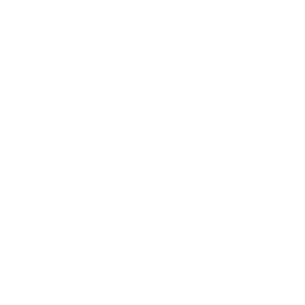 \
*Example of Desired Size for a Horizontal Box with Textblock and Image widget's*

For the desired size example we have a horizontal box holding a text block and an image widget.
In this case we compute the desired size for the text block (which is measured by the string that is displaying) and the image widget (which is measured based on the image data that is shown).
Then the horizontal box is computed by combining the text block and image widget’s(we are assuming that the text block is 14 slate units and the image widget is 8 slate units) desired sizes,
so for this example 14 slate units + 8 slate units = 22 Slate Units.

2. **Arrange Children**: This occurs in a *Top-Down* approach where the widget is asked to arrange its children based on
their desired sizes and the desired size of this widget (which all occurred in the first pass).

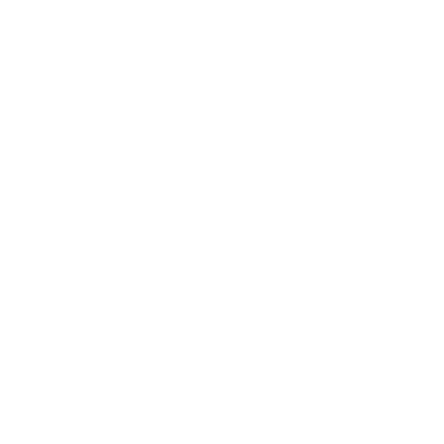 \
*Example of Arranged Children using Allotted Size for a Horizontal Box with Textblock and Image widget’s*

For the arranged children example the horizontal box was allotted 25 slate units by its parent widget (not shown to keep things simple).
The first horizontal box slot indicates that it wants the desired size of the child which is 14 slate units from the text block,
while the second slot wants to fill the available width which is 11 slate units remaining for the image widget.

<a name="on-paint"></a>
### 4.5 On Paint

**Drawing Slate** is the process where Slate will iterate over all visible widgets and create a list of **Draw Elements** to send to the rendering system, this list is created every frame.

This occurs in an On Paint function where it will do two things:
- Arrange all the children based on their **Geometry** (desired size).
- Paint the actual visuals related to this widget.

**[<span>&#11014;</span> Back to Top](#table-of-contents)**
<a name="widget-ticking"></a>
### 4.6 Widget Ticking

Slate Widget's(which also means UMG widget's) themselves do not tick, they do not have tick components and do not have tick groups.
The order that Slate Widget's tick occurs is during the Paint pass with these calls originating from the Slate Application,
so that a widget's tick function will only be called when it is on screen and being rendered:
1. `FSlateApplication::Tick`
2. `FSlateApplication::TickAndDrawWidgets`...
3. `SWidget::Paint`
4. `SWidget::OnPaint`...
5. `SObjectWidget::Tick`
6. `UUserWidget::NativeTick`(this is when Blueprint will receive tick too)

<a name="widget-hierarchy"></a>
### 4.7 Widget Hierarchy

The concept of the **Widget Hierarchy** is done using child slots, which are optional objects that can be tied to a Slate Widget
(because some Widgets are not designed to have children such as the Image widget(**Leaf Widget**))
but requires the slot to be custom build for tracking each widgets child such as how the Button widget(**Compound Widget**)
only accepts 1 child widget meanwhile an Overlay widget can have multiple child widgets.

Widgets usually come in 3 main types:
- **Leaf Widgets**: Widgets with no child slots. \
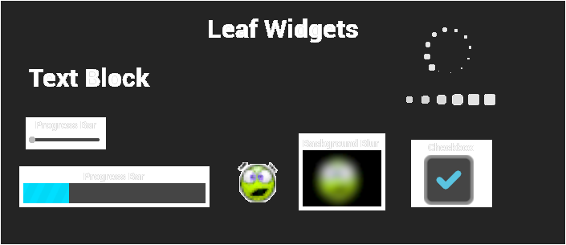
- **Panels Widgets**: with a dynamic number of child slots. \
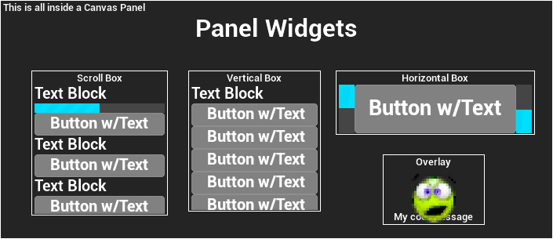
- **Compound Widgets**: Widgets with a fixed number of explicitly named child slots. \
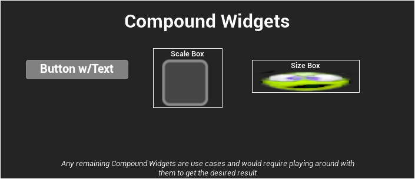

The key elements of any Slate Widget (also known as an SWidget, where every Slate Widget is prefixed with a capital ‘S’ in C++)
are a mix of functions and values:
- **Compute Desired Size** (Function): Responsible for calculating the desired size as the first pass for layouting.
  - **Slate Rect** (Value): A rectangle with its origin at the top left corner, defined by upper-left and lower-right corners.
  The origin is in the top-left with the Y-axis going downwards and X-axis going to the right. This is used with calculations for desired size and for the bounds.
- **Arrange Children** (Function): Responsible for arranging child widgets as the second pass for layout's.
- **On Paint** (Function): Responsible for the actual rendered appearance of the widget.
- **Event Handlers** (Delegate values and/or Functions): These are the event based hooks for the UI elements to change at runtime usually in the form of “OnSomething”.

<a name="invalidation"></a>
### 4.8 Invalidation

[Epic's Official Documentation on Invalidation with Slate & UMG](https://docs.unrealengine.com/latest/INT/invalidation-in-slate-and-umg-for-unreal-engine/)

To avoid having to calculate the desired size of the widget every frame (which can tax the CPU if it’s happening to a lot of Widgets at once),
Widgets have the concept of caching their desired size, but at runtime if the size of the widget changes (either through an animation or through game code)
then it will **Invalidate** the widget to tell Slate that this widget needs to recalculate its **Desired Size** and then **Rearrange the Layout** that widget is in (or has).
This is an optimization to avoid polling for each widget's desired size every frame when it doesn’t need to recalculate it.

There are different types of invalidation reasons that you can specify when invalidating a widget located in `InvalidateWidgetReason.h`:
- Layout: Use Layout invalidation if your widget needs to change desired size. This is an expensive invalidation so do not use if all you need to do is redraw a widget.
- Paint: Use when the painting of widget has been altered, but nothing affecting sizing.
- Volatility: Use if just the volatility of the widget has been adjusted.
- ChildOrder: A child was added or removed(this implies prepass and layout).
- RenderTransform: A Widgets render transform changed.
- Visibility: Changing visibility (this implies layout).
- AttributeRegistration: Attributes got bound or unbound (it's used by the SlateAttributeMetaData).
- Prepass: Re-cache desired size of all of this widget's children recursively (this implies layout).
- PaintAndVolatility: Use Paint invalidation if you're changing a normal property involving painting or sizing. Additionally if the property that was changed affects Volatility in anyway, it's important
  that you invalidate volatility so that it can be recalculated and cached.
- LayoutAndVolatility: Use Layout invalidation if you're changing a normal property involving painting or sizing. Additionally if the property that was changed affects Volatility in anyway, it's important
  that you invalidate volatility so that it can be recalculated and cached.

<a name="slate-attributes-events"></a>
### 4.9 Slate Attributes and Events

Slate(and through Slate; UMG) support the usage of Attribute's for binding properties/functions/lambdas to a widget's property(s).
Widget Attributes are only updated if the widget is visible/not collapsed, so setting its visibility to hidden will cause it not to update.

Attributes are particularly useful with widget styling where you can specify the different visual styles of widgets across the project as general theme. Which improves productivity across the project for both engineering and art teams.

- `TAttribute`: Base attribute type of Unreal Engine, do not use for member properties in SWidget's. 
  - Not compatible with invalidation because it does not broadcast when the data changes. 
  - Not cache-friendly(which means it can be slower for the CPU).
  - If you use `TAttribute` to change state of an SWidget then you need to override `ComputeVolatility`(this is not needed for `TSlateAttribute` & `TSlateManagedAttribute`).
- `TSlateAttribute`: Should be used with SWidget member properties, allows the property to work with Slate's invalidation system and is more performant for Slate specific code while keeping attributes safe across the engine. 
  - Does not inherit from `TAttribute`, this inherits from `FSlateAttributeBase`/`TSlateMemberAttribute`.
  - Not copyable but if you need it to be movable then it is recommended to use `TSlateManagedAttribute` instead.
  - Updated once per frame in the PrePass update phase and because of this are more performance friendly. 
  - Member attributes are updated in the order that the variables are defined in the SWidget definition(by default). 
  - Allows for the invalidation reason to be a predicate and/or can be overriden per SWidget but use this with precaution since it can break invalidation for parent widget's.
- `TSlateManagedAttribute`: Should be used with SWidget member properties that are inside arrays OR other moving data structures. 
  - Does not inherit from `TAttribute`, this inherits from `FSlateAttributeBase`/`TSlateMemberAttribute`.
  - Can only be moved and not copied, they consume more memory because of this.

> - `TAttributes` have a high memory overhead and are not cache friendly. So use at your own discretion.
> - All slate attributes are saved inside `SlateAttributeMetaData` for easy access in each SWidget.

When declaring event and attribute macros inside an SWidget you need to have them be between two other macros:
- `SLATE_BEGIN_ARGS` OR `SLATE_USER_ARGS`: The difference is that `SLATE_USER_ARGS` requires the user to have all widget implementation within the source file, 
so the header can only hold declaration information where all handlers are essentially truly private and can be inlined(so less boilerplate code).
- `SLATE_END_ARGS`

Using these macros allows the widget authors to add support for widget construction via `SNew` and `SAssignNew`.

Attributes in Slate also have specific macros that must be used when declaring them and must be used if you want to expose these properties when creating a Slate Widget at runtime.

- `SLATE_ATTRIBUTE`:
  - Allows the attribute to be used with a value OR a function.
  - Takes the attribute type as the first parameter and the name of the attribute for the second parameter(recommend matching the member property to avoid confusion).
- `SLATE_ARGUMENT`:
  - Allows the attribute to only be used with a value.
  - Takes the attribute type as the first parameter and the name of the attribute for the second parameter(recommend matching the member property to avoid confusion).
- `SLATE_ARGUMENT_DEFAULT`: Same as `SLATE_ARGUMENT` but also supports default values, syntax: `SLATE_ARGUMENT_DEFAULT(float, WheelScrollMultiplier) = 1.0f;`
- `SLATE_STYLE_ARGUMENT`: Same as `SLATE_ARGUMENT` but they can only be used with types that inherit from `FSlateWidgetStyle` for a widget's visual styling purposes.

Here is an example where we're making a custom button widget using these macros.
```c++
class SMyButtonWidget : public SMyParentWidget
{
    SLATE_DECLARE_WIDGET(SMyButtonWidget, SMyParentWidget)
public:

    /** Setup default values for these arguments, underscore is to avoid shadowing of member names */
    SLATE_BEGIN_ARGS( SMyButtonWidget )
        : _Style(&FCoreStyle::Get().GetWidgetStyle< FButtonStyle >( "Button" ))
        , _AdditionalPadding(FMargine(4.0f, 2.0f))
        , _CanBounce(true)
    { }

    /** Scaling for after the button is customized */
    SLATE_ARGUMENT_DEFAULT( float, CustomizedScaling ) = 1.0f;

    /** Visual style of the button */
    SLATE_STYLE_ARGUMENT( FButtonStyle, Style )
    
    /** Additional padding for what this button needs to display its visuals. */
    SLATE_ATTRIBUTE( FMargin, AdditionalPadding )
    
    /** For knowing if the button should be able to bounce when clicked. */
    SLATE_ARGUMENT( bool, CanBounce )

    SLATE_END_ARGS()
    
    /**
	 * Construct this widget
	 *
	 * @param	InArgs	The declaration data for this widget
	 */
	void Construct( const FArguments& InArgs )
	{
	    // Order does not matter here but to get the property we need the underscore infront of the value we're getting.
	    bCanBounce = InArgs._CanBounce;
	    Style = InArgs._Style;
	    AdditionalPadding = InArgs._AdditionalPadding;
	    CustomizedScaling = InArgs._CustomizedScaling;
	}

private:

    /** Scaling for after the button is customized */
    float CustomizedScaling;

    /** Style resource for this custom button. */
    const FButtonStyle* Style;
    
    /** Additional padding for what this button needs to display its visuals. */
	TSlateAttribute<FMargin> AdditionalPadding;

    /** Flag to know if this button can be bounced when clicked. */
    TSlateAttribute<bool> bCanBounce;
}
```

Slate Events are basically delegates in SWidgets for binding on widget creation, you would declare your delegate in C++ with this macro in the Arguments range macro declaration. 

- `SLATE_EVENT`: Adds event handler support for this widget with a specific member variable, this exposes delegates for binding on creation. Expects that the widget has a delegate fo the `EventDelegateType` that is named the same as the event's name that was inputted in.

Here is an example widget that is using the event macro for when it is hovered.
```c++
class SMyWidget : public SMyParentWidget
{
    SLATE_DECLARE_WIDGET(SMyWidget, SMyParentWidget)
public:

    SLATE_USER_ARGS( SMyWidget )
    { }

    /** Called when this widget is hovered. */
    SLATE_EVENT( FSimpleDelegate, OnHovered)

    SLATE_END_ARGS()

private:

    /** Called when this widget is hovered. */
    FSimpleDelegate OnHovered; // FSimpleDelegate is within the engine BTW
}
```

<a name="slate-widget-examples"></a>
### 4.10 Slate Widget Examples(Slate Test Suite/Starship Suite)

The **Slate Widget Examples** (also known as **Slate Test Suite** if using UE4/ **Starship Suite** if using UE5)
is a collection of Slate built examples such as radio buttons, responsive grid, color wheel, etc.

You can access the test suite within the Unreal Editor by going to:
1. This is different depending on whether you’re using UE4/UE5 
   - UE4: `Window>Developer Tools>Debug Tools` 
   - UE5: `Tools/Debug/Debug Tools` \
   
2. Select `Test Suite` \
   

You can also run the Test Suite as its own application without the Unreal Editor open if you have the source code version of the engine
and build the Test Suite program(which will create the executable in `[EnginePath]/Engine/Binaries/Win64/`).
- UE4
  - `[EnginePath]/Engine/Source/Runtime/AppFramework/Public/Widgets/Testing/STestSuite.h`
  - `[EnginePath]/Engine/Source/Runtime/AppFramework/Private/Widgets/Testing/STestSuite.cpp`
- UE5
  - `[EnginePath]/Engine/Source/Runtime/AppFramework/Public/Widgets/Testing/SStarshipSuite.h`
  - `[EnginePath]/Engine/Source/Runtime/AppFramework/Private/Widgets/Testing/SStarshipSuite.cpp`

 \
*Test Suite from UE4, currently the UE4 version of the test suite is more feature rich than Starship Suite in UE5.*

<a name="helpful-console-commands-for-slate"></a>
### 4.11 Helpful Console Commands for Slate

> For debug console commands please navigate to [Debug Console Commands](#debug-console-commands) of the [Development & Debug Tools for UMG/Slate](#dev-debug-tools) section.

- `Slate.GlobalScrollAmount [float value]` (default = 32.0): The amount used for scrolling for each click of the mouse wheel(in Slate Units).

**[<span>&#11014;</span> Back to Top](#table-of-contents)**
<a name="umg"></a>
## 5.0 UMG (Unreal Motion Graphics)

The UMG framework are UObject’s that have to be tied to a specific **Player Controller** known as the **Owning Player**(to account for split screen),
if nothing is inputted for the owning player then it will automatically be connected to the first local player in the level.

The hierarchy of UMG’s object types is laid out below:
- **UVisual**: The base class for elements in UMG Slots and Widgets.
  - **UWidget**: The base class for all Widgets, they create Slate Widgets and handle routing functionality from Blueprint/UObject based classes to Slate.
  These are widgets like TextBlock, ScrollBox, Button, etc.
    - **UUserWidget**: The base class for designing UI, animating UI, and connecting that functionality to game code.

User Widgets are built out of Widgets except how a User Widget does not require a root widget,
basically like how Actors are built out of multiple Actor Components and require a root Actor Component(known as Root Component).

User Widgets cannot inherit their **Widget Hierarchy** like how Actors do with Components but they can inherit class functionality
(so making a User Widget abstract will allow for other classes to inherit from it or creating the class in C++ will allow for inheritance).

<a name="user-widget-hierarchy"></a>
### 5.1 User Widget Hierarchy

Each **User Widget** is the root `UWidget` by design, so a User Widget can have no widgets inside it and is by default a **Compound Widget** that can only have 1 child,
but that child can have other children under it and causes the cascading effect of child widgets within each User Widget's **Tree Hierarchy**.

|                                                                                             Designer/Hierarchy Editor View                                                                                              |                                  Runtime Result                                  |
|:-----------------------------------------------------------------------------------------------------------------------------------------------------------------------------------------------------------------------:|:--------------------------------------------------------------------------------:|
| 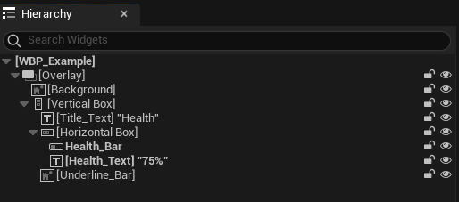<br/>*`Health_Bar` and `Health_Text` are **bold** because they have their `Is Variable` flag enabled*<br/>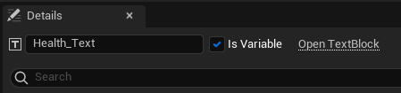 | 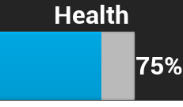 |

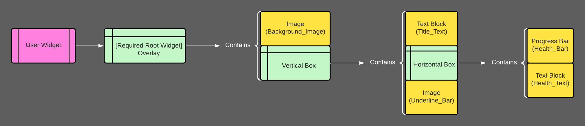
*Example of that hierarchy as a diagram*

<a name="user-widget-animation"></a>
### 5.2 User Widget Animation

Every User Widget is able to create custom animations using the widgets within that User Widget via **Sequencer**.
You can create these animations inside the Widget Designer and you’re able to modify things relating to that widget specifically such as render transform, widget visibility, etc.
You can also modify properties of widgets such as material parameters, runtime values within the widget, etc.

 \
*Example of the animation designer in UMG*

If a User Widgets **Tick Frequency** is set to **Never** instead of **Auto** in the class defaults then it will never run animation’s
because for an animation to play at all, the user widget needs to be able to tick that animation and
if the user widgets ability to tick is turned off(by setting its tick frequency to never) then it will not tick the animation object.

<a name="user-widget-events"></a>
### 5.3 User Widget Events

Every user widget has built in events that you can implement and add your own functionality from;

- **Pre Construct**: This occurs both in editor in the designer and before the widget is actually created, similar to the Construction Script found on Actors.
```c++
virtual void UUserWidget::NativePreConstruct()
{
    // Call BP version
    PreConstruct(IsDesignTime());
}
```
  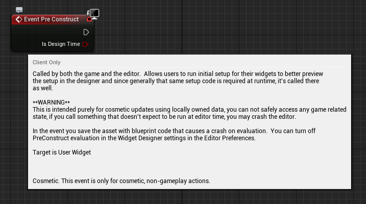
- **On Initialized**: This occurs only once at runtime when the non template instance is created(when you spawn a user widget).
```c++
virtual void UUserWidget::NativeOnInitialized()
{
    // Bind any input delegates that may be on this widget to its owning player controller
    if(APlayerController* PC = GetOwningPlayer())
    {
    	UInputDelegateBinding::BindInputDelegates(GetClass(), PC->InputComponent, this);		
    }
    
    OnInitialized();
}
```
  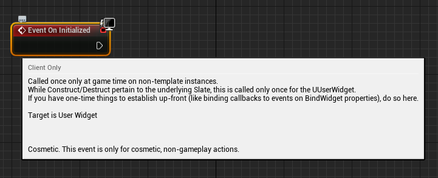
- **Construct**: This can occur multiple times on a single user widget because it is based on when it is Constructed to the screen (Add to Viewport or Add to Player Screen). 
So if you're removing the widget from parent and re-adding it later then it's recommended not to put first time initialization code in this but instead put that in “On Initialized”.
```c++
virtual void UUserWidget::NativeConstruct()
{
    // Call BP version
    Construct();
    UpdateCanTick();
}
```
  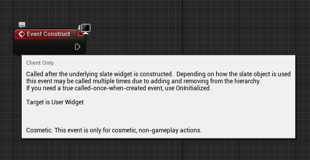
- **Destruct**: Occurs when this widget is no longer on screen, can be called multiple times as its the inverse of Construct where it occurs when this widget is removed from parent.
```c++
virtual void UUserWidget::NativeDestruct()
{
    StopListeningForAllInputActions();
    // Call BP version 
    Destruct();
}
```  
  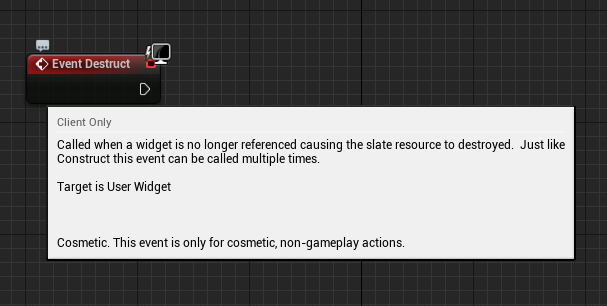
- **On Paint**: Occurs when this widget is painted every frame, different from Tick as it is meant to handle Paint Context information.
```c++
virtual int32 UUserWidget::NativePaint(const FPaintArgs& Args, const FGeometry& AllottedGeometry, const FSlateRect& MyCullingRect, FSlateWindowElementList& OutDrawElements, int32 LayerId, const FWidgetStyle& InWidgetStyle, bool bParentEnabled ) const
{
    // If BP implemented the function
    if ( bHasScriptImplementedPaint )
    {
    	FPaintContext Context(AllottedGeometry, MyCullingRect, OutDrawElements, LayerId, InWidgetStyle, bParentEnabled);
    	// Call BP version
    	OnPaint( Context );

    	return FMath::Max(LayerId, Context.MaxLayer);
    }

    return LayerId;
}
```
  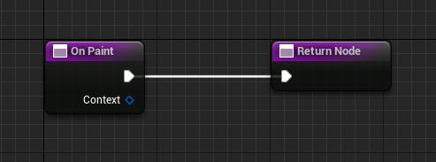
- **Tick**: This will occur every frame that this widget is on screen, it will not tick if the widget is not being shown(even if it still exists, the only thing that matters is that it is being shown then its ticking).
```c++
virtual void UUserWidget::NativeTick(const FGeometry& MyGeometry, float InDeltaTime)
{
    //...
    
    // If BP implemented the function in the event graph
    if (bHasScriptImplementedTick)
    {
        // Call BP version
    	Tick(MyGeometry, InDeltaTime);
    }
}
```
  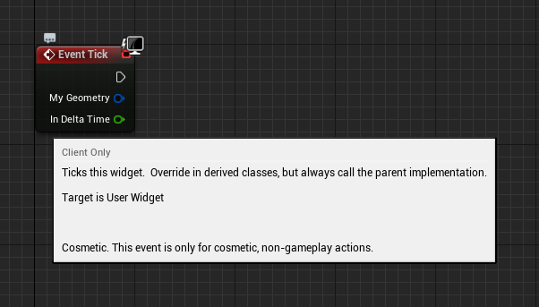
- **On Animation Started**: Occurs when an widget animation starts playing, it will give you that widget that started playing in case you need to check against it or use it later.
(For Blueprint users; recent versions of Unreal require animation finished events to be in the event graph while prior ones allow for them to show up as overridable functions)
```c++
virtual void UUserWidget::OnAnimationStartedPlaying(UUMGSequencePlayer& Player)
{
    // Call BP version
    OnAnimationStarted(Player.GetAnimation());

    BroadcastAnimationStateChange(Player, EWidgetAnimationEvent::Started);
}
```
  
- **On Animation Finished**: Occurs when an widget animation finishes playing, it will give you that widget finished playing in case you need to check against it or use it later.
(For Blueprint users; recent versions of Unreal require animation finished events to be in the event graph while prior ones allow for them to show up as overridable functions)
```c++
virtual void UUserWidget::OnAnimationFinishedPlaying(UUMGSequencePlayer& Player)
{
    // This event is called directly by the sequence player when the animation finishes.

    // Call BP version
    OnAnimationFinished(Player.GetAnimation());

    BroadcastAnimationStateChange(Player, EWidgetAnimationEvent::Finished);

    if ( Player.GetPlaybackStatus() == EMovieScenePlayerStatus::Stopped )
    {
    	StoppedSequencePlayers.Add(&Player);

    	if (AnimationTickManager)
    	{
    		AnimationTickManager->AddLatentAction(FMovieSceneSequenceLatentActionDelegate::CreateUObject(this, &UUserWidget::ClearStoppedSequencePlayers));
    	}
    }

    UpdateCanTick();
}
```
  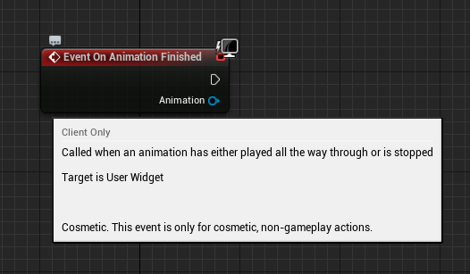
- **On Focus Received**: (If you're having trouble finding it in Blueprint, it has to return an Event Reply struct so you have to override it in the functions list and not in the event graph)
Occurs when focus is given to this User Widget(only this widget). It requires that you return an Event Reply struct which you can choose to either return Handled or Unhandled.
```c++
virtual FReply UUserWidget::NativeOnFocusReceived( const FGeometry& InGeometry, const FFocusEvent& InFocusEvent )
{
    // Call BP version and return what BP returns
    return OnFocusReceived( InGeometry, InFocusEvent ).NativeReply;
}
```
  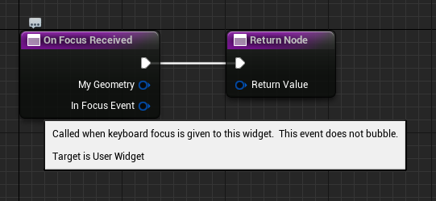
  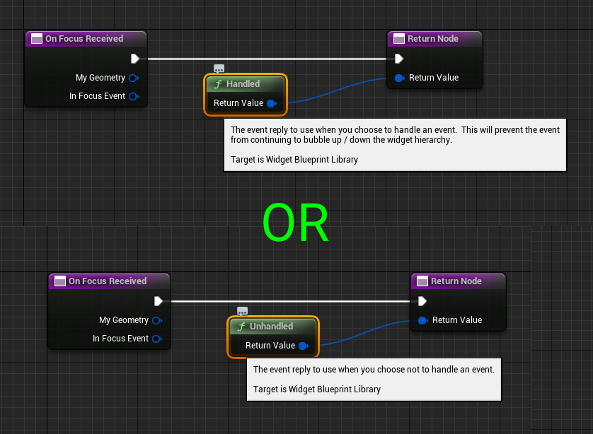
- **On Added to Focus Path**: Occurs when this widget or a child widget within this User Widget is added to the focus path(or focused) and wasn’t previously part of it.
```c++
virtual void UUserWidget::NativeOnAddedToFocusPath(const FFocusEvent& InFocusEvent)
{
    // Call BP version
    OnAddedToFocusPath(InFocusEvent);
}
```
  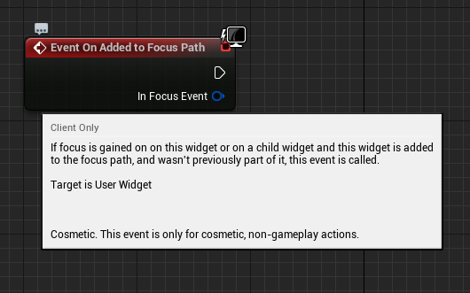
- **On Focus Lost**: Occurs when this User Widget(only this widget) loses focus.
```c++
virtual void UUserWidget::NativeOnFocusLost( const FFocusEvent& InFocusEvent )
{
    // Call BP version
    OnFocusLost( InFocusEvent );
}
```
  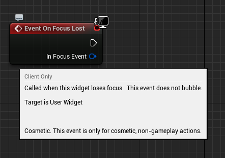
- **On Removed from Focus Path**: Similar to On Focus Lost except it can occur when a child widget within this User Widget or this widget itself is no longer part of the focus path.
```c++
virtual void UUserWidget::NativeOnRemovedFromFocusPath(const FFocusEvent& InFocusEvent)
{
    // Call BP version
    OnRemovedFromFocusPath(InFocusEvent);
}
```
  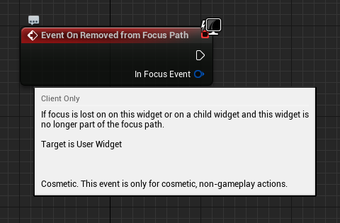

**[<span>&#11014;</span> Back to Top](#table-of-contents)**
<a name="common-widgets"></a>
## 6.0 Common Widgets

There is a large amount of commonly used widgets in Unreal Engine, at its basic core elements. \
Most/All of your UI that used UMG/Slate will probably be built from a combination of these widgets:

- **Text Block** *[Leaf Widget]*: Handles displaying static text that can be changed at runtime by setting it to another text value.
TextBlock widgets allow for a custom font to be used(including its typeface if the font has any others), customizing its text size, letter spacing(also known as kerning), its outline settings(this will offset the rendered text),
apply materials to the letters themselves, add a shadow offset(this will offset the rendered text), set its justification(how the text is aligned), etc. \
  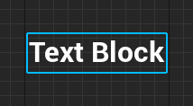
- **Rich Text Block** *[Leaf Widget]*: Works similarly to TextBlock widgets but allows for the use of custom images, glyphs, multiple fonts, etc to be used within the same text value at once. \
  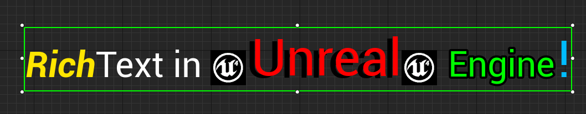
- **Image** *[Leaf Widget]*: Handles displaying either a texture or a material that uses the UI domain to display it. \
  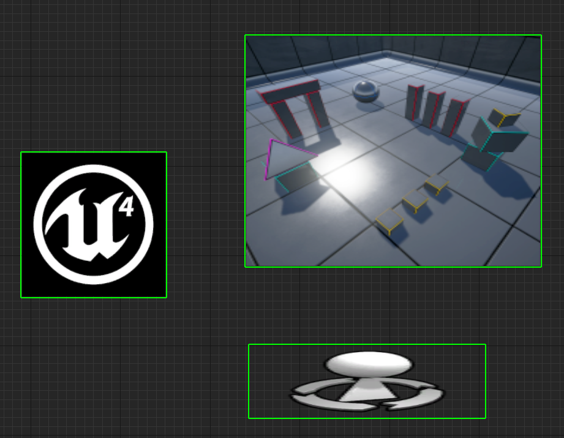
- **Border** *[Compound Widget]*: Can only have 1 child widget. Displays child widget in front of this widget, basically an Image widget that can have a child. \
  
- **Button** *[Compound Widget]*: Can only have 1 child widget. Displays that child in front of this widget, can be interacted with and focused. Returns when it is clicked/pressed/released/hovered/unhovered. You can also set its click(mouse button) method, touch(touch screen’s) method, and press(keyboard & gamepad) method. \
  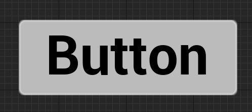
- **Check Box** *[Leaf Widget]*: Handles displaying a specific image/material depending on what state the check box is in, it can be clicked(or set to a specific state) and meant to show if something is on/off. \
  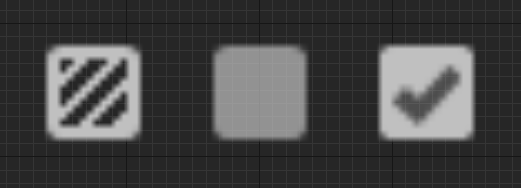
- **Progress Bar** *[Leaf Widget]*: Handles displaying an image/material in front of this widget via a scaled 0-1 fill percentage value via its Bar Fill Type & Bar Fill Style.
  - Fill Types: 
    - **Left to Right**: Fills the progress bar from left to right. \
    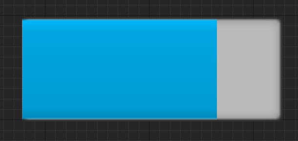 \
    *Masked Version* \
    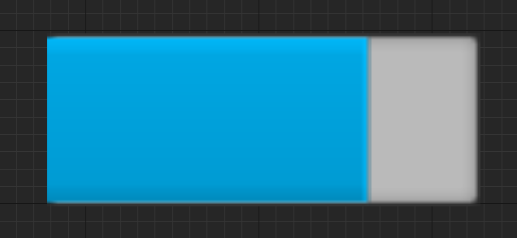 \
    *Scaled Version*
    - **Right to Left**: Fills the progress bar from right to left. \
    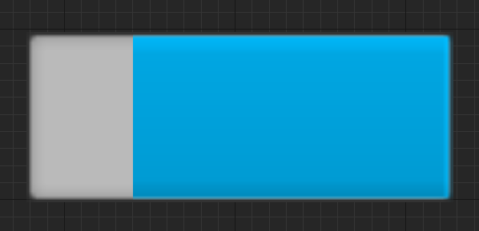 \
    *Masked Version* \
    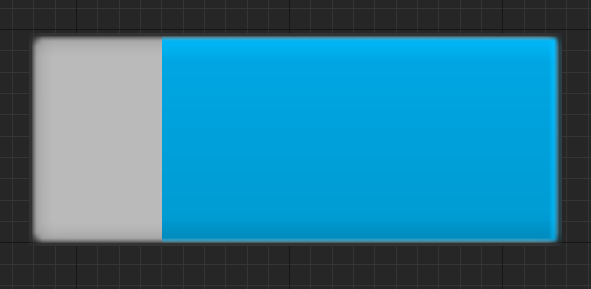 \
    *Scaled Version*
    - **Fill from Center**: Linearly fills the progress bar on both X and Y from the center towards the edges. \
    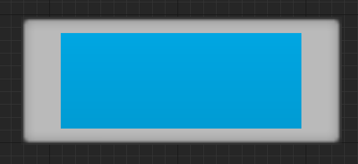 \
    *Masked Version* \
    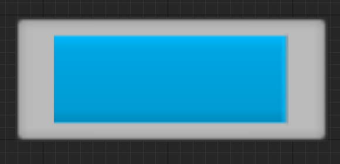 \
    *Scaled Version*
    - **Fill from Center Horizontal**: Linearly fills the progress bar on the X axis from the center towards the edges. \
    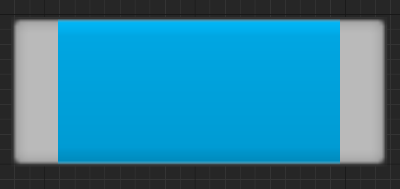 \
    *Masked Version* \
    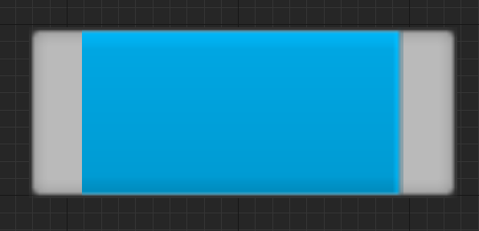 \
    *Scaled Version*
    - **Fill from Center Vertical**: Linearly fills the progress bar on the Y axis from the center towards the edges. \
    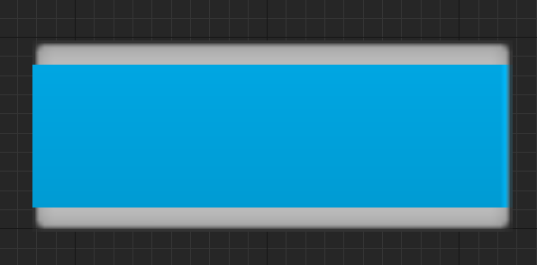 \
    *Masked Version* \
    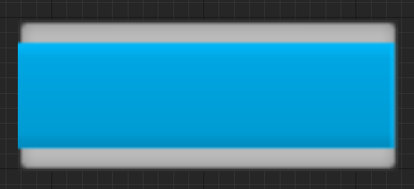 \
    *Scaled Version*
    - **Top to Bottom**: Fills the progress bar from top to bottom. \
    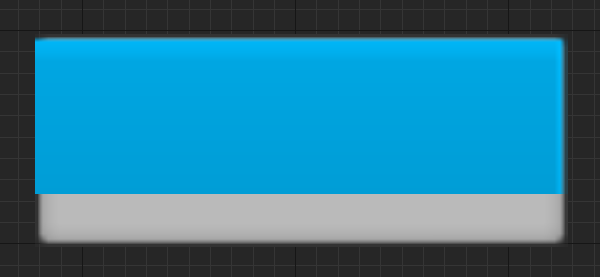 \
    *Masked Version* \
    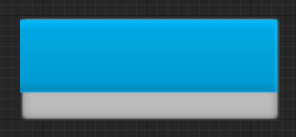 \
    *Scaled Version*
    - **Bottom to Top**: Fills the progress bar from bottom to top. \
    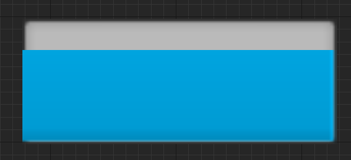 \
    *Masked Version* \
    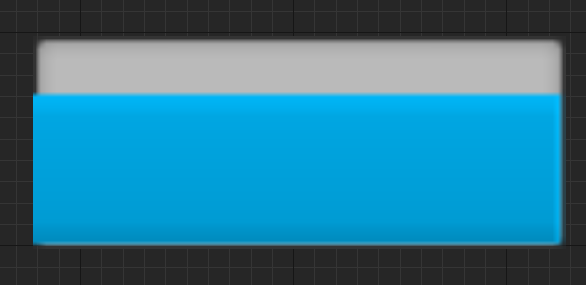 \
    *Scaled Version*
  - Fill Styles:
    - **Mask**: The progress bar's fill image is masked out based on the fill percentage and fill type.
    - **Scale**: The progress bar's fill image is scaled and stretched/squished based on the fill percentage and fill type.
- **Slider** *[Leaf Widget]*: Similar to the progress bar except it is interactable and you can change the orientation of it from horizontal to vertical and set its step size(for keyboard/gamepad presses). \
  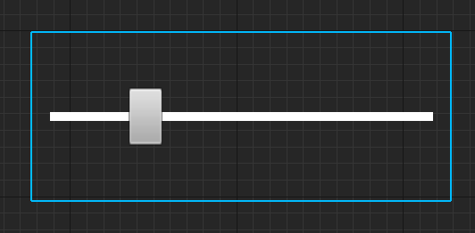
- **Editable Text** *[Leaf Widget]*: A field for the user to be able to type in one line of text, allows for hint text and can be set to read only, is password(so it only shows a dot instead of the actual text), as well as being able to adjust settings on it like a normal text block widget. \
  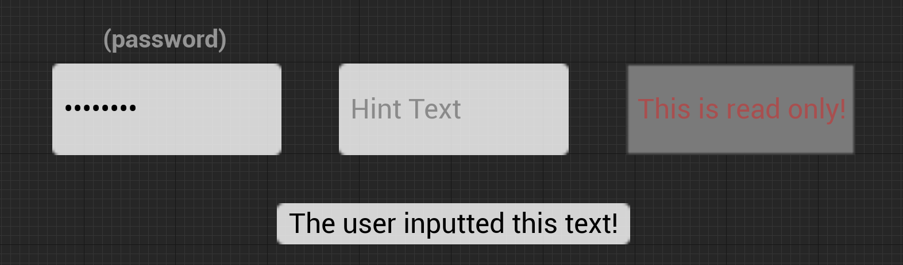
- **Editable Text(Multi-Line)** *[Leaf Widget]*: Same as Editable Text widget except the user can type in multiple lines of text instead of one. \
  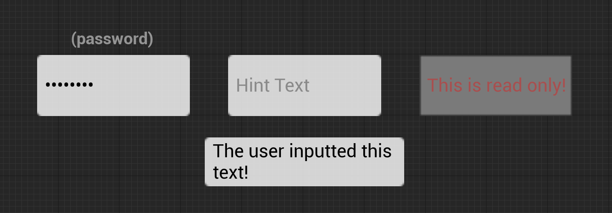
- **Text Box** *[Leaf Widget]*: Same as Editable Text except it is wrapped with an image/material behind the text. \
  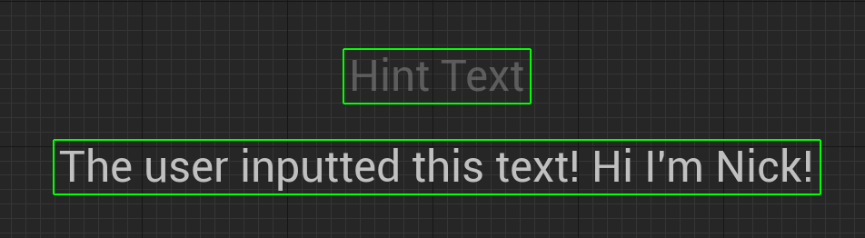
- **Text Box(Multi-Line)** *[Leaf Widget]*: Same as Editable Text(Multi-Line) except it is wrapped with an image/material behind the text. \
  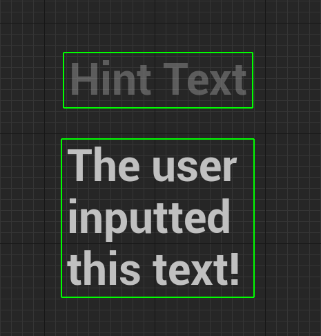
- **Spin Box** *[Leaf Widget]*: Displays a number(can be set to allow decimals or not) that the user can input or use the mouse and interact with it to slide and increase/decrease the number. \
  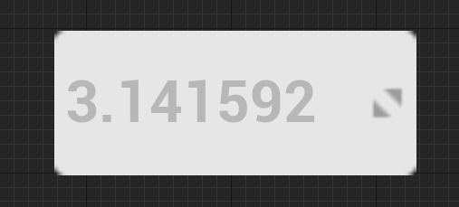
- **Combo Box(String)** *[Leaf Widget]*: A drop down box widget that displays a string(NOT TEXT, so its not localizable) value when selected and displays its options as well. \
  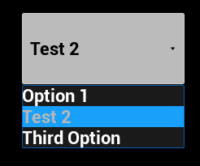
- **Invalidation Box** *[Compound Widget]*: Can only have 1 child widget. This will control when that child widget is invalided for its layout/geometry passes, very useful for performance optimization. *Can't really use a picture for this because it wraps entirely around the widget and is invisible*.
- **Retainer Box** *[Compound Widget]*: Can only have 1 child widget. This will render a material over its child widget and only its child widget so it will not render that material over background space that the child widget does not occupy with its render. \
For example if you wrap a Text Block with a Retainer Box, the material will only apply over the text and not the space between each letter. \
  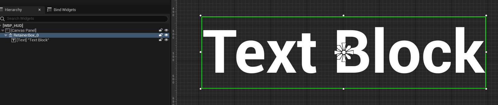 \
  *The retainer box's hierarchy in the designer* \
  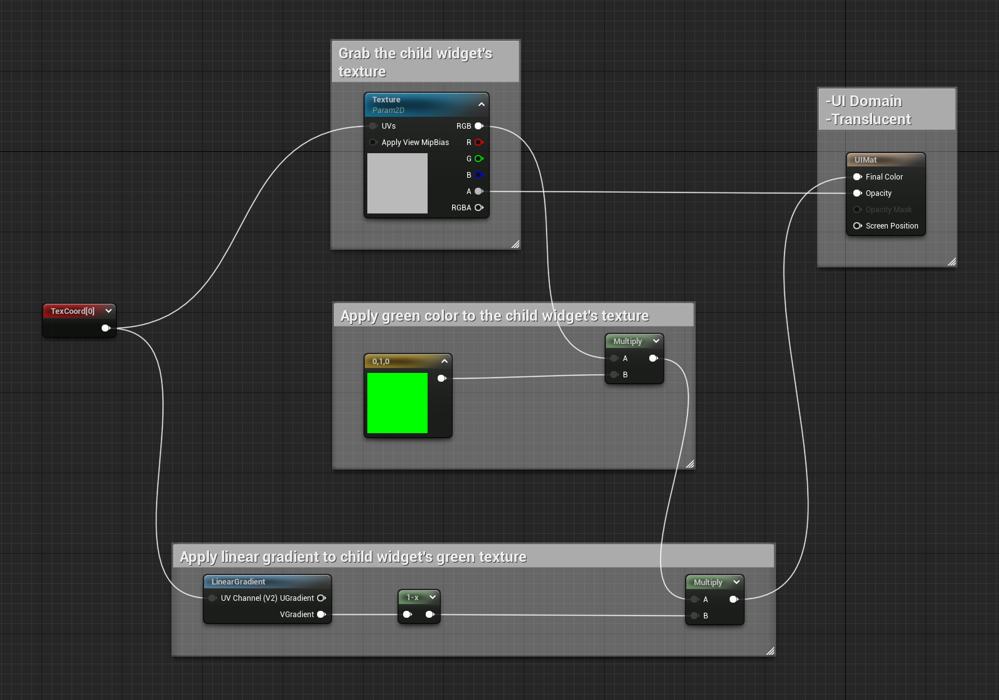 \
  *The retainer box's material* \
  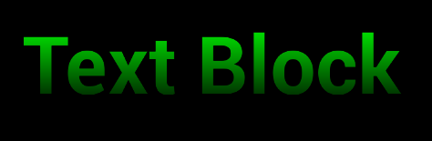 \
  *The retainer box at runtime(when running play in editor)*
- **Throbber** *[Leaf Widget]*: Displays an image/material in a specific animated pattern. Useful for showing something is loading. \
  
- **Circular Throbber** *[Leaf Widget]*: A version of the throbber that moves the images/materials in a circle. \
  
  - > *A note from the author; “Please change the throbber’s image with something other than the default image in your final products if possible. I'm tired of seeing the default throbber in full release products, you can do better! Thank you.”*
- **Spacer** *[Leaf Widget]*: This widget does not have a visual representation and it just provides padding and space between other widgets, recommended to use this rather than padding within slots if your UI design is changing constantly to make rapid iteration easier.
- **Background Blur** *[Compound Widget]*: Can only have 1 child widget. Basically an image widget with its child rendered behind it, and blurs the rendered result of that child widget using Gaussian Blur. \
Recommended to use this with proper clipping area’s setup otherwise use a custom material to make it easier for artists to modify. \
  
- **Input Key Selector** *[Leaf Widget]*: Allows for the user to press an input while focusing this widget and it will display what input that is. \
  
- **Canvas Panel** *[Panel Widget]*: This is the default widget found in newly created User Widgets, allows for the designer to place child widgets at arbitrary locations, anchored and z-ordered with other children of this canvas. \
It uses absolute layout for its placement so it's good for on screen indicators that follow a specific in-world object or something that can move around the entire screen. \
  
- **Horizontal Box** *[Panel Widget]*: Allows for its child widgets to be laid out in a horizontal flow moving from left to right with 0 index as the farthest left and its last widget being farthest right. \
  
- **Vertical Box** *[Panel Widget]*: Works the same as horizontal boxes except it lays out its children in a vertical flow moving from top to bottom, with 0 index as the farthest top widget and its last widget being the farthest bottom widget. \
*Vertical Box and Horizontal Box do not scroll, to allow for that you would have to use a scroll box widget or something similar.* \
  
- **Scroll Box** *[Panel Widget]*: Works the same way as the vertical box AND the horizontal box(has to be set to either vertical or horizontal) but allows them to be scrollable. Does not support virtualization. \
  
- **Size Box** *[Compound Widget]*: Can only have 1 child widget. Allows for this widget to specify the desired size of its child widget(since not all widgets will report a desired size because they are dependent on their own child widgets). \
  
- **Scale Box** *[Compound Widget]*: Can only have 1 child widget. Allows for this widget to have its child scaled to fit a constrained size on this box's allotted area. \
   \
  *In this example the scale box is resizing the image to fit uniformly*
- **Overlay** *[Panel Widget]*: Displays widgets stacked on top of each other based on their index within the child widgets. This widget is extremely useful to quickly overlay a widget over another widget quickly. \
   \
  *The text and the image are children of the overlay widget*
- **Grid Panel** *[Panel Widget]*: Allows child widgets to automatically be placed in a grid like pattern resembling a table that retains the width of every column. \
  
  *This grid has been configured to fill the space between each column and row, yours may look different depending on how you configured it*
- **Uniform Grid Panel** *[Panel Widget]*: Basically the grid panel but it will evenly divide up available space between all of its children. \
  
- **Widget Switcher** *[Panel Widget]*: This will only display one of its child widgets at a time via its child index but it will load all of them(not good for main pages, just smaller stuff) and initialize, construct all of them when the widget switcher is loaded, initialized, constructed.
- **Safe Zone** *[Compound Widget]*: Can only have 1 child widget. This widget is special where it will apply padding to the top/bottom/left/right sides of its child widget inwards to account for what device this widget is being shown on,
so for example on some mobile devices with a notch on one side, the safe zone will account for that and add padding to its child widget so it does not get cut off by the notch, as well as accounting for tv’s with extra pixels under the bezel,
projectors having extra columns of pixels hidden behind the black border, etc. A good example is for certain phones that have a notch(you know which ones I’m talking about), the safe zone will pad out that side of the screen for you so your widgets are not being covered by the notch.

> You can also use some helpful debug console commands for simulating the safe zone on PC in the editor located 
> in [Debug Console Commands](#debug-console-commands) of the [Development & Debug Tools for UMG/Slate](#dev-debug-tools) section.

   \
*In this example we wrapped a canvas panel with a save zone so it pushes the canvas away from the area of the screen that would be inaccessible due to the screen's notch or operating system*

**[<span>&#11014;</span> Back to Top](#table-of-contents)**
<a name="common-widget-functionality"></a>
## 7.0 Common Widget Functionality

Each widget has its own functionality and use while still containing a common functionality across all the widgets such as:

- **Accessibility**: Each widget will listen to the project’s default settings for accessibility, these settings can be overridden for each widget and can affect its own children, \
going over accessibility is out of scope for this document but here is an official Epic approved course going over it: \
[Epic Approved Course for Introduction to Accessible Design](https://www.unrealengine.com/en-US/onlinelearning-courses/introduction-to-accessible-design-with-unreal-engine). \

  - **Override Accessible Defaults**: When enabled will override the default accessibility behavior and text for this widget.
    - **Can Children be Accessible**: Flag to know if children of this widget should be as distinct accessible widgets.
    - **Accessible Behavior**: Setting for whether or not this widget is accessible, including how to describe it. When using the "custom" option, you're able to enter in your own accessible text.
      
    - **Accessible Summary Behavior**: Setting for how to describe this widget when it's being presented via a summary of a parent widget. When using the "custom" option, you're able to enter in your own accessible text.
      
- **Tool Tip Text**: A tool tip text widget that is either using the default widget or your own custom one, to show when the user hovers over the widget with the mouse. \
  
- **Is Enabled**: Flag to know if this widget is enabled/disabled and if it can be modified interactively by the user. \
  
- **Visibility**: The render visibility and interactivity visibility of the widget.
  - **Visible**: Renders the widget and allows it to be intractable with the cursor.
  - **Collapsed**: Does not render, not interactable, and takes up no space in the layout.
  - **Hidden**: Does not render and is not interactable but occupies layout space.
  - **Not Hit-Testable/Hit Test Invisible(Self & All Children)**: Does render the widget but cannot be interacted with and does not allow its children to be interactable.
  - **Not Hit-Testable/Hit Test Invisible(Self Only)**: Does render the widget but only this widget cannot be interacted with. \
  
- **Render Opacity**: The render opacity of this widget and does affect its children’s opacity as well. 0 = Invisible, 1 = Fully Visible. \
  
- **Render Transform**: Each widget has a render transform, which can affect the collision shape of the widget, but not override the original layout and paint information. \
Think of it like it’s a modifier to the original transform information but it does not change its layout.
  - **Translation**: The X and Y location offset.
  - **Scale**: The X and Y scale of the widget.
  - **Shear**: The X and Y shear of the widget, also known as skew.
  - **Angle**: The rotation of the widget. You only need 1 axis to rotate on in a 2D space but it can go between -180 and 180 degrees.
  - **Pivot**: The pivot offset of the widget that controls the location for where transforms are applied from. \
  The actual value is a normalized amount starting at 0.5 on X/Y to be the center of the widget, 0.0 = Left/Top and 1.0 = Right/Bottom directions. \
  
- **Is Volatile**: This flag when set to true will mark this widget as non-cacheable so it always has to update its layout and geometry collision, it is defaulted to false because it is not commonly used but it is exposed in case you need it.
  
- **Clipping**: This is in regards to layout and geometry information where you can specify how the widget is clipped, \
this does not batch together clipping spaces so this can have a performance cost depending on how many overlapping and clipping widgets you have on screen. \
  
  - **Inherit**: This clipping space does not allow the widget to clip its children, but this widget and all its children inherit the clipping area of the last widget that was clipped above it. \
   \
  *In this example there is a `Scroll Box` widget with its clipping set to `Inherit` and it is a child of a `Canvas Panel` widget that has its clipping set to `Clip to Bounds`.*
  - **Clip to Bounds**: This clipping space clips to the bounds of this widget, it intersects those bounds with any previous clipping area from above it. \
   \
  *In this example there is a `Scroll Box` widget with its clipping set to `Clip to Bounds` so its child widgets which are `Button`'s will be intersected when they go out of bounds of the `Scroll Box`*
  - **Clip to Bounds - Without Intersecting(Advanced)**: This clipping area clips to its bounds as well but it does **<u>NOT</u>** intersect with any existing clipping geometry, it will always push its own new clipping state. \
  Allowing this widget to render outside the bounds of the hierarchy that does clip it. This will **<u>NOT</u>** allow you to ignore the clipping zone that is set to *"Always"* though. \
   \
  *In this example there is a `Scroll Box` widget with its clipping set to `Clip to Bounds` and one of its child widgets has its clipping set to `Clip to Bounds - Without Intersecting(Advanced)`*
  - **Clip to Bounds - Always(Advanced)**: This clipping area clips to bounds as well and it always intersects those bounds with any previous clipping area. \
  This clipping area **<U>CANNOT</U>** be ignored, it will always clip its children. Useful for hard barriers in the UI where you never want animations or other effects to break into/out of that region. \
   \
  *In this example there are 3 main widgets; \
  `Canvas Panel` with its clipping set to `Clip to Bounds - Always(Advanced)` \
  `Scroll Box` within `Canvas Panel` with its clipping set to `Clip to Bounds` \
  `Button` within `Scroll Box` with its clipping set to `Clip to Bounds - Without Intersecting(Advanced)`* 
  - **On Demand(Advanced)**: This clipping area clips to its bound when its Desired Size is larger than the allocated geometry in the layout. \
  If it does occur where it needs to be clipped, then it will be treated like *“Always”*. According to the source code, this mode was primarily added for Text for when it is placed inside a container that eventually is resized to not be able to support the length of the text. \
   \
  *In this example we have a `Vertical Box` widget with clipping set to `Inherit` and a custom `Textblock` widget from Epic's Common UI Plugin that has its clipping set to `On Demand(Advanded)` so the text can scroll and be clipped properly(this example is also found in Epic's Context Examples project in the Common UI example map)*
- **Navigation**: This is where you would add your navigation hooks for what widget to navigate to when using Unreal’s focusing framework. You can set these at runtime in Blueprint and in C++. \
Please refer to the [Unreal's Focusing System](#unreals-focusing-system) section for a more detailed explanation of the navigation flow. \
  
  - **Escape**: This navigation type will navigate to either another widget or try to reach any other widget and escape out of the bounds of this widget when navigated out in that direction. \
  
  - **Stop**: Navigation stops when trying to navigate out of this widget in that direction. \
  
  - **Wrap**: Navigation will attempt to wrap to the opposite bounds of this widget(for example in a vertical box, navigating to the bottom widget and having a wrap setting for down on the last widget will send navigation to the top widget of the vertical box). \
  
  - **Explicit**: Navigates to a specifically chosen widget when navigating out of this widget in that direction. \
   \
  *You can only select other widgets that have their name edited in the editor when selecting it in the designer, otherwise in code you can just provide the widget itself regardless of if its been renamed or not.*
  - **Custom**: Allows you to override what widget to navigate to using a function that can either return a widget or no widget(simulating the *“Stop”* navigation type). Intended for when navigating **FROM** or out of this widget to another widget in that specific direction. \
  
  - **Custom Boundary**: Allows you to override what widget to navigate to using a function that can either return a widget or no widget(simulating the *“Stop”* navigation type). Intended for when navigating **TO** this widget from another widget in that specific direction, \
  so if the direction is Left and you have it set to Custom Boundary then when you navigate from another widget to this one and it was a Left direction then it will run this function that it's bound to. \
  
- **Flow Direction**: For localization, allows you to set the flow direction of this widget regarding whether it is from left to right, or right to left. \
Only certain widgets actually use it but it is in all widgets in case you want to add your own functionality based on flow direction. For example text widgets can flip from left to right/right to left depending on its flow direction and the language that specifies its flow direction to that.
  - **Inherit**: Inherits the flow direction set by the parent widget.
  - **Culture**: Begins laying out widgets using the current cultures layout direction preference, flipping the directionality of flows.
  - **Left to Right**: Forces a Left to Right layout flow.
  - **Right to Left**: Forces a Right to Left layout flow. \
  

**[<span>&#11014;</span> Back to Top](#table-of-contents)**
<a name="umg-in-relation-to-levels-worlds"></a>
## 8.0 UMG in relation to Levels/Worlds

<a name="hud-actors"></a>
### 8.1 HUD Actors

HUD Actors are actors that are only spawned into the level by the Game Mode(I do not recommend spawning them manually unless you are overriding Game Mode functionality and know what you're doing).
These actors do not replicate, are hidden by default, and are only spawned per local player controller(to account for split screen) and does not spawn on dedicated servers.

The purpose of HUD Actors has changed with the release of Unreal Engine 4(it has stayed the same for Unreal Engine 5) from how it was in Unreal Engine 3 where it used to be the main source of functionality for UI elements in a level for a player,
but with the release of UMG and Slate this caused HUD actors to become manager objects for UMG/Slate UI elements rather than driving every aspect of the UI's functionality but they are completely optional to how you want to architect your code.

<a name="hud-drawing"></a>
#### 8.1.1 HUD Drawing

HUD Actors are tied to a specific player controller and have debug mode information, as well as the functionality to manually draw UI elements to the screen.
Here is the list of drawable UI elements:
- Text: Draws a string on the viewport canvas.
- Line: Draws a 2D line on the viewport canvas in 2D screenspace.
  - 2D Line: Draws a 2D line on the viewport canvas using pixel coordinates(which can be less accurate than screenspace due to how Unreal uses Slate Units).
  - 3D Line: Tells the debug line drawing system for the world to draw a line in world space.
- Rect: Draws an untextured quad(square/rectangle) on the viewport canvas.
- Texture: Draws a textured quad(square/rectangle) on the viewport canvas.
  - Texture Simple: Draws a textured quad(square/rectangle) assuming 1:1 texel density on the viewport canvas. 
- Material: Draws a material-textured quad(square/rectangle) on the viewport canvas.
  - Material Simple: Draws a material-textured quad(square/rectangle) on the viewport canvas but assumes UV's are (0.0, 0.0) and (1.0, 1.0).
  - Material Triangle: Draws a material-textured triangle shape on the viewport canvas.
> A important note is that the way that the HUD Actor draws images and other UI elements is by skipping a few steps of how UMG does it by directly getting the canvas and telling it to draw items.

<a name="hud-hitboxes"></a>
#### 8.1.2 HUD HitBoxes

An interesting feature that HUD Actors have is they have the ability to know if portions of the screen are moused over/clicked/pressed and released.
The way they do this is by using a class called `FHUDHitBox`.

`FHUDHitBox` is a C++ only class that has these properties:
- Coords `FVector2D`: Coordinates of top left of the hit box.
- Size `FVector2D`: Size of the hit box.
- Name `FName`: The name of the hit box.
- bConsumesInput `boolean`: Does not consume actual input from the game.
  - True: Prevents hit checks to other hit boxes.
  - False: Allows the hit check to pass through to other hit boxes.
- Priority `int32`: The priority of the hit box(could also be considered the Z-Order). Higher hit boxes are given priority first.

The benefits of using a `FHUDHitBox` is that the HUD has mouse events that work with it, each event provides the name of the HitBox:
- Click: Occurs when a hit box is clicked on.
- Release: Occurs when a hit box is no longer clicked.
- Begin Cursor Over: Occurs when a hit box is moused over.
- End Cursor Over: Occurs when a hit box no longer has a mouse over it.

The HUD Actor essentially has an array of HUD HitBoxes that can be added/removed at runtime. The array is a public variable in all HUD Actors but can only be accessed in C++:
`HitBoxMap`(I know it says map but its not a map array). \
There is two ways of adding a HitBox:
- Calling `AddHitBox` and feeding in the parameters to create a `FHUDHitBox` class inside the function.
- Manually creating the `FHUDHitBox` class and adding it to the `HitBoxMap` array.

To remove a HitBox you can simply remove it from the `HitBoxMap` array.

<a name="widget-components"></a>
### 8.2 Widget Components

Widget Components are `UMeshComponent`'s(actor components that are primitive components that can render a mesh)
that basically creates a procedural static mesh in the world with its texture being the widget's drawn texture(you can access that render target using `GetRenderTarget`).

> Widget Components DO NOT TICK on Dedicated Servers. \
> This is obvious since most of the functionality of the component is updating rendering of the User Widget. \
> The component also deals with collision based on the User Widget, so if the widget is not spawning on Dedicated Servers then the component's collision will not work properly.

An important performance impact of using widget component's is that each widget component is a render target being updated on the component's tick. \
So if you have 100 widget component's at high resolutions then that's 100 render targets being updated every frame(you can have the component tick when drawn but that still takes up GPU memory). \
To avoid these kinds of GPU memory impacts, here are some common situations and solutions(THESE ARE NOT THE ONLY WAY TO SOLVE THESE ISSUES, THESE ARE JUST RECOMMENDATIONS FROM MY OWN EXPERIENCE):
- Situation 1: Large amount of images or progress bars that are above NPC's head's
  - Solution: Using static mesh components with materials with a texture parameter for the image, and a material for creating the progress bar either via a texture or math based approach(recommend looking up SDF's with Unreal for examples).
- Situation 2: Rendering indicators through the world but scales as the player's camera moves closer/farther from the indicator's location.
  - Solution: Creating a material to ignore the depth pass, in recent versions of Unreal Engine there is also a boolean to skip the motion blur pass but you can do this by modifying the engine in previous versions. You can do this with either static mesh components or particle systems drawing the static mesh, profile and come to your own conclusions. 

For building materials to work with Widget Components, here are texture parameters that work automatically with Widget Components:
- `SlateUI`: Inputs the widget's Render Target.
- `TintColorAndOpacity`: Inputs the widget component's TintColorAndOpacity property.
- `OpacityFromTexture`: Inputs the widget component's OpacityFromTexture property.

An important aspect to remember is that while this is a component it does actually create a User Widget. \
To access the User Widget you can use `GetUserWidgetObject`(you can also use `GetSlateWidget` to get the `SWidget` that it is tied to).

> You cannot use `GetUserWidgetObject` in an actor's construction script due to the widget only being valid from `BeginPlay`.

By default it gets the first local player from the game instance:
```c++
if (UWorld* LocalWorld = GetWorld())
{
	UGameInstance* GameInstance = LocalWorld->GetGameInstance();
	check(GameInstance);

	return GameInstance->GetFirstGamePlayer();
}
```
This can be changed by calling `SetOwnerPlayer` and inputting a `ULocalPlayer`.

For getting the 2D plane widget space location from a world location on the widget component you can use `GetLocalHitLocation` which calculates it out by doing these math operations:
> 1. By converting the world location into relative space of the widget component using `InverseTransformPosition`
> 2. Builds a simple 2D location with X-axis being the relative location's negative Y-axis and relative location's negative Z-axis for the 2D Y-axis.
> 3. Offsets(adds) the 2D X-axis by the current draw size's X-axis * Pivot's X-axis.
> 4. Offsets(adds) the 2D Y-axis by the current draw size's Y-axis * Pivot's Y-axis.
> 5. Caches a normalized location of the 2D location divided by the current draw size.
> 6. Updates the 2D location's Y-axis to be the current draw size's Y-axis * normalized location's Y-axis, this is to account parabola distortion.

<a name="widget-interaction-components"></a>
#### 8.2.1 Widget Interaction Components

For being able to interact with widget component's there is the Widget Interaction Component that is \
meant to simulate user inputs and mouse pointer(or virtual finger tip) inputs as a laser pointer style of interacting with widget.

Each widget interaction component has a virtual user associated with it that handles providing input to slate widgets. \
When activated the component will create an actual `FSlateUser` to simulate input and such. \
By default the engine will use Slate User index 8(the maximum allowed amount of slate users) instead of 0 and increments up from there, \
allowing for slate users and virtual users to not have conflicts.

Widget Interaction Components will trace on tick to determine what widget its interacting with. \
Here is the order of the tick frame for the component to figure out the component its line tracing against in `UWidgetInteractionComponent::TickComponent`:
> 1. `UWidgetInteractionComponent::SimulatePointerMovement`
>    1. Check if we can even hit test by checking `bEnableHitTesting`
>    2. Check if the component is able to send input in `CanSendInput`
>       1. If the slate application is initialized & if the virtual user has been setup.
>    3. `UWidgetInteractionComponent::DetermineWidgetUnderPointer`
>       1. Cache the previously hovered widget component.
>       2. `UWidgetInteractionComponent::PerformTrace`
>          1.  Line trace based on the type of `InteractionSource`:
>             - World: Multi-Line Trace by `TraceChannel` in the forward direction of the interaction component's location, \
>               ignores any components in the owning actor so it doesn't hit itself(excluding widget components).
>             - Mouse: Multi-Line Trace by `TraceChannel` from the mouse position deprojected from screen to world.
>             - Center Screen: Multi-Line Trace by `TraceChannel` from the viewport's center position deprojected from screen to world.
>             - Custom: Uses `CustomHitResult`'s properties which can be set at runtime. \
>                An important note about this struct is in the first tick frame it might not have been set yet since Blueprint tick might occur after this is called. \
>                You can set it in BeginPlay and will have been setup ahead of time for that first tick frame.
>          2. If we're not using the custom `InteractionSource` type then filter through invisible widgets.
>          3. Gets the hit widget component and feeds in the hit result, from there the widget component will return the 2D hit location in widget space.
>          4. Finds the `FWidgetPath` from the returned widget space hit location.
>          5. Returns the trace result of `PerformTrace`.
>       3. Tell the newly hovered widget component to redraw.
>       4. Iterate through an arranged list of widgets from the retrieved widget path from the trace and update these flags based on the final widget:
>          - `bIsHoveredWidgetInteractable`: If the widget is interactable.
>          - `bIsHoveredWidgetFocusable`: If the widget is keyboard focusable.
>          - `bIsHoveredWidgetHitTestVisible`: If the widget is hit testable.
>       5. If the newly hovered widget component is different from the previously hovered widget component then tell that previous component to redraw. And broadcast `OnHoveredWidgetChanged` for other systems.
>       6. Return widget path from the trace.
>    4. Notify the slate application(to send to the rest of the engine) that an input is being simulated on that widget or if we're not hovering anything anymore then tell it that the pointer has moved off that old widget.

<a name="widget-components-rendering"></a>
#### 8.2.2 How Widget Components are Rendered

For drawing a user widget to a `UTextureRenderTarget2D` the general process of it that Widget Component's do(along with extra work because it is a component and thus has to provide a scene proxy and such);
is by creating a `FWidgetRenderer` and then getting the slate widget from the user widget and having the widget renderer draw it as a texture. \
Here is example code of using the widget renderer to create a texture from a `UUserWidget`(there are multiple implementations of `FWidgetRenderer::DrawWindow` & `FWidgetRenderer::DrawWidget`so this is one of the ways):
```c++
bool UExampleFunctionLibrary::DrawWidgetToTarget(UTextureRenderTarget2D*& DrawnWidgetRenderTarget, 
    UUserWidget* WidgetToRender, const FVector2D DrawSize, const float DeltaTime)
{
    // Reset the variable for Blueprint users to avoid reusing previous calls
    DrawnWidgetRenderTarget = nullptr;
    // Are we using a valid widget to grab from for the render target
    if(!IsValid(WidgetToRender))
    {
        UE_LOG(LogExampleFunctionLibrary, Error, TEXT("UExampleFunctionLibrary::DrawWidgetToTarget: Inputted NULL WidgetToRender"));
    	return false;
    }
    // Make sure we're using a valid draw size
    if(DrawSize.X <= 0 || DrawSize.Y <= 0)
    {
        UE_LOG(LogExampleFunctionLibrary, Error, TEXT("UExampleFunctionLibrary::DrawWidgetToTarget: Inputted INVALID DrawSize(%s)"), *DrawSize.ToString());
    	return false;
    }
    // Create the render target object using the user widget as the outer object(as a safety measure)	
    DrawnWidgetRenderTarget = NewObject<UTextureRenderTarget2D>(WidgetToRender);
    // Setup the render target's size and formatting
    DrawnWidgetRenderTarget->InitCustomFormat(DrawSize.X, DrawSize.Y,
    	FSlateApplication::Get().GetRenderer()->GetSlateRecommendedColorFormat(),
    	true); // If we set this to false then it will not use linear gamma, but then we wouldn't get accurate coloring
    
    // This is the object that handles talking with the slate renderer to draw widgets as textures
    FWidgetRenderer* WidgetRenderer = new FWidgetRenderer(true, false); // FWidgetRenderer(bool bUseGammaCorrection = false, bool bInClearTarget = true)
    WidgetRenderer->DrawWidget(DrawnWidgetRenderTarget, 
        WidgetToRender->TakeWidget(),
        DrawSize,
        DeltaTime,
        false); // THIS PARAMETER IS EXTREMELY IMPORTANT, this is for if you want to immediately update the render target.
    // bDeferRenderTargetUpdate: Whether or not the update is deferred until the end of the frame when it is potentially less expensive to update the render target.
    
    // Flush any queued rendering commands to immediately have the GPU draw the widget and get the texture information filled out
    FlushRenderingCommands(); // This is ANOTHER way of forcing the GPU to update the render target.
    
    // HINT HINT ^^^
    // Deferred cleanup of the widget renderer to be deleted AFTER the render command queue has been flushed 
    BeginCleanup(WidgetRenderer);   
    return true;
} 
```
For drawing the widget in world space it uses the above approach but instead of `DrawWidget` it uses `DrawWindow` directly.

For drawing the widget in screen space it will add the user widget to a second game layer widget that is meant to only handle widget components called `FWorldWidgetScreenLayer` that talks directly to `SWorldWidgetScreenLayer`.

**[<span>&#11014;</span> Back to Top](#table-of-contents)**
<a name="dev-debug-tools"></a>
## 9.0 Development & Debug Tools for UMG/Slate

Unreal Engine has development and debug tools for UMG & Slate that assist with creating UI 
and can be used in both editor and packaged development builds(including consoles).

<a name="debug-console-commands"></a>
### 9.1 Debug Console Commands

[Official Documentation for Console Slate Debugger](https://docs.unrealengine.com/latest/INT/console-slate-debugger-in-unreal-engine/)(Also located in [External Links Page](EXTERNAL_LINKS.md)).

- Please refer to the [Slate Console Debugger Console Commands](#slate-console-debugger) section for Slate Debugger specific console commands.
- `Slate.HitTestGridDebugging [0/1]`: Flag for showing UMG/Slate focusing hit test grid.
- `SlateDebugger.Invalidate.[Disable/Enable]`: Enables or disables the invalidation debugger visualizer.
- Safe Zone Commands:
  - `r.DebugSafeZone.TitleRatio 0.96`: Default is `1.0`. The safe zone ratio that will be returned by `FDisplayMetrics::GetDisplayMetrics` on platforms that don't have a defined safe zone between 0-1.
  - `r.DebugActionZone.ActionRatio 0.96`: Default is `1.0`. The action zone ratio that will be returned by `FDisplayMetrics::GetDisplayMetrics` on platforms that don't have a defined safe zone between 0-1.
  - `r.DebugSafeZone.Mode [integer between 0 and 2]`
    - `0`: Do not display the safe zone overlay
    - `1`: Display the overlay for the title safe zone
    - `2`: Display the overlay for the action safe zone
- `Slate.ThrottleWhenMouseIsMoving [0/1]`: Default is `false`. Whether to attempt to increase UI responsiveness based on mouse cursor movement.  
  - `True`: Allow throttling based on mouse movement activity. 
- `Slate.TargetFrameRateForResponsiveness [integer]`: Default is `35` frames per second. Minimum sustained average frame rate required before we consider the editor to be "responsive" for a smooth UI experience.
- `Slate.AllowSlateToSleep [0/1]`: Whether Slate should go to sleep when there are no active timers and the user is idle.
- `Slate.SleepBufferPostInput [float]`: Default is `0.0`. The amount of time that must pass without any user action before Slate is put to sleep (provided that there are no active timers).
- `Slate.RequireFocusForGamepadInput [0/1]`: Default is `false`. Whether gamepad input should be ignored by the engine if the application is not currently active.
- `Slate.Transform.FullscreenMouseInput [0/1]`: Default is `true`. Set true to transform mouse input to account for viewport stretching at fullscreen resolutions not natively supported by the monitor.
- `Slate.EnableTooltips [0/1]`: Default is `true` if the platform needs UI tooltips, defaults to `false` if otherwise. Whether to allow tooltips to spawn at all.
- `Slate.TriggerInvalidate`: Triggers a global invalidate of all widgets. Does not run on Shipping Builds.

<a name="widget-reflector"></a>
### 9.2 Widget Reflector

[Official Documentation for Widget Reflector](https://docs.unrealengine.com/latest/INT/using-the-slate-widget-reflector-in-unreal-engine/)(Also located in [External Links Page](EXTERNAL_LINKS.md)).

> To open the widget reflector, you can navigate to `Tools/Debug/Widget Reflector` or build the widget reflector as a separate application when using the Source version of Unreal Engine.

The widget reflector tool is intended to help developers optimize and debug UI that allows the developers to debug:
- Widget Hierarchy: The hierarchy of widgets that displays the parents and children of widgets. You can inspect the following properties when using the widget hierarchy:
  - Widget Name
  - Foreground Visibility(FG Visibility)
  - Focus
  - Clipping
  - Source: The source code location of the widget for ease of access.
  - Address: The raw widget path that slate uses when calculating widget hierarchy and trees.
- Widget Details: Widget details that such as visibility, focus, etc(anything that the slate widget exposes as an exposed property).
- Widget Events:
  - Input
  - Focus
  - Navigation
  - Warnings
  - Mouse Capture
- Widget Navigation and the Hit Test Grid
- Invalidation
- Widget Update
- Widget Paint
- Clipping
- Culling
- Caching


> For debugging devices such as consoles or phones, you can use the "Remote Session" plugin(formally named "Slate Remote") within the engine to 
> connect the debugger to the device to live debug Slate & UMG with the widget reflector.

<a name="slate-console-debugger"></a>
### 9.3 Slate Console Debugger

The Slate Console Debugger is a list of console commands that can be used to debug different parts of Slate for debugging purposes.
Each console command is prefixed with `SlateDebugger.`, when enabling an option this will cause it's debug information to be printed to the output log.

The good news is that you can enable these flags from the widget reflector so you don't have to type in the difference debug commands.


Below is the list of each Slate Debugger console command:
- Slate Trace, located in `SlateTrace.cpp`:
  - `SlateDebugger.bCaptureRootInvalidationCallstacks [0/1]`: Whenever a widget is the root cause of an invalidation, capture the callstack for slate insights(another debugging tool that's a part of Unreal Insights).
- Events, located in `ConsoleSlateDebugger.cpp`:
  - `SlateDebugger.Event.Start` OR `SlateDebugger.Start`: Starts the debugger for events.
  - `SlateDebugger.Event.Stop` OR `SlateDebugger.Stop`: Stops the debugger for events.
  - `SlateDebugger.Event.LogWarning`: Logs warning events.
  - `SlateDebugger.Event.LogInputEvent`: Logs input events.
  - `SlateDebugger.Event.LogFocusEvent`: Logs focus events.
  - `SlateDebugger.Event.LogAttemptNavigationEvent`: Logs attempted navigation events.
  - `SlateDebugger.Event.LogExecuteNavigationEvent`: Logs executed navigation events.
  - `SlateDebugger.Event.LogCaptureStateChangeEvent`: Logs when input capture state change events.
  - `SlateDebugger.Event.LogCursorChangeEvent`: Logs cursor changed events.
  - `SlateDebugger.Event.CaptureStack`: This toggles capturing and logging the callstack when there is an event.
  - `SlateDebugger.Event.InputRoutingModeEnabled`: This toggles logging the route that an input event took.
  - `SlateDebugger.Event.SetInputFilter [Filter]`: Toggles specific input filters:
    - Filters:
      - `MouseMove`
      - `MouseEnter`
      - `MouseLeave`
      - `PreviewMouseButtonDown`
      - `MouseButtonDown`
      - `MouseButtonUp`
      - `MouseButtonDoubleClick`
      - `MouseWheel`
      - `TouchStart`
      - `TouchEnd`
      - `TouchForceChanged`
      - `TouchFirstMove`
      - `TouchMoved`
      - `DragDetected`
      - `DragEnter`
      - `DragLeave`
      - `DragOver`
      - `DragDrop`
      - `DropMessage`
      - `PreviewKeyDown`
      - `KeyDown`
      - `KeyUp`
      - `KeyChar`
      - `AnalogInput`
      - `TouchGesture`
      - `MotionDetected`
  - `SlateDebugger.Event.DisableAllInputFilters`: Disables all enabled input filters.
  - `SlateDebugger.Event.EnableAllInputFilters`: Enables all input filters.
  - `SlateDebugger.Event.SetFocusFilter [Filter]`: Toggles specific focus filters:
    - Filters:
      - `FocusChanging`
      - `FocusLost`
      - `FocusReceived`
  - `SlateDebugger.Event.ClearFocusFilters`: Disables all enabled focus filters.
  - `SlateDebugger.Event.EnableAllFocusFilters`: Enables all focus filters.
- Breaks, this is useful for other tools to use and requires an debugger to be attached to the editor to act as a breakpoint. 
Located in `ConsoleSlateDebuggerBreak.cpp`:
  - `SlateDebugger.Break.OnWidgetInvalidation Reason=[Reason][WidgetPtr][WidgetId]`: Break when the inputted widget gets invalidated.
    - Invalidation Reasons:
      - `Layout`
      - `Paint`
      - `Volatility`
      - `ChildOrder`
      - `RenderTransform`
      - `Visibility`
      - `AttributeRegistration`
      - `Prepass`
      - `PaintAndVolatility`
      - `LayoutAndVolatility` 
  - `SlateDebugger.Break.OnWidgetBeginPaint [WidgetPtr][WidgetId]`: Break before the widget starts being painted.
  - `SlateDebugger.Break.OnWidgetEndPaint [WidgetPtr][WidgetId]`: Break when the widget was just painted.
  - `SlateDebugger.Break.RemoveAll`: Removes all the requests to break.
- Paint, located in `ConsoleSlateDebuggerPaint.cpp`:
  - `SlateDebugger.Paint.Start`: Start the painted widget debug tool. Use to show widgets that have been painted this frame.
  - `SlateDebugger.Paint.Stop`: Stops the painted widget debug tool.
  - `SlateDebugger.Paint.Enable`: Toggles(Start/Stop) the painted widget debug tool to show widgets that are painted.
  - `SlateDebugger.Paint.LogOnce`: Logs the names of all widgets that were painted during the last update in the tool.
  - `SlateDebugger.Paint.MaxNumberOfWidgetDisplayedInList [MaxNumberOfWidgetsInList]`: The max number of widgets that will be displayed when DisplayWidgetNameList is active in the tool.
  - `SlateDebugger.Paint.ToggleWidgetNameList`: Toggleable option to display the name of the widgets that have been painted in the tool.
  - `SlateDebugger.Paint.LogWarningIfWidgetIsPaintedMoreThanOnce`: Toggles logging a warning if a widget is painted more than once in a single frame in the tool.
  - `SlateDebugger.Paint.OnlyGameWindow`: Toggles only debugging the game window's widgets in the tool.
- Update, located in `ConsoleSlateDebuggerUpdate.cpp`:
  - `SlateDebugger.Update.Start`: Start the update widget debug tool to show when widgets are updated.
  - `SlateDebugger.Update.Stop`: Stops the update widget debug tool.
  - `SlateDebugger.Update.Enable`: Toggles(Start/Stop) the update widget debug tool to show when widgets are updated.
  - `SlateDebugger.Update.ToggleLegend`: Toggle to display the color legend in the tool.
  - `SlateDebugger.Update.ToggleWidgetNameList`: Toggle to display the name of the widgets that have been updated in the tool.
  - `SlateDebugger.Update.ToggleUpdateFromPaint`: Toggle to also display the widgets that do not have an update flag but are updated as a side effect of an other widget.
  - `SlateDebugger.Update.SetWidgetUpdateFlagsFilter`: Enable/Disable specific widget update flag filters.
    - Filters, located in `WidgetUpdateFlags.h`:
      - `None`
      - `Tick`: Widget has a tick function.
      - `ActiveTimer`: Widget has an active timer that needs to update.
      - `Repaint`: Needs repaint because the widget is dirty.
      - `VolatilePaint`: Needs repaint because the widget is volatile.
      - `Any`
    - `SlateDebugger.Update.SetInvalidationRootIdFilter`: Toggle to show only the widgets that are part of an invalidation root.
    - `SlateDebugger.Update.OnlyGameWindow`: Toggle to only show the debug info for the game window.
- Invalidation, located in `ConsoleSlateDebuggerInvalidate.cpp`:
  - `SlateDebugger.InvalidationRoot.Start`: Starts the invalidation widget debug tool. It shows widgets that are invalidated.
  - `SlateDebugger.InvalidationRoot.Stop`: Stops the invalidation widget debug tool.
  - `SlateDebugger.InvalidationRoot.Enabled`: Toggles(Start/Stop) the invalidation widget debug tool to show widgets that are invalidated.
  - `SlateDebugger.InvalidationRoot.bShowLegend`: Toggle to display the color legend.
  - `SlateDebugger.InvalidationRoot.bShowWidgetList`: Toggle to display the names of the invalidation widgets.
  - `SlateDebugger.InvalidationRoot.bLogInvalidatedWidget`: Toggle to log the invalidated widget to the console.
  - `SlateDebugger.InvalidationRoot.ThresholdPerformanceMS`: For `bUsePerformanceThreshold`, threshold in milliseconds to reach before logging and/or displaying the invalidated widgets.
  - `SlateDebugger.InvalidationRoot.bUsePerformanceThreshold`: Only display the invalidated widgets and/or log them if performance is worst than the threshold in milliseconds.
  - `SlateDebugger.InvalidationRoot.SetInvalidateRootReasonFilter`: Enable/Disable specific invalidate root reason filters.
    - Filters, located in `SlateDebugging.h`:
      - `None`
      - `ChildOrder`
      - `Root`
      - `ScreenPosition`
- Invalidation Root, located in `ConsoleSlateDebuggerInvalidationRoot.cpp`:
  - `SlateDebugger.InvalidationRoot.Start`: Starts the invalidation root widget debug tool. It shows when invalidation roots are using the slow or the fast path.
  - `SlateDebugger.InvalidationRoot.Stop`: Stops the invalidation root widget debug tool.
  - `SlateDebugger.InvalidationRoot.Enable`: Toggles(Start/Stop) the invalidation root widget debug tool to show when invalidation roots are using teh slow or the fast path.
  - `SlateDebugger.InvalidationRoot.ToggleLegend`: Toggle to display the color legend.
  - `SlateDebugger.InvalidationRoot.ToggleWidgetNameList`: Toggle to display the name of the invalidation root.

**[<span>&#11014;</span> Back to Top](#table-of-contents)**
<a name="input-framework-of-unreal-engine"></a>
## 10.0 Input Framework of Unreal Engine(relating to UMG/Slate)

<a name="input-flow-of-unreal-engine"></a>
### 10.1 Input Flow of Unreal Engine

This is a high level overview flow of input from the lowest level to the highest level is listed in order below in the order that an input is routed for each user
(each stage calls to the next stage of the input flow of Unreal Engine):
1. **Engine Heartbeat Tick**`FEngineLoop`: Unreal Engine’s heartbeat tick that notifies the platform SDKs to tick/update every frame.
2. **Platform’s API**`GenericApplication` & `FGenericApplicationMessageHandler`: SDK for Windows/Mac/Xbox/Playstation/etc which creates the Slate Application on engine initialization and sends inputs to it every frame per user.
3. **Slate Application**`FSlateApplication`: Handles routing that input between Input Processors, Slate UI and the game engine for game code to receive that input.
4. **Input Processors** *optional*`IInputProcessor`: These are C++ objects that can be dynamically added/removed from a list of Input Pre Processors within the Slate Application and receive input before anything else does and controls whether input is consumed or continues to be routed down.
It’s recommended you make one for your project because it gives you full control of your inputs before anything else in the engine gets them, there’s even an Epic made example in the engine called **AnalogCursor**!
This will also get input even if you're using Input Mode UI Only and receive inputs in the editor!
5. **Slate UI Elements**`SWidget`: Any focused UI elements on screen that should be receiving input and can consume that input.
   - This is also where **UMG Widgets**`UWidget` will receive input since UMG Widgets are just UObject based wrappers for Slate Widgets.
6. **Game Viewport Client**`UGameViewportClient`: When looking through the code it may seem a little confusing for figuring out where the input is routed to the Game Viewport Client but basically at its core level,
if the Slate Application sent it to the Slate elements and it did not get consumed then it gets routed down through to the viewport widget which is a Slate widget(which is also the visual representation of the game’s final rendered image) that is then routed to the Game Viewport Client,
which handles propagating that input to the rest of the game engine and connecting with the game code. This is the point where depending on which input mode you’re using, Input Mode Game/Input Mode Game and UI will allow pawn’s to receive input.
7. **Player Controller**`APlayerController`: Once the Game Viewport receives an input, it has to go through some checks to make sure it's usable for game code and then tells the player controller to add it to its **Input Stack** inside `ProcessPlayerInput` which is called on from the player controller’s `Tick`.
8. **Player Input**`UPlayerInput`: A player input object that Player Controllers have for routing input to pawns and other objects that are on its Input Stack.
9. **Input Component**`UInputComponent`: This is the commonly used method to receive input for game code that is also found in Epic's official documentation, it is an object that is on every actor that connects with the Player Controller’s Input Stack to receive input that is routed through the engine for the game code to listen to and receive inputs.

 \
*Input Flow Diagram*

<a name="input-components"></a>
### 10.2 Input Components

Input Component's are `UActorComponent`'s that are present in all actors(`AActor`). 
These components will link with AxisMappings and ActionMappings as bindings in your project to run functionality.
Each binding can consume input events which prevents other components on the input stack from processing that same input event.
Input Components enable an actor to bind input events to delegate functions that are automatically handled by two classes:

> - `APlayerController`:: Handles building the input stack and controls the order and prioritization.
> - `UPlayerInput`:: Handles broadcasting those delegate functions and handles figuring out if an binding is being used or not.
> 
> Here is the actual order of operations for input components every frame. *Diagram Below*
> 
> 1. [`APlayerController::TickPlayerInput`]
>    1. [`UPlayerInput::Tick`]
>    2. Collects mouse over events.
>    3. Collects touch over events.
>    4. [`APlayerController::ProcessPlayerInput`]
>       1. [`APlayerController::BuildInputStack`]: Builds the stack of input components and the order that they will be processed. Can be overriden to control the order.
>       2. [`UPlayerInput::ProcessInputStack`]: Actually start processing input.
>          1. [`APlayerController::PreProcessInput`]
>          2. Copies the state of non-axis key's.
>             1. Starts going through the stack of input components from top to bottom;
>                one by one(now consider we're working with a single input component but in a loop until there's no more input components).
>                1. Builds the keymap for this input component to know what actions/axis work with specific key bindings to create input cords.
>                2. Looks for touch bindings and decide if an input action binding has occured. If that's the case then track it.
>                3. Looks for gesture bindings and decide if an input action binding has occurred. If that's the case then track it.
>                4. Looks for axis bindings and decide if an input axis binding has occured. If that's the case then track it.
>                5. Decide whether to consume key or not(based off book-keeping done in between building the keymap and reaching this point).
>          3. Resets each input component's axis bindings to zero.
>          4. Broadcasts Input Actions to the input components that should have functionality run.
>          5. Broadcasts Input Axis to the input components that should have functionality run.
>          6. [`APlayerController::PostProcessInput`]
>          7. [`UPlayerInput::FinishProcessingPlayerInput`]: Finishes processing input for this frame by saving if inputs are now being held. Cleaning up values for next frame.
>          8. Clears all the bindings that were broadcast.
>       3. Resets the input stack for next frame.
>    5. [`APlayerController::ProcessForceFeedbackAndHaptics`]

 \
*The order of operations for how Input is ticked and processed in levels starting from `TickPlayerInput` inside `APlayerController`*

Input Components can also have a priority stack so that input can be consumed by the higher priority actors. \
The priority stack for input components are as follows(highest priority first):
1. Actors with "Accepts Input" enabled, from most-recently enabled to least-recently enabled. 
   1. To move an actor to the top of priority in this stack, you can re-enable its "Accepts Input" value and it will be moved to the top of the priority stack.
2. Player Controllers
3. Level Script
4. Pawns

 \
*Input Component Stack, courtesy of [Epic's Documentation](https://docs.unrealengine.com/5.0/en-US/input/)*

<a name="input-event-types"></a>
### 10.3 Input Event Types

Each time an input occurs a struct is used for each type of input that all inherit from **FInputEvent**:

- **FInputEvent**: Base struct for all mouse, key events, Touch/Motion events.
  - **Modifier Keys** `FModiferKeysState`: State of modifier keys when this event happened during this frame.
  - **Is Repeat** `bool`: Flag to know if this input event was auto-repeated(held and then repeatedly fired).
  - **User Index** `uint32`: The integer index of the **Slate User** that caused this event.
  - **Event Path** `const FWidgetPath*`: The path of events that are sent along with this event.

Every other event type comes from `FInputEvent`:
- **FKeyEvent** `FInputEvent`: A key action for Keyboard/Gamepad being Pressed/Released. It is passed to event handlers dealing with this key input.
  - **Key** `FKey`: The name of the key that was pressed.
  - **CharacterCode** `uint32`: The character code that's the Unreal friendly version of the key that was pressed. If it’s not accounted for then the character key returns zero.
  - **KeyCode** `uint32`: The original character code received from hardware/SDK.
- **FAnalogInputEvent** `FKeyEvent`: Describes an analog key value to account for thumbsticks.
  - **AnalogValue** `float`: 0-1 value to represent the thumbstick axis, 0 = not being pressed & 1 being fully pressed.
- **FCharacterEvent** `FInputEvent`: A keyboard action where a UTF-16 code(Unicode 16 bit encoding) is inputted, used for OnKeyChar functionality.
  - **Character** `TCHAR`: The character that was pressed.
- **FPointerEvent** `FInputEvent`: A Mouse/Touch input(since Touch is considered as Mouse inputs as well where they only use the Left Mouse Button as the Touch input) used for Press/Release/Move/etc. Some of these values you may not even need to use, but it provides a lot of helpful information.
  - **ScreenSpacePosition** `FVector2D`: The current screen space position of this pointer event.
  - **LastScreenSpacePosition** `FVector2D`: The last frame’s screen space position of this pointer event.
  - **CursorDelta** `FVector2D`: The distance between current and last screen space positions.
  - **PressedButtons** `const TSet<FKey>*`: The currently pressed mouse buttons that this pointer event is using.
  - **EffectingButton** `FKey`: The mouse button that this pointer event is representing(touch events will always use Left Mouse Button).
  - **PointerIndex** `uint32`: Which pointer(finger) index is for this Slate User.
  - **TouchpadIndex** `uint32`: Which pointer(finger) index is for this Slate User when on laptops with touchpad mouse’.
  - **Force** `float`: How much force is being applied on this touchpad/pointer input.
  - **IsTouchEvent** `bool`: Is this a touch(including trackpad) based pointer event or mouse based.
  - **GestureType** `EGestureType`: Which type of gesture this pointer event is using such as a swipe, scroll, magnify, rotate, long press, etc.
  - **WheelOrGestureDelta** `FVector2D`: The change in gesture value since the last gesture event of the same type.
  - **IsDirectionInvertedFromDevice** `bool`: Is the gesture delta inverted.
  - **IsTouchForceChanged** `bool`: Is this event a special force-change touch event.
  - **IsTouchFirstMove** `bool`: Is this event a special first-move touch event.
- **FMotionEvent** `FInputEvent`: Describes a touch pad event using the internal gyroscope such as it being Pressed/Moved/Lifted/Rotated/etc.
  - **Tilt** `FVector`: The current tilt of the device/controller.
  - **RotationRate** `FVector`: The rotation speed of the device/controller.
  - **Gravity** `FVector`: The direction of gravity in the real world(pointing down towards the ground) that was reported by the device/controller.
  - **Acceleration** `FVector`: The 3D acceleration of the device/controller.
- **FNavigationEvent** `FInputEvent`: The focus navigation event for Left/Right/Up/Down which is passed around for **User Focus**.
  - **NavigationType** `EUINavigation`: The navigation direction of this event, if it was Up/Down/Left/Right/etc.
  - **NavigationGenesis** `ENavigationGenesis`: Enum for knowing where this navigation event came from(was caused by) such as Keyboard/Controller/User.

<a name="input-modes"></a>
### 10.4 Input Modes

**WidgetBlueprintLibrary** has 3 functions for setting something called **Input Mode** on Player Controllers,
the three states explain what’s actually happening in the input flow in relation to step 6; Game Viewport Client.
It is important to understand that there is no dedicated Input Mode, but these are shortcuts for changing values on the Game Viewport Client via the Player Controller.

Any changes done to input the modes values will persist between level/map travel,
regardless of if you used the default Unreal Engine functionality to change it or if you manually changed those values yourself in the Game Viewport Client.

- **Input Mode UI Only**: Basically tells the Game Viewport Client to ignore input so any inputs that the Game Viewport Client receives are discarded
so the input is not routed down to later steps in the input flow AND releases the mouse so you can click around in the viewport(or outside of the Viewport if the **Mouse Lock Mode** says so).
- **Input Mode Game Only**: Tells the Game Viewport Client that it can receive inputs so when the Game Viewport Client receives those inputs
they are properly routed down to later steps in the input flow AND locks the mouse so it cannot click around in the viewport.
- **Input Mode Game & UI**: Tells the Game Viewport Client that it can receive inputs AND releases the mouse so you can click around in the viewport
(or outside of the Viewport if the **Mouse Lock Mode** says so).

[](https://youtu.be/ktIDz1wCe0Y)

Mouse Lock Mode`EMouseLockMode` is how the mouse cursor is locked(meaning the cursor cannot move out of the bounds) to the viewport depending on the mode it is in:
- **Do Not Lock**: Do not lock the mouse cursor to the viewport. \

- **Lock On Capture**: Only lock the mouse cursor to the viewport when the mouse is captured(clicking or interacting with the viewport). \

- **Lock Always**: Always lock the mouse cursor to the viewport, not allowing it to leave the viewport. \

- **Lock in Fullscreen**: Always lock the cursor if we're in fullscreen. \


> I want to specify that Mouse Lock Mode is on a per viewport basis which accounts for split screen for each player's viewport while window would account for the entire window all of the viewports.

**[<span>&#11014;</span> Back to Top](#table-of-contents)**
<a name="unreals-focusing-system"></a>
## 11.0 Unreal's Focusing System

Unreal Engine’s focusing system in regards to Slate/UMG is the concept of **User Focus** where only one **Slate Widget** can be focused at a time by a specific user known as a **Slate User**.

Multiple Slate Users can focus on the same widget but a user cannot focus on two widgets at once (to do so would require you to have to build that functionality out on your own
but at that point you’re probably fighting with it rather than working with it and saving time having to manage both the game you’re building and your custom focusing system).

User Focus is tracked by the **Slate Application** using an integer index for each **Slate User** and the widget focus path for which **Slate Widget** that user is currently focusing on,
these are the local users on this application to account for split screen players. Focus will persist between level/map travel so its good practice to reset it by sending focus back to the game's viewport.

Unreal Engine’s focusing system is built from 4 key elements:
- **Slate Application**: This handles tracking which widget is currently in focus(including notifying when focus is changed) and for telling the focusing system that an input was pressed.
- **HittestGrid**(yes that is how the class is named, I consider it a typo of HitTestGrid): Handles finding the next focusable widget by using the function FindNextFocusableWidget and returns it to the Slate Application.
- **SWidget**: This is a base functionality in all widgets that is meant to be overridden:
  - `OnKeyDown`: When a key is pressed and focus is on this widget, this is the functionality for what this widget should do.
  - `OnNavigation`: When the widget is focused/loses focus, etc.
- **Navigation Config**: Handles figuring out which navigation direction to use based on an input.

<a name="navigation-grid-explanation"></a>
### 11.1 Navigation Grid Explanation

> To visualize the hit test grid, the console command is `Slate.HitTestGridDebugging [0/1]` also located in the [Debug Console Commands](#debug-console-commands) of the [Development & Debug Tools for UMG/Slate](#dev-debug-tools) section.

The hit test grid is basically how it handles navigation, and it will facilitate which widget to navigate to per use(so each user has their own Hittest Grid),
navigation is calculated only along the direction specified along a grid(at a resolution of 128,
there is no reason to change it since it checks if the widget is within that evenly spaced grid in a straight line)
made up of the collidable bounding boxes of each opted in widget (thus desired size and geometry come into play here) and this grid is populated based on specific widgets that have opted into this hit test grid.

|  |  |
|:-----------------------------------------------------:|:-----------------------------------------------------:|

*In this example we show what buttons we can navigate to on navigation direction press.
Button 2 in this case will always navigate to the closest widget because it can navigate to any widget below it.*

 \
*This is what the navigation grid actually looks like in the example when using the `Slate.HitTestGridDebugging 1` console command.*

When an **Navigation Genesis** occurs it basically gets the cells that the currently focused widget is at and then based off the navigation direction the hit test grid check in a straight line
to find the focusable widget by sweeping in each cell to see if there is a widgets bounding box within it and running through a series of checks in the specified order, if they fail these checks then we return a debug result for it and skip it:
1. **Does Not Intersect**: If the bounding rectangle of the widget is not intersecting with the sweep.
2. **Previous Widget Is Better**: If the widget isn’t closer than the previously checked widget then we failed because the previous widget was closer, the closest widget is always favored.
3. **Not A Descendent**: If the widget's boundary navigation rule isn’t Escape and the widget isn’t a descendent of our boundary condition widget(so we’re not supposed to navigate to this widget in the first place).
4. **Disabled**: If that widget is not enabled.
5. **Does Not Support Keyboard Focus**: This widget does not support keyboard focus.

After the widget has passed these tests it is saved as the Best Widget and saves its **Slate Rect**(to be used for navigation later) and then it checks what that widgets boundary navigation rule is
(Explicit, Custom, CustomBoundary, Stop, Wrap) and handles for each one that isn’t Escape. Once the sweep reaches the window edge of the screen, it will send focus to the best widget.

You can also know when focus changes for any user(be sure to filter for specific users!) by getting the Slate Application and getting its `FocusChangingDelegate` using the `OnFocusChanging()` accessor function
(depending on your version of Unreal you may just be able to get the delegate variable itself)and listening for focus changes.

You can filter which user changed focus via the `FFocusEvent` that the delegate outputs that has the user index that changed focus(it also has the cause for the focus change in case you need to know that for a specific use case).

*Scroll to the right for the header file ->*
<table>
<tr>
<td style="text-align: center;">Source File(.cpp)</td> 
<td style="text-align: center;">Header File(.h)</td>
</tr><!--- This will end the line horizontally and start a new line vertically --->
<td>

```c++
void AMyPlayerController::BeginPlay()
{
  Super::BeginPlay();
  
  // Valid check that slate application initialized 
  if(FSlateApplication::IsInitialized())
  {
    // Depending on your version of Unreal Engine, 
    // you may need to just do "FSlateApplication::Get().FocusChangingDelegate" instead of using a function to get it
    
    // Bind for when focus changes, if you're having issues with this then I recommend learning about Unreal's delegate framework
    // or looking at the slate application's header and source file regarding the focus changing delegate
    FSlateApplication::Get().OnFocusChanging().AddUObject(this, &AMyPlayerController::FocusChanged);    
  }  
}

void AMyPlayerController::FocusChanged(const FFocusEvent& FocusEvent, const FWeakWidgetPath& OldFocusedWidgetPath,
	const TSharedPtr<SWidget>& OldFocusedWidget, const FWidgetPath& NewFocusedWidgetPath,
	const TSharedPtr<SWidget>& NewFocusedWidget)
{
  // Check if this player controller has a valid local player object yet
  if(!IsValid(GetLocalPlayer()))
  {
  	// If we don't have a valid local player object then don't continue because we're not done setting up the player controller
  	return;
  }
  // Check if the player that changed focus is ourselves
  if(GetLocalPlayer()->GetControllerId() != FocusEvent.GetUser())
  {
  	// If self didn't do this focus change, then don't continue
  	return;
  }
  // Do stuff
}
```

</td>
<td>

```c++
UCLASS()
class MYGAME_API AMyPlayerController : public APlayerController
{
	GENERATED_BODY()
protected:

  // AActor interface
  virtual void BeginPlay() override;
  // ~AActor interface

  /**
   * Occurs when a Slate User changes widget focus. 
   * @param FocusEvent The type of focus event that occured.
   * @param OldFocusedWidgetPath The previously focused widget's path in the widget tree.
   * @param OldFocusedWidget The previously focused slate widget.
   * @param NewFocusedWidgetPath The widget path of the slate widget we're going to focus.
   * @param NewFocusedWidget The slate widget we're going to focus.
   */
  virtual void FocusChanged(const FFocusEvent& FocusEvent,
    const FWeakWidgetPath&  OldFocusedWidgetPath,
    const TSharedPtr<SWidget>& OldFocusedWidget,
    const FWidgetPath& NewFocusedWidgetPath,
    const TSharedPtr<SWidget>& NewFocusedWidget);	
};
```

</td>
</table>

<a name="navigation-genesis"></a>
### 11.2 Navigation Genesis

Navigation can be caused by 3 types, known as **Navigation Genesis**:
- **Keyboard**: The navigation event was caused by the keyboard input.
- **Controller**: The navigation event was caused by the gamepad input.
- **User**: The navigation event is a user generated event that was caused by game code, widgets, etc.

**[<span>&#11014;</span> Back to Top](#table-of-contents)**
<a name="split-screen"></a>
## 12.0 Split Screen

Split Screen works where it has a **Game Layer Manager** that manages the viewport slate widget, which player that’s using that slate widget and how to shape that slate widget.
The game layer manager is instanced by the game engine on initialization inside `GameEngine.cpp`(`UGameEngine`) and in `PlayLevel.cpp`(`UEditorEngine`) using a hard coded class so to build your own it would require modifying the engine’s source code
in `UGameEngine::CreateGameViewportWidget` & `UEditorEngine::GeneratePIEViewportWindow` (Epic if you see this, please change this to be a configurable class that can be specified in the project settings, you have it setup for the Game Viewport Client so it's already halfway there!).

> One possible route depending on your use case would be to call `UGameViewportClient::SetGameLayerManager` but be aware this could have downstream effects and could require some workarounds from non-overridable engine code. 

When displaying a widget to the screen you have two options:
- **Add to Viewport**: Adds it to the entire game viewport, covering both players viewports with that one widget;
useful for pause menus or anything that’s meant to entirely take up the screen and is something that should affect all other local players.
- **Add to Player Screen**: Adds it to that specific player’s viewport and does not cover other players viewports with that one widget;
useful for HUDs or anything that is specific to that local player and not all the other players.

<a name="game-layer-manager"></a>
### 12.1 Game Layer Manager

The Game Layer Manager is an interface that has the barebones information for getting the geometry of the viewport, getting the local player using this widget,
adding layers of widgets(not recommended unless you know what you’re doing) which holds all slate widgets that have been added to that specific viewport, and for holding the actual game viewport slate widget.
The Game Layer Manager is located in `SGameLayerManager.h/cpp` and you can find the interface (`IGameLayerManager`) and a compound widget that is the `SGameLayerManager` which handles displaying the game viewport widget(also useful as a basic example implementation of the interface)
using a simple rectangle layout that is retrieved from the game viewport client. The `SGameLayerManager` also routes changes to DPI scale and for scaling the viewport based on the DPI scale value including all of its widget layers.

<a name="viewport-layout"></a>
### 12.2 Viewport Layout

By default the layout design is a rectangle shape that is customized via its X/Y size and its X/Y position on the screen in a 0-1 ratio for the center of it.
This is set in the default `UGameViewportClient`’s constructor.
If you want to create your own custom viewport shapes; you would have to create your own Game Layer Manager class to have it calculate out a custom shape and apply it to the viewport widget.

 \
*This is a general overview of how the game layer manager works with some visual explanation of how the Slate Application talks to these systems.*

<a name="local-players"></a>
### 12.3 Local Players

Each local player on a single machine has a `ULocalPlayer` object that can exist between levels. This is the literal representation of the player as a `UObject` type,
each local player is useful for knowing which gamepad that this player is using, which viewport client this player is using, getting its Slate User, getting online subsystem information, etc.

Local Players are tracked using different ID's for different elements of the application, they are listed below:
- Platform ID: The player's ID on this machine, so index 0 would be the initial player.
- Controller ID: While this says controller, this is actually the gamepad ID.
- Unique Net ID: The unique network ID for this player in an online multiplayer level.

<a name="gamepad-id"></a>
#### 12.3.1 Gamepad ID(Controller ID)

> Gamepad ID is really Controller ID, but to avoid confusion we will be saying Gamepad ID from this point onward.
> Also none of the gamepad ID functionality is exposed to Blueprint so you would need to do this yourself but they are all publicly accessible values and functions in `ULocalPlayer`.

Local Players are able to know which gamepad ID they're using by calling `ULocalPlayer::GetControllerId()`. 
For changing it to another gamepad you would call `ULocalPlayer::SetControllerId()`, if another player is using that ID then it will force-ably swap that player's gamepad ID and it will update the platform user ID as well.
For getting the delegates for when the gamepad ID is changed you can use `ULocalPlayer::OnControllerIdChanged()`.

> Why is it Controller ID and not Gamepad ID? 
> I honestly don't know, I do hope Epic fixes this naming convention because this can be confused to be talking about Player Controller and not Gamepad Controller
> (honestly just saying gamepad would 100% clear up confusion). 
> The code comments do not explain this clearly either because they refer to it as physical ControllerID, which again could be confused with Player Controllers.

**[<span>&#11014;</span> Back to Top](#table-of-contents)**
<a name="important-file-names"></a>
## 13.0 Important File Names

Here is a list(in no particular order) of important/helpful C++ files within Unreal Engine that it’s
recommended you should look at, some might not even be talked about in this compendium.

You don’t need to understand it immediately but this helps with knowing helpful files to refer back to.

|                                                                   Object Name                                                                    |            Header            |           Source           | Notes                                                                                                                                                                                                                   |
|:------------------------------------------------------------------------------------------------------------------------------------------------:|:----------------------------:|:--------------------------:|:------------------------------------------------------------------------------------------------------------------------------------------------------------------------------------------------------------------------|
|                   `FEngineLoop`<br/>[Documentation](https://docs.unrealengine.com/latest/INT/API/Runtime/Launch/FEngineLoop/)                    |      LaunchEngineLoop.h      |    LaunchEngineLoop.cpp    | This is the heart of the entire Unreal Engine application, recommend only looking but not touching.                                                                                                                     |
|                                                                    [Multiple]                                                                    |       SharedPointer.h        |  SharedPointerInternals.h  | This is where Epic's Shared(Smart) Pointer Framework is located, also recommend taking a look at `SharedPointerTesting.ini` for example's of using Shared Pointers.                                                     |
|   `FSlateApplication`<br/>[Documentation](https://docs.unrealengine.com/latest/INT/API/Runtime/Slate/Framework/Application/FSlateApplication/)   |      SlateApplication.h      |    SlateApplication.cpp    |                                                                                                                                                                                                                         |
|              `FHittestGrid`<br/>[Documentation](https://docs.unrealengine.com/latest/INT/API/Runtime/SlateCore/Input/FHittestGrid/)              |        HittestGrid.h         |      HittestGrid.cpp       |                                                                                                                                                                                                                         |
|                  `SWidget`<br/>[Documentation](https://docs.unrealengine.com/latest/INT/API/Runtime/SlateCore/Widgets/SWidget/)                  |          SWidget.h           |        SWidget.cpp         |                                                                                                                                                                                                                         |
|                   `UWidget`<br/>[Documentation](https://docs.unrealengine.com/latest/INT/API/Runtime/UMG/Components/UWidget/)                    |           Widget.h           |         Widget.cpp         |                                                                                                                                                                                                                         |
|                                                                    [Multiple]                                                                    |  DeclarativeSyntaxSupport.h  |           [None]           | Holds all the declarative syntax macros for Slate to use such as SNew, SLATE_ARGUMENT, etc. Extremely important file to study.                                                                                          |
|              `SUserWidget`<br/>[Documentation](https://docs.unrealengine.com/latest/INT/API/Runtime/SlateCore/Widgets/SUserWidget/)              |        SUserWidget.h         |      SUserWidget.cpp       |                                                                                                                                                                                                                         |
|                `UUserWidget`<br/>[Documentation](https://docs.unrealengine.com/latest/INT/API/Runtime/UMG/Blueprint/UUserWidget/)                |         UserWidget.h         |       UserWidget.cpp       |                                                                                                                                                                                                                         |
|   `FNavigationConfig`<br/>[Documentation](https://docs.unrealengine.com/latest/INT/API/Runtime/Slate/Framework/Application/FNavigationConfig/)   |      NavigationConfig.h      |    NavigationConfig.cpp    | This is where most of the Navigation related types are, this includes structs and enums.                                                                                                                                |
|                                                                    [Multiple]                                                                    |         SlateEnums.h         |           [None]           | This is where most of the Slate related Enum Types are.                                                                                                                                                                 |
|                   `TAttribute`<br/>[Documentation](https://docs.unrealengine.com/latest/INT/API/Runtime/Core/Misc/TAttribute/)                   |         Attribute.h          |           [None]           |                                                                                                                                                                                                                         |
| `TSlateAttribute`<br/>[Documentation](https://docs.unrealengine.com/latest/INT/API/Runtime/SlateCore/Widgets/TSlateAttribute_FText_EInvalidat-/) | SWidget.h & SlateAttribute.h |                            | While this is declared in `SWidget.h`, it is actually explained in `SlateAttribute.h`                                                                                                                                   |
|                                                                    [Multiple]                                                                    |       InputCoreTypes.h       |     InputCoreTypes.cpp     | This is where most of the Input related types are, this includes structs and enums.                                                                                                                                     |
|               `FInputEvent`<br/>[Documentation](https://docs.unrealengine.com/latest/INT/API/Runtime/SlateCore/Input/FInputEvent/)               |           Events.h           |         Events.cpp         | This is where the hierarchy of `FInputEvent` types are located.                                                                                                                                                         |
|          `SGameLayerManager`<br/>[Documentation](https://docs.unrealengine.com/latest/INT/API/Runtime/Engine/Slate/SGameLayerManager/)           |     SGameLayerManager .h     |   SGameLayerManager .cpp   |                                                                                                                                                                                                                         |
|        `UGameViewportClient`<br/>[Documentation](https://docs.unrealengine.com/latest/INT/API/Runtime/Engine/Engine/UGameViewportClient/)        |     GameViewportClient.h     |   GameViewportClient.cpp   |                                                                                                                                                                                                                         |
|                                                                    [Multiple]                                                                    |        UnrealClient.h        |      UnrealClient.cpp      | This one is interesting because it holds manager objects for the viewport's rendering and some of its functionality at the same time.<br/>This is also where screenshots are processed(including ones with/without UI). |
|             `FSceneViewport`<br/>[Documentation](https://docs.unrealengine.com/latest/INT/API/Runtime/Engine/Slate/FSceneViewport/)              |       SceneViewport.h        |     SceneViewport.cpp      | This is where our viewport's slate widget is essentially housed.                                                                                                                                                        |
|     `IInputProcessor`<br/>[Documentation](https://docs.unrealengine.com/latest/INT/API/Runtime/Slate/Framework/Application/IInputProcessor/)     |      IInputProcessor.h       |           [None]           | This is the base interface class for Input Pre Processors, you would inherit from this class if you were making one. For an example of how to set one up, lookup FAnalogCursor.                                         |
|       `FAnalogCursor`<br/>[Documentation](https://docs.unrealengine.com/latest/INT/API/Runtime/Slate/Framework/Application/FAnalogCursor/)       |        AnalogCursor.h        |      AnalogCursor.cpp      |                                                                                                                                                                                                                         |
|          `FSlateUser`<br/>[Documentation](https://docs.unrealengine.com/latest/INT/API/Runtime/Slate/Framework/Application/FSlateUser/)          |         SlateUser.h          |       SlateUser.cpp        |                                                                                                                                                                                                                         |
|               `ULocalPlayer`<br/>[Documentation](https://docs.unrealengine.com/latest/INT/API/Runtime/Engine/Engine/ULocalPlayer/)               |        LocalPlayer.h         |      LocalPlayer.cpp       | This also holds `FLocalPlayerContext` which is useful for passing around to UI and other objects to have context to the local player, its player controller, game instance, world, etc.                                 |
|       `UWidgetLayoutLibrary`<br/>[Documentation](https://docs.unrealengine.com/latest/INT/API/Runtime/UMG/Blueprint/UWidgetLayoutLibrary/)       |    WidgetLayoutLibrary.h     |  WidgetLayoutLibrary.cpp   |                                                                                                                                                                                                                         |
|     `USlateBlueprintLibrary`<br/>[Documentation](https://docs.unrealengine.com/latest/INT/API/Runtime/UMG/Blueprint/USlateBlueprintLibrary/)     |   SlateBlueprintLibrary.h    | SlateBlueprintLibrary.cpp  | As a heads up, the script name is also written as "SlateLibrary" in case you have trouble finding it.                                                                                                                   |
|    `UWidgetBlueprintLibrary`<br/>[Documentation](https://docs.unrealengine.com/latest/INT/API/Runtime/UMG/Blueprint/UWidgetBlueprintLibrary/)    |   WidgetBlueprintLibrary.h   | WidgetBlueprintLibrary.cpp | As a heads up, the script name is also written as "WidgetLibrary" in case you have trouble finding it.                                                                                                                  |
|     `UUserinterfaceSettings`<br/>[Documentation](https://docs.unrealengine.com/latest/INT/API/Runtime/Engine/Engine/UUserInterfaceSettings/)     |   UserinterfaceSettings.h    | UserinterfaceSettings.cpp  | This is also where the render focus rule and a few other data types that you find in those settings are declared.                                                                                                       |


**[<span>&#11014;</span> Back to Top](#table-of-contents)**
